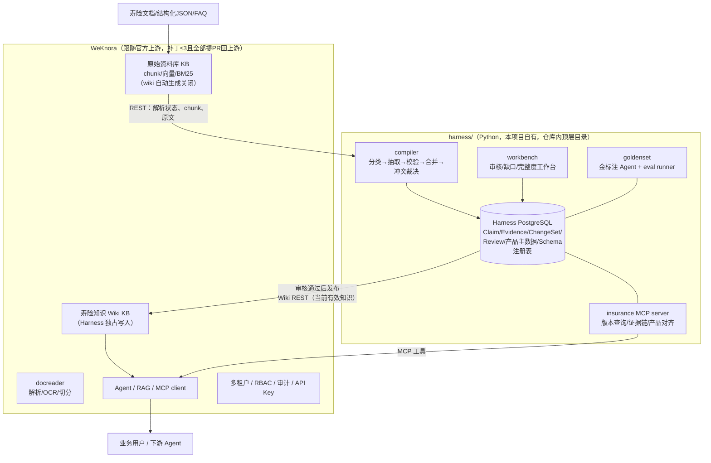

# 02 · 技术架构设计

> 本文是寿险知识平台的架构基准文档。所有开发（含 OpenSpec change）不得违背本文的边界约束；如需变更架构，先修订本文并记录新的 ADR。
>
> 关联文档：[00-project-overview.md](00-project-overview.md)（项目入口）· [01-requirements-and-challenges.md](01-requirements-and-challenges.md)（需求与难点）· [03-knowledge-model.md](03-knowledge-model.md)（知识模型）· [04-extraction-harness.md](04-extraction-harness.md)（抽取管道）· [05-golden-set-eval.md](05-golden-set-eval.md)（金标与评估）

## ADR-001：插件式架构（2026-07-11 拍板）

**背景**：`docs/project-iterations/2026-07-insurance-knowledge-compiler-master-plan.md`（下称 master plan）最初设计为"Go 编排 + gRPC 调用 Python + 保险表建在 WeKnora Postgres"。业务方随后明确两条约束：① 希望持续跟随 WeKnora 开源上游的版本更新；② 保险模块做成"类似插件"。

**决策**：采用**插件式架构（路线 B）**——

- WeKnora 核心代码**原样跟随官方上游**（fork 当前与官方 v0.6.3 零分岔，保持这个状态）；
- 所有保险领域能力（Claim/Evidence/ChangeSet/审核/金标/工作台）放在仓库内独立的 **Python Harness**（`harness/` 顶层目录），持久化在 **Harness 自有的 PostgreSQL schema**；
- Harness 与 WeKnora 只通过 **REST API 和 MCP** 交互；
- 对 WeKnora 的改动限定为 ≤3 个**通用能力补丁**，全部向腾讯上游提 PR。

**放弃的方案**：A（master plan 原样）——保险表进 WeKnora Postgres 会使每次跟版都需人肉解冲突，与"持续跟随上游"矛盾。

**后果与代价**：
- 审核工作台、完整度仪表盘在独立 UI，与 WeKnora 前端是两个界面（知识阅读仍在 WeKnora Wiki 界面）；
- 检索时的"按保单时间过滤版本"不进 Go 检索管线，改由两招实现：生产 KB 只发布"当前有效"知识 + 历史版本问答走 Harness 暴露的 MCP 工具；
- 解析完成感知在补丁合入前只能轮询。

**master plan 的地位不变**：仍是唯一主清单，但其中 Go 侧条目的落点按本文 §6 的映射表调整。

## 1. 架构总览



## 2. 组件职责

| 组件 | 职责 | 不负责 |
|---|---|---|
| **WeKnora core** | 文档接入与解析、chunk/向量/检索、Wiki 存储与人类阅读界面、Agent/RAG 服务、多租户/RBAC/审计、IM 集成 | 任何保险语义（产品识别、字段抽取、冲突裁决、版本治理） |
| **harness/compiler** | 文档分类、结构化事实抽取、校验、实体对齐、增量合并、冲突裁决、ChangeSet 生成、发布到 Wiki | 文档解析（用 docreader 的产物）、检索服务 |
| **harness/goldenset** | 金标注 Agent（最强模型直读）、金标版本管理、eval runner、回归门禁 | — |
| **harness/workbench** | 审核队列、冲突处理、完整度矩阵/缺口仪表盘、ChangeSet 差异与回滚操作 | 知识的日常阅读（在 WeKnora Wiki 界面） |
| **harness/mcp** | 向 WeKnora Agent 暴露：按保单时间查适用版本、查 Claim 证据链、产品别名对齐 | — |
| **harness/adapters/weknora** | 封装 WeKnora REST/OpenAPI，屏蔽上游 API 变化（唯一允许感知 WeKnora API 细节的模块） | — |

## 3. 硬边界（monorepo 三条纪律）

1. **物理隔离**：`harness/` 是自包含 Python 项目（自己的 pyproject.toml、migrations、tests、CI）。与 Go 代码零 import、零共库。
2. **只走 API**：Harness 永不直读 WeKnora 的数据库表、永不消费其 Asynq 队列、永不在 Go 的处理链里注入保险逻辑。所有交互经 `adapters/weknora/`（REST）或 MCP。
3. **上游零污染**：保险业务代码进 WeKnora Go/Vue 代码 = 0；未上游化的通用补丁 ≤ 3 个，每个必须有对应的上游 Issue/PR 和兼容性测试。

违反任何一条的 PR 不允许合并。这三条同时是 code review 的检查项。

## 4. 与 WeKnora 的集成契约

### 4.1 双知识库策略

- **原始资料库 KB**：接收全部原始文档，负责解析、chunk、向量、BM25、证据原文。`wiki_enabled` 关闭（不让内置 wiki ingest 自动生成页面）。
- **寿险知识 Wiki KB**：只接收 Harness 发布的审核通过页面。需要 wiki 功能开启但内置自动 ingest 关闭——这依赖补丁 P-3（见 §5）；补丁合入前的过渡方案：该 KB 不上传任何原始文档（无文档则内置 ingest 无从触发），Harness 经 REST 独占写入。
- 两个 KB 必须同租户、同 ACL 策略，避免"看得到页面、无权看原文"。

### 4.2 调用面（现状可用）

| 方向 | 接口 | 说明 |
|---|---|---|
| 读解析状态 | `GET knowledge`（轮询 `parse_status=completed`） | 补丁 P-2 合入后改为事件驱动 |
| 读 chunk | chunk REST（`docs/api/chunk.md`） | 事实的证据定位用 `knowledge_id + chunk_id + 页码` |
| 写 Wiki | `POST/PUT /knowledgebase/{kb}/wiki/pages`、folder CRUD | 写入 `source_refs`、`chunk_refs`、`page_metadata`；**当前无乐观锁（last-write-wins）**，补丁 P-1 合入前 Harness 内部对 slug 串行化写入 |
| 鉴权 | Tenant API Key，能力域 `retrieve`（读）+ `ingest`（写） | 给 Harness 发作用域受限的专用 key |
| Agent 扩展 | WeKnora MCP client 挂载 harness/mcp | 版本敏感问答的通道 |

### 4.3 已知缺口与规避

- **chunk_refs 服务端不校验**：Harness 发布前自行校验引用真实性（金标子系统的引文回验逻辑复用）。
- **无批量写接口**：发布器按页逐写 + 本地断点续传；量大时按 release 分批。

## 5. 上游补丁清单（全部为通用能力，不含保险逻辑）

| # | 补丁 | 动机 | 上游化策略 |
|---|---|---|---|
| P-1 | Wiki 更新乐观锁/幂等键（`expected_version` / `If-Match`） | 当前 `PUT /pages/*slug` 是 last-write-wins；外部写入方与内置管线并发会静默覆盖 | 提 PR 至 Tencent/WeKnora |
| P-2 | 知识生命周期 Outbox/Webhook（`knowledge.completed/failed/reparsed/deleted`） | 当前无解析完成对外事件，只能轮询 | 提 PR |
| P-3 | `WikiConfig.ingest_mode: auto \| manual` | 当前 `WikiEnabled=false` 时连 REST 写 wiki 也 400（`validateWikiKB`），无法实现"关自动生成、留人工/API 写入" | 提 PR |

红线：补丁未合并期间以独立 patch 文件维护于 `deploy/patches/`，跟版时逐个重放并跑契约测试；任何新增补丁需先在本表登记并开上游 Issue。

## 6. master plan 条目落点映射

master plan 的优先级（P0→P3）与切片（S1→S7）**保持不变**，条目落点调整如下：

| master plan 条目 | 原落点 | 新落点 |
|---|---|---|
| P0-1/P0-2/P0-3 的 "Python" 项 | knowledge-compiler gRPC 服务 | `harness/compiler`（先以库+CLI 形态，传输层后置） |
| P0-1/P0-3/P0-4 的 "Go 与数据层" 新表（insurance_products、wiki_claims、change_sets 等） | WeKnora Postgres + Go repository | **Harness 自有 PostgreSQL**（schema 见 03-knowledge-model.md §7） |
| P0-3 "RAG/Wiki/Agent 查询支持 as_of_date" | Go 检索管线改造 | 生产 KB 只发布当前有效知识 + `harness/mcp` 版本查询工具 |
| P0-5 审核与发布门禁、P1-1 仪表盘、P1-3 Schema 工作台的前端项 | WeKnora Vue 前端 | `harness/workbench` 独立 UI |
| P0-2 结构化导入、P0.5 批处理调度 | Go 任务类型 + asynq | Harness 自有任务编排（LangGraph + 队列，见 04 §编排） |
| gRPC 六个契约（AnalyzeDocument 等） | Go↔Python 接口 | 降级为 `harness/compiler` 的内部 Python API；未来若需要跨语言调用再加传输层 |
| 金标准/评测（散见验收标准） | 未单列 | 新增独立工作流 **S0：金标与评估子系统**（`harness/goldenset`，排在 S1 之前启动，见 05） |
| P2 图谱、P3 多模态 | 混合 | 原则同上：语义计算在 Harness，展示尽量复用 WeKnora 现有图谱/预览界面 |

## 7. 仓库目录规划

```
InsuranceKB-WeKnora/
├── internal/ docreader/ frontend/ ...   # WeKnora 上游原样（不动）
├── harness/                             # ★ 寿险知识编译 Harness（Python）
│   ├── pyproject.toml
│   ├── compiler/        # 抽取/校验/合并/发布管道（04）
│   ├── goldenset/       # 金标注 Agent + eval runner（05）
│   ├── workbench/       # 审核/仪表盘工作台
│   ├── mcp/             # insurance MCP server
│   ├── adapters/weknora/ # WeKnora REST 适配层（唯一 API 感知点）
│   ├── schemas/         # schema 注册表（YAML，版本化）
│   ├── migrations/      # Harness 自有 DB 迁移
│   └── tests/
├── deploy/patches/                      # 未上游化补丁（≤3）
├── docs/insurance-kb/                   # 本文档集
├── docs/project-iterations/             # master plan（唯一主清单）
├── openspec/                            # SDD 变更流程
└── HANDOFF.md                           # 交接文档（持续更新）
```

## 8. 升级治理（版本列车）

1. `upstream` remote 指向 `github.com/Tencent/WeKnora`，固定官方 tag/镜像 digest，不实时跟 main；
2. 新版本发布 → 建升级分支：合并官方 tag → 重放 `deploy/patches/` → 跑 **API 契约测试**（adapters/weknora 的接口断言）→ 跑**金标回归**（05 的 eval runner）→ 数据库迁移演练；
3. 灰度发布，观察解析成功率、发布差异率、问答准确率、Langfuse 指标后转正；
4. fork 债务检查随每次升级执行：保险代码入 Go 计数（必须为 0）、patch 数（≤3）、每个 patch 的上游 Issue 状态。

## 9. 技术栈与可观测

- Harness：Python 3.12+，FastAPI + Pydantic v2 + LangGraph（可恢复 checkpoint）+ PostgreSQL + Alembic；
- 模型接入：生产弱模型（minimax 2.5 / qwen 3.6 / qwen-VL），裁决与升级模型 DeepSeek v4，金标模型为可用的最强模型（见 05）；模型网关统一封装，可切换；
- 可观测：与 WeKnora 共用 Langfuse 实例，以 `knowledge_id` / `harness_job_id` / `change_set_id` 关联端到端链路；
- 许可证：WeKnora MIT；nashsu/llm_wiki 及其 fork 为 GPL-3.0，**只借鉴思想，不复制代码**（详见 06-asset-migration.md §合规）。
