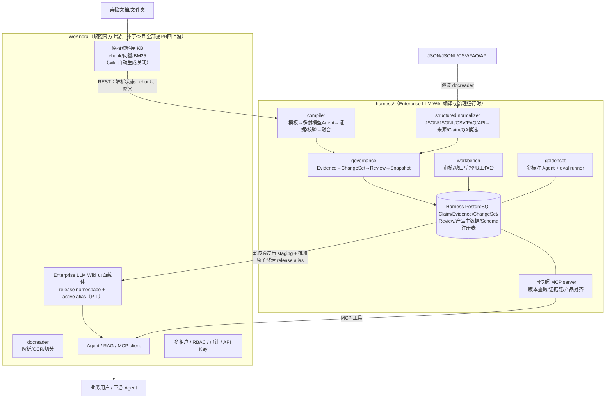

# 02 · 技术架构设计

> 本文是寿险知识平台的架构基准文档。所有开发（含 OpenSpec change）不得违背本文的边界约束；如需变更架构，先修订本文并记录新的 ADR。
>
> 最高层基准：[Enterprise LLM Wiki 北极星设计](../superpowers/specs/2026-07-21-enterprise-llm-wiki-north-star-design.md)。关联文档：[00-project-overview.md](00-project-overview.md)（项目入口）· [01-requirements-and-challenges.md](01-requirements-and-challenges.md)（需求与难点）· [03-knowledge-model.md](03-knowledge-model.md)（知识模型）· [04-extraction-harness.md](04-extraction-harness.md)（抽取管道）· [05-golden-set-eval.md](05-golden-set-eval.md)（金标与评估）

## ADR-002：Enterprise LLM Wiki 是产品本体（2026-07-21 拍板）

**决策**：本项目不是“WeKnora + 一组保险抽取功能”，而是运行在 WeKnora 企业底座上的 **Enterprise LLM Wiki**。三者职责固定为：

- **WeKnora**：租户、权限、审计、解析/OCR/chunk、通用检索、页面存储/渲染/目录/链接图与企业部署；
- **Harness**：模板优先、只依赖生产弱模型的持久知识编译与治理运行时，负责分类、事实路由、抽取、证据回验、校验、融合、冲突、版本、审核、告警与快照；
- **Enterprise LLM Wiki**：产品页、概念页、FAQ、差异、关系、change log 和同快照 MCP 组成的产品本体，是人和 Agent 的默认知识权威。

保险 KB 必须关闭 WeKnora 内置自动 Wiki 生成。语义与页面编译权归 Enterprise LLM Wiki 编译器，WeKnora 只承载页面和通用平台能力。生产发布不得依赖强模型；强模型仅可作为可选离线金标/评测工具，其不可用不得阻塞生产。

权威分层：内部语义 SSOT 是 `Claim + Evidence + ChangeSet + Revision + ReleaseSnapshot`；默认消费权威是 P-1 active alias 指向、批准仍有效且 seal/hash 核对一致的 snapshot Wiki 与同快照 MCP；Harness `CurrentRelease` 只保存 activation receipt 镜像。RAW 文档/chunk 只作证据和明确标注的未编译兜底，不能覆盖已发布结论。

## ADR-001：插件式架构（2026-07-11 拍板）

**背景**：`docs/project-iterations/2026-07-insurance-knowledge-compiler-master-plan.md`（下称 master plan）最初设计为"Go 编排 + gRPC 调用 Python + 保险表建在 WeKnora Postgres"。业务方随后明确两条约束：① 希望持续跟随 WeKnora 开源上游的版本更新；② 保险模块做成"类似插件"。

**决策**：采用**插件式架构（路线 B）**——

- WeKnora 核心代码**原样跟随官方上游**（fork 当前与官方 v0.6.3 零分岔，保持这个状态）；
- 所有保险领域能力（Claim/Evidence/ChangeSet/审核/金标/工作台）放在仓库内独立的 **Python Harness**（`harness/` 顶层目录），持久化在 **Harness 自有的 PostgreSQL schema**；
- Harness 与 WeKnora 只通过 **REST API 和 MCP** 交互；
- 对 WeKnora 的改动限定为 ≤3 个**通用能力补丁**，全部向腾讯上游提 PR。

**放弃的方案**：A（master plan 原样）——保险表进 WeKnora Postgres 会使每次跟版都需人肉解冲突，与"持续跟随上游"矛盾。

**后果与代价**：
- 审核工作台、完整度仪表盘在独立 UI，与 WeKnora 前端是两个界面；目标态知识阅读复用 WeKnora Wiki，但必须先有 P-1 的 release namespace/active alias。P-1 落地前只允许在受限 staging KB 预览，普通用户通过 Harness 的只读 current-release reader 查看已批准快照，不得把逐页写入的 WeKnora KB 当生产权威；
- 检索时的"按保单时间过滤版本"不进 Go 检索管线，改由两招实现：生产 KB 只发布"当前有效"知识 + 历史版本问答走 Harness 暴露的 MCP 工具；
- 解析完成感知在补丁合入前只能轮询。

**master plan 的地位不变**：仍是唯一主清单，但其中 Go 侧条目的落点按本文 §6 的映射表调整。

## 1. 架构总览



## 2. 组件职责

| 组件 | 职责 | 不负责 |
|---|---|---|
| **WeKnora core** | 文档接入与解析、chunk/向量/检索、Wiki 页面存储与人类阅读载体、Agent/RAG 服务、多租户/RBAC/审计、IM 集成 | 任何保险语义、内置自动生成保险 Wiki、产品识别、字段抽取、冲突裁决、版本治理 |
| **`harness/src/insurance_harness/compiler/`** | 持久任务/attempt/checkpoint、模板选择、多弱模型 Agent、文档分类、事实抽取、证据回验、校验、实体对齐、增量合并、冲突提案、ChangeSet、告警、页面与关系编译 | 文档解析（用 docreader 的产物）、通用页面存储、绕过审核直接发布 |
| **`harness/src/insurance_harness/structured_import/`** | JSON/JSONL/CSV/FAQ/API 直接冻结 SourceRevision、规范化 Product/Claim/QA 候选，并进入与文档相同的 Evidence/ChangeSet/Review/Snapshot 治理 | 上传到 RAW 后伪装成文本、跳过 provenance/冲突/审核 |
| **`harness/src/insurance_harness/goldenset/`** | 独立离线标注、金标版本管理、eval runner、模板/模型/schema 回归门禁；可选使用最强模型或人工但不构成生产依赖 | 直接生成生产知识、生产 fallback、生产发布裁决 |
| **`harness/src/insurance_harness/workbench/`** | 审核队列、冲突处理、完整度矩阵/缺口仪表盘、ChangeSet 差异与回滚操作；P-1 未落地时提供只读 current-release 安全预览 | 目标态知识日常阅读（P-1 后在 WeKnora Wiki 界面） |
| **`harness/src/insurance_harness/mcp/`** | 读取 WeKnora active alias，核对仍有效 approval/seal/manifest 与 Harness receipt 后，向 Agent 暴露同 snapshot 的版本查询、Claim 证据链和跨产品比较 | 只信本地 CurrentRelease、返回未发布候选/无效批准或与 Wiki 不同快照的口径 |
| **`harness/src/insurance_harness/adapters/weknora/`** | 封装 WeKnora REST/OpenAPI，屏蔽上游 API 变化（唯一允许感知 WeKnora API 细节的模块） | — |

## 3. 硬边界（monorepo 五条纪律）

1. **物理隔离**：`harness/` 是自包含 Python 项目（自己的 pyproject.toml、migrations、tests、CI）。与 Go 代码零 import、零共库。
2. **只走 API**：Harness 永不直读 WeKnora 的数据库表、永不消费其 Asynq 队列、永不在 Go 的处理链里注入保险逻辑。所有交互经 `adapters/weknora/`（REST）或 MCP。
3. **上游零污染**：保险业务代码进 WeKnora Go/Vue 代码 = 0；未上游化的通用补丁 ≤ 3 个，每个必须有对应的上游 Issue/PR 和兼容性测试。
4. **生产弱模型边界**：生产 compiler/judge/fallback 只允许已批准的弱模型能力档；强模型不能成为运行依赖。执行前的专用模板 miss 只影响 TemplatePackage stack 选择，可退回已批准上层；运行时效果不足严格按“重定位/重切分→定向补抽→多弱模型共识→通用 agentic 路径→Alert + ReviewItem”降级。
5. **知识写入纪律**：所有语义变更必须经 Claim/Evidence/ChangeSet/ReleaseSnapshot；直接写 Wiki 只允许发布已批准的确定性编译产物。

违反任何一条的 PR 不允许合并。这五条同时是 code review 的检查项。

## 4. 与 WeKnora 的集成契约

### 4.1 知识库与发布可见性策略

- **原始资料库 KB**：接收全部原始文档，负责解析、chunk、向量、BM25、证据原文。`wiki_enabled` 关闭（不让内置 wiki ingest 自动生成页面）。
- **寿险知识 Wiki KB（目标态）**：只接收 Harness 的 snapshot-addressed 页面 namespace。P-1 提供每 KB 的 `active_release_id`、原子 CAS 激活与默认读取过滤；普通 list/get/search/index/graph/RAG/UI 只看 active namespace，staging namespace 仅 release 管理员通过显式管理 API 可见。P-3 关闭内置自动 ingest、保留 API 写入。
- **受限 staging KB（P-1 前的过渡）**：与普通用户和 Agent ACL 隔离、禁用生产检索，仅供授权人预览 snapshot 制品。P-1 未落地并通过 live 契约测试前，禁止把页面逐页写入面向普通用户的生产 Wiki KB；已批准当前快照由 Harness 只读 reader/MCP 安全提供，不能宣称 WeKnora Wiki 生产阅读已完成。
- RAW、目标 Wiki 与临时 staging 必须属于同租户并有显式 ACL 映射；证据跳转还须验证用户同时有 RAW 来源权限，避免“看得到页面、无权看原文”。

### 4.2 调用面（现状可用）

| 方向 | 接口 | 说明 |
|---|---|---|
| 读解析状态 | `GET knowledge`（轮询 `parse_status=completed`） | 补丁 P-2 合入后改为事件驱动 |
| 读 chunk | chunk REST（`docs/api/chunk.md`） | 事实的证据定位用 `knowledge_id + chunk_id + 页码` |
| 写 Wiki | `POST/PUT /knowledgebase/{kb}/wiki/pages`、folder CRUD | 当前只能逐页写且 last-write-wins，不具备生产原子发布语义；仅可写受限 staging。目标态改用 P-1 的 release-scoped staging/idempotency API |
| 激活 Wiki release | P-1 `activate-release(expected_active_release, release_id, manifest_hash)` | 单次 CAS 改变 WeKnora UI/RAG 的唯一 serving alias；MCP 每次请求读取该 alias 并校验 Harness 中同 hash 的批准 snapshot，失配即 fail closed + Alert |
| 鉴权 | Tenant API Key，能力域 `retrieve`（读）+ `ingest`（写） | 给 Harness 发作用域受限的专用 key |
| Agent 扩展 | WeKnora MCP client 挂载 harness/mcp | 版本敏感问答的通道 |

### 4.3 已知缺口与规避

- **chunk_refs 服务端不校验**：Harness 发布前由 production compiler 自己的 verifier 校验引用真实性。compiler 与 goldenset 只共享规范化协议、版本化 schema 和公开测试向量，**互不 import verifier 实现**；goldenset 再用独立实现复核，避免“运动员复用裁判答案”。
- **现有页面状态不足以隔离 staging**：当前 WikiBrowser 的默认列表未强制只取 `published`，且逐页状态翻转也不原子；因此 `draft`、单发布者纪律或稳定 slug 覆盖都不能作为生产规避方案。P-1 前必须使用受限 staging KB + Harness current-release reader。
- **无 release namespace/原子 serving alias**：这是直接 WeKnora Wiki UI 上线的阻断项，不允许用内部 `CurrentRelease` 指针假装已解决。P-1 要求所有公共读路径和检索索引按 active release 过滤，并对 staging 隐藏做失败注入测试。

## 5. 上游补丁清单（全部为通用能力，不含保险逻辑）

| # | 补丁 | 动机 | 上游化策略 |
|---|---|---|---|
| P-1 | 通用 Wiki release namespace + 原子 active alias：`(tenant,target_kb,release_id,logical_slug)` 身份、Space↔target/staging KB 一一绑定、release-scoped 幂等 staging、原子 `seal-release`、manifest/index hash、`active_release_id` CAS/ETag、批准有效性、pin/retention/GC 与 rollback preflight；公共读路径只解析 active release | 当前逐页 last-write-wins 与页面 `draft/published` 不能隐藏整套 staging、阻止校验后写入或原子切换，直接 UI 会暴露混合快照 | 提 PR 至 Tencent/WeKnora；合入并 live 验证前，生产直接 Wiki UI fail closed |
| P-2 | 知识生命周期 Outbox/Webhook（`knowledge.completed/failed/reparsed/deleted`） | 当前无解析完成对外事件，只能轮询 | 提 PR |
| P-3 | `WikiConfig.ingest_mode: auto \| manual` | 当前 `WikiEnabled=false` 时连 REST 写 wiki 也 400（`validateWikiKB`），无法实现"关自动生成、留人工/API 写入" | 提 PR |

红线：补丁未合并期间以独立 patch 文件维护于 `deploy/patches/`，跟版时逐个重放并跑契约测试；任何新增补丁需先在本表登记并开上游 Issue。P-1 是人/Agent 同快照的生产前置，不属于可由单发布者或维护窗口豁免的“优化项”。

## 6. master plan 条目落点映射

master plan 的优先级（P0→P3）与切片（S1→S7）**保持不变**，条目落点调整如下：

| master plan 条目 | 原落点 | 新落点 |
|---|---|---|
| P0-1/P0-2/P0-3 的 "Python" 项 | knowledge-compiler gRPC 服务 | `harness/src/insurance_harness/compiler/`（先以库+CLI 形态，传输层后置） |
| P0-1/P0-3/P0-4 的 "Go 与数据层" 新表（insurance_products、wiki_claims、change_sets 等） | WeKnora Postgres + Go repository | **Harness 自有 PostgreSQL**（schema 见 03-knowledge-model.md §8） |
| P0-3 "RAG/Wiki/Agent 查询支持 as_of_date" | Go 检索管线改造 | 生产 KB 只发布当前有效知识 + `harness/src/insurance_harness/mcp/` 版本查询工具 |
| P0-5 审核与发布门禁、P1-1 仪表盘、P1-3 Schema 工作台的前端项 | WeKnora Vue 前端 | `harness/src/insurance_harness/workbench/` 独立 UI |
| P0-2 结构化导入、P0.5 批处理调度 | Go 任务类型 + asynq | Harness 自有任务编排（LangGraph + 队列，见 04 §编排） |
| gRPC 六个契约（AnalyzeDocument 等） | Go↔Python 接口 | 降级为 `harness/src/insurance_harness/compiler/` 的内部 Python API；未来若需要跨语言调用再加传输层 |
| 金标准/评测（散见验收标准） | 未单列 | 新增独立工作流 **S0：金标与评估子系统**（`harness/src/insurance_harness/goldenset/`，排在 S1 之前启动，见 05） |
| P2 图谱、P3 多模态 | 混合 | 原则同上：语义计算在 Harness，展示尽量复用 WeKnora 现有图谱/预览界面 |

## 7. 仓库目录规划

```
InsuranceKB-WeKnora/
├── internal/ docreader/ frontend/ ...   # WeKnora 上游原样（不动）
├── harness/                             # ★ 寿险知识编译 Harness（Python，src 布局）
│   ├── pyproject.toml   # uv 管理；ruff/mypy/pytest 配置
│   ├── src/insurance_harness/
│   │   ├── config.py    # Pydantic Settings（HARNESS_ 前缀，零硬编码）
│   │   ├── compiler/    # 抽取/校验/合并/发布管道（04）
│   │   ├── goldenset/   # 金标注 Agent + eval runner（05）
│   │   ├── workbench/   # 审核/仪表盘工作台
│   │   ├── mcp/         # insurance MCP server
│   │   ├── adapters/weknora/ # WeKnora REST 适配层（唯一 API 感知点）
│   │   └── schemas/     # schema 注册表（YAML，版本化）
│   ├── migrations/      # Harness 自有 DB 迁移
│   └── tests/
├── deploy/patches/                      # 未上游化补丁（≤3）
├── docs/insurance-kb/                   # 本文档集
├── docs/project-iterations/             # master plan（唯一主清单）
├── openspec/                            # SDD 变更流程
└── HANDOFF.md                           # 交接文档（持续更新）
```

## 8. 升级治理（版本列车）

1. `upstream` remote 指向 `github.com/Tencent/WeKnora`，固定官方 tag/镜像 digest，不实时跟 main；
2. 新版本发布 → 建升级分支：合并官方 tag → 重放 `deploy/patches/` → 跑 **API 契约测试**（adapters/weknora 的接口断言）→ 跑**金标回归**（05 的 eval runner）→ 数据库迁移演练；
3. 灰度发布，观察解析成功率、发布差异率、问答准确率、Langfuse 指标后转正；
4. fork 债务检查随每次升级执行：保险代码入 Go 计数（必须为 0）、patch 数（≤3）、每个 patch 的上游 Issue 状态。

## 9. 技术栈与可观测

- Harness：Python 3.12+，FastAPI + Pydantic v2 + LangGraph（可恢复 checkpoint）+ PostgreSQL + Alembic；
- 模型接入：生产只依赖弱模型能力档（MiniMax M2.5 / Qwen 3.x / Qwen-VL 等），裁决采用确定性规则 + 多弱模型 Agent 共识 + 人工最终审核；可选离线金标可用最强模型或人工（见 05），但不得直接发布或成为生产前置；模型网关统一封装、身份冻结、可切换；
- 可观测：与 WeKnora 共用 Langfuse 实例，以 `knowledge_id` / `harness_job_id` / `change_set_id` 关联端到端链路；
- 许可证：WeKnora MIT；`LLM-wiki-black` 已由项目权利人确认为第一方完整著作权资产，可按 06 的 provenance 迁移；`nashsu/llm_wiki` 等第三方项目继续按各自许可证管理。历史能力在新 OpenSpec/027/Golden Slice 前仍 production-disabled，原因是架构与质量准入，不是第一方权利未决。

## 10. 澄清：两种"抽取"与两种"Wiki"的关系（2026-07-13 补）

**两种抽取 = 单向依赖 + 有权威顺序的双轨检索。** harness 抽取（本项目核心：schema/模板/多弱模型 Agent）只消费 WeKnora 的解析产物（chunk/页文本，用于证据定位），**不依赖**其任何语义加工；WeKnora 的自动 QA 生成、GraphRAG、内置 wiki 生成在本部署中关闭。当前 snapshot 的编译知识是默认权威；只有缺失时才允许 KB-RAW 原文 RAG 作为明确标注“未编译/低保证”的兜底，并同步产生 gap，绝不能用临时 RAW 答案覆盖 Wiki 结论。Harness 的使命是持续把内容从兜底轨升级到编译轨。

**两种 Wiki = 平台载体与领域编译器，拆开用。** WeKnora 内置 Wiki 只复用通用页面存储/渲染/互链/目录/图；保险生成管线永久关闭，由经 027、TemplatePackage/Runtime、ReleaseApproval 与适用 admission 门禁的 Harness 编译器负责语义。普通版本列车升级不能重新开放内置生成；只有业务方批准新 ADR、证明等价治理并完成全量回归，才允许重决策。形态路线：029/032/013 MVP 同快照 → NS-C/P-1 原子发布 → 009 概念页/义项 → 008 审核 → 011 健康 → 015 飞轮。
