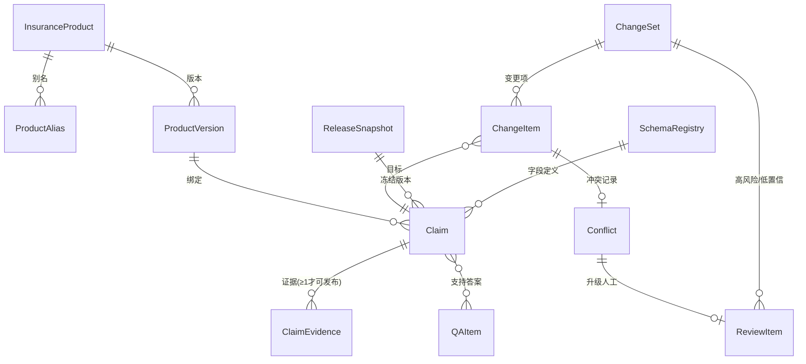

# 03 · 寿险知识模型设计

> **本文地位**：本文定义寿险知识平台的领域对象模型、页面模型、版本模型与冲突裁决规则，是 Python Harness（knowledge-compiler 插件）数据层的唯一设计依据。
>
> - 架构边界与插件划分见 [02-architecture.md](02-architecture.md)；本文定义的所有对象**持久化在 Harness 自有 PostgreSQL schema 中**，不建表进 WeKnora 的数据库。
> - 抽取管道如何产出这些对象，见 [04-extraction-harness.md](04-extraction-harness.md)。
> - 术语与 master plan（`docs/project-iterations/2026-07-insurance-knowledge-compiler-master-plan.md` §3.2）保持一致；master plan 中规划由 Go 侧持久化的对象（`wiki_claims`、`knowledge_change_sets` 等），按架构决策 ADR-001（插件式路线 B）全部落到本插件侧。

---

## 1. 设计原则

1. **事实是一等公民，页面是投影**。知识的 SSOT（唯一权威存储）是 Claim + Evidence，不是 Wiki 页面。Wiki 页面由编译器从 Claim 生成（"编译投影"），可以随时重编、回滚、重新渲染；直接改页面不改 Claim 属于违规操作。
2. **每条事实必须可溯源**。没有 Evidence 的 Claim 不允许进入 `published` 状态。
3. **正确归属优先于自动化**。产品归属置信度不足的事实进 `unassigned` 候选池，不污染产品知识。
4. **权威度与有效期优先于内容完整度**。培训/销售材料再详细也不能覆盖正式条款。
5. **未抽取 ≠ 不存在**。所有字段采用三态（`present / absent_explicitly / unknown`），杜绝"没抽到豁免"被解读为"该产品无豁免"。
6. **一切变更经由 ChangeSet**。不存在绕过变更集的直接写入；自动裁决全部留痕、可翻案。

---

## 2. 领域对象模型

### 2.1 对象总览



### 2.2 产品主数据（InsuranceProduct / ProductAlias / ProductVersion）

产品是知识归属的锚点。**产品身份用稳定 UUID，绝不用 Wiki 路径、slug 或产品名作身份**（名称会变、路径会调整）。

| 对象 | 关键字段 | 说明 |
|---|---|---|
| `InsuranceProduct` | `id`、`product_code`（内部险种代码，唯一）、`canonical_name`、`category`（重疾/医疗/寿险/年金/意外/车险…）、`status`（在售/停售/归档）、`regulatory_filing_no`（监管备案号）、`business_owner` | 产品主数据，一个产品一行 |
| `ProductAlias` | `product_id`、`alias`、`alias_type`（历史名/简称/别称/渠道名/口语名）、`source` | 实体对齐的确定性依据。抽取时先按 code/标准名/别名做确定性匹配，向量与 LLM 只做候选召回与判别（master plan P0-1） |
| `ProductVersion` | `id`、`product_id`、`version_label`（如"2024版"）、`terms_revision`（条款修订号）、`effective_from`、`effective_to`、`channels[]`、`regions[]` | "同一产品不同条款版本"的载体。回答历史保单问题时按 `as_of_date` 选版本 |

### 2.3 Claim（事实）

一条 Claim = 一条可独立验证、可独立审核、可独立版本化的最小事实。

```yaml
Claim:
  id: uuid
  subject_type: product_version | concept | product_concept   # 主语类型
  subject_ref:                       # 主语引用（实体ID，非名称）
    product_version_id: uuid | null
    concept_id: uuid | null          # 概念（如"在线问诊"），见第4节
  predicate: string                  # 属性或关系，取自 SchemaRegistry 字段字典（如 waiting_period_days / premium_waiver_insured）
  value_state: present | absent_explicitly | unknown   # 三态，见 2.3.1
  value: jsonb | null                # value_state=present 时必填；结构由 schema 字段类型约束
  effective_from: date | null       # 事实自身的生效期（如"2024-01-01 起等待期改为90天"）
  effective_to: date | null
  status: draft | candidate | published | superseded | retracted
  confidence: float                  # 抽取置信度（多证据一致会提升）
  extraction_method: llm | structured_import | manual | derived
  schema_version: string             # 抽取时依据的 schema 注册表版本串（如 v1.1+hash）；
                                     # schema_registry 表落库后升级为 schema_version_id uuid
  current_revision: int              # 修订号，见第5节
  pending_judge: bool                # 抽取管道在途裁决标记（judge-queue 未回写前禁止自动通过门禁）
```

**2.3.1 三态语义（必须严格执行）**

| 状态 | 语义 | 下游行为 |
|---|---|---|
| `present` | 文档明确给出该字段的值 | 正常发布、可被引用 |
| `absent_explicitly` | 文档**明确说没有**（如"本产品无投保人豁免责任"），本身要有 Evidence | 可发布；回答"该产品无 X" 必须引用这条，而不是引用"查无" |
| `unknown` | 未抽到，不知道有没有 | **禁止**发布为"无"；自动生成缺口任务（含候选证据与重试建议），进完整度矩阵的缺口格 |

**2.3.2 状态机**

```
draft ──(通过校验)──> candidate ──(审核/自动门禁)──> published
                          │                             │
                          └──(驳回)──> draft            ├─(被新版本取代)──> superseded
                                                        └─(来源撤回/证据失效)──> retracted
```

- 只有 `published` 的 Claim 参与生产问答与 Wiki 发布；`candidate`/`draft` 需显式授权才可见。
- `superseded` 保留全部内容与证据，指向取代它的 Claim（`superseded_by`），支撑历史问答与审计。

### 2.4 Evidence（证据）

```yaml
ClaimEvidence:
  id: uuid
  claim_id: uuid
  knowledge_id: string        # WeKnora 侧文档 ID（原始资料库）
  chunk_id: string | null     # WeKnora chunk UUID
  quote: text                 # 原文摘录——必须能在 chunk 原文中做子串/规范化匹配（抽取管道的确定性回验依据）
  location:                   # 页码/章节/表格坐标/时间戳（音视频）
    page: int | null
    section: string | null
    table_ref: string | null
    timestamp_ms: int | null
  authority_level: int        # 来源权威等级，见第6节
  doc_role: terms | official_desc | approved_faq | internal_ops | training | sales | external   # 内容角色
  extraction_method: llm | structured_import | manual
  extracted_at: timestamptz
```

规则：
- 一条 Claim 可有多条 Evidence（多份文档相互印证 → `confidence` 上调）。
- `quote` 回原文匹配失败的 Evidence 视为幻觉，**在入库前就被抽取管道拦截**（见 04 文档），数据层再做一次约束兜底。
- 删除来源文档时按证据引用计数处理：Claim 仍有其他权威证据 → 仅移除该 Evidence；证据清零 → Claim 转 `retracted` 并进 ChangeSet 留痕（对应 WeKnora wiki retract 思想，但在 Claim 层执行）。

### 2.5 ChangeSet / ChangeItem / Conflict（变更集）

每一批导入（一份文档、一批 JSON、一次人工编辑）产生**一个不可变 ChangeSet**，是回滚与审计的基本单位。

```yaml
ChangeSet:
  id: uuid
  source_batch:               # 触发来源
    kind: document | structured_import | manual_edit | recompile | rollback
    knowledge_ids: []         # 涉及的 WeKnora 文档
    external_record_id: string | null    # 结构化导入幂等键的一部分
    source_revision: string | null
  status: pending | partially_applied | applied | rejected | rolled_back
  created_by: string          # 系统组件名或操作者
  created_at: timestamptz

ChangeItem:
  id: uuid
  change_set_id: uuid
  action: add | enrich | supersede | conflict | retract
  claim_id: uuid | null       # 目标 Claim（add 时为空，应用后回填）
  proposed: jsonb             # 提议的 Claim 内容（含证据引用）
  decision: auto_applied | needs_review | approved | rejected
  decision_basis:             # 裁决依据（全部留痕）
    authority_cmp: string     # 权威等级比较结果
    effective_cmp: string     # 生效时间比较结果
    completeness_cmp: string
    llm_verdict: text | null  # LLM 裁决理由（若用到）
    reviewer: string | null
```

五种 action 的语义（与 master plan P0-4 一致）：

| action | 触发条件 | 默认处理 |
|---|---|---|
| `add` | 新事实，已有库中无同 (subject, predicate, 版本) | 低风险自动应用 |
| `enrich` | 与现有 Claim 值一致，补充新证据 / 补 `unknown` 字段 | 自动应用，confidence 上调 |
| `supersede` | 新值取代旧值且裁决序判定新值胜出 | **高风险字段一律进审核**；低风险可自动，旧 Claim 转 `superseded` |
| `conflict` | 新旧值矛盾且裁决序无法自动分出胜负 | 生成 `Conflict` 记录，进 ReviewItem，**冲突未决的 Claim 不得进入生产问答** |
| `retract` | 来源删除/证据失效/人工撤回 | 按证据计数降级或撤回 |

### 2.6 ReviewItem（人工/强模型审核项）

借鉴上游 llm_wiki review-store 的两个关键思想（思想重实现，不复制 GPL 代码）：

1. **内容派生稳定 ID**：`review_key = hash(type :: 规范化主题 :: subject_ref)`。pipeline 重跑、文档重传时同一逻辑审核项不会重复出现，**已决状态不丢失**。
2. **受限动作集**：每个 ReviewItem 只允许枚举动作（如 `采纳新值 / 保留旧值 / 双值并存标注适用范围 / 退回重抽 / 驳回`），不允许自由文本动作，防止"审核意见无法执行"。

```yaml
ReviewItem:
  id: uuid
  review_key: string (unique)      # 内容派生稳定ID
  type: product_attribution | conflict | low_confidence | high_risk_change | schema_change | research_writeback
  subject: jsonb                   # 关联的 ChangeItem / Conflict / Claim
  allowed_actions: []              # 受限动作集
  status: open | resolved | dismissed
  resolution: {action, actor, reason, at} | null
  risk_level: high | medium | low
```

本阶段（按 2026-07-11 决策）不投入人工审核资源：`resolved` 的 actor 可以是**最强模型裁决 Agent**，但记录格式与人工完全一致，未来人工介入零迁移成本。

---

## 3. QA：一等知识对象（不是实体字段）

**决策（已定稿）**：QA 不做成产品实体的一个字段。理由：QA 生命周期与产品事实不同、会无限膨胀无法单独审核、答案会与事实口径分叉。

```yaml
QAItem:
  id: uuid
  question: text
  question_intent: string          # 归一化意图（相似问合并的键）
  qa_kind: authoritative | derived
  answer: text
  supporting_claim_ids: []         # 答案必须由 published Claim 支持，不允许纯 LLM 文本
  related_entities: []             # 产品/版本/概念，多对多
  effective_from/to, status, source_refs, quality_score
```

- **权威 QA**（`authoritative`）：来自已批准 FAQ 或人工确认的官方口径，有独立版本与审核状态。
- **派生 QA**（`derived`）：编译器从 Claim 自动生成；**支撑它的 Claim 更新时自动标脏并重编译**，从机制上消灭"事实改了、QA 还是旧答案"。
- 展示：产品页/概念页聚合渲染关联 QA——人看到的效果等同"QA 字段"，底层是关联。
- 检索：已发布 QA 作为高精度候选进入 RAG，仍过权限、版本、有效期过滤（master plan P1-2）。

---

## 4. 三层页面模型（人类友好的 Wiki 形态）

Wiki 页面是 Claim 的**编译投影**，服务于"像真实维基百科一样给人看"的需求（含义项消歧）。

```
┌────────────────────────────────────────────────┐
│ ① 概念主页（canonical）  例：在线问诊              │
│    - 通用定义、公司统一口径（来自 concept 级 Claim）│
│    - 跨产品差异对比表（编译器从各限定页聚合生成）      │
│    - ③ 义项索引：链向所有产品限定页                 │
└──────────────┬─────────────────────────────────┘
               │ 义项（消歧按"产品"维度，结构化、非自由文本）
     ┌─────────┴──────────┬───────────────────┐
┌────▼─────────┐  ┌───────▼──────┐  ┌─────────▼────┐
│ ② 产品限定页   │  │ ② 产品限定页    │  │ ② 产品限定页    │
│ 在线问诊@安心保 │  │ 在线问诊@平安福  │  │ 在线问诊@e生保  │
│ (facet page)  │  │              │  │               │
│ 承载具体事实：   │  │  各自独立的：   │  │               │
│ 次数/人群/除外  │  │  版本链        │  │               │
│ 全部来自Claim  │  │  来源引用       │  │               │
│               │  │  审核状态      │  │                │
└───────────────┘  └──────────────┘  └───────────────┘
```

规则：

1. **事实一律落在产品限定页层**（Claim 的 `subject_type = product_concept`）；概念主页只放概念级通用口径（`subject_type = concept`）和聚合内容。
2. 抽取出的每条事实必须携带 `(product_id, concept/predicate, evidence)` 才能入库——"一份文件涉及多个产品"的路由问题由此变成显式的实体对齐步骤，对齐不了进 `unassigned` 池。
3. 概念主页的差异对比表、义项索引由编译器生成，**不允许人工直接编辑**（改了也会被下次编译覆盖）；要改内容去改 Claim。
4. 产品实体页（如"安心保2024版"总览页）同理：从该产品版本的全部 published Claim 按 schema 分组渲染，附证据链接与 QA 聚合区。
5. 页面互链：正文 `[[slug]]` 由编译器在发布期注入（概念名→概念主页、产品名→产品页），死链在发布前校验。

---

## 5. 版本模型与回滚

两级版本，各管一件事：

### 5.1 Claim/页面级：revision 链

- 每次 ChangeItem 应用产生一条 `ClaimRevision`（不可变）：`{claim_id, revision_no, before, after, change_item_id, actor, reason, at}`。
- changelog 必含：**系统/操作者、时间、来源（ChangeSet→文档/批次）、变更前后值、合并原因、审核记录**（master plan P0-4 验收项）。
- Wiki 页面不单独维护语义版本——页面由 Claim 集合决定，页面"历史"即其支撑 Claim 集合的历史；发布器在 `page_metadata` 中记录本次渲染依据的 snapshot_id 与 claim 清单。

### 5.2 库级：ReleaseSnapshot（发布快照）

```yaml
ReleaseSnapshot:
  id: uuid
  label: string                 # 如 2026-07-15-r1
  claim_set: 冻结的 (claim_id, revision_no) 集合   # 物化或按水位线记录
  rendered_pages: 物化的页面渲染产物（slug/title/content/refs/metadata）  # 回滚=按快照重发布的直接依据
  published_at, published_by, notes
```

- **生产 Agent 只消费"当前指针指向的快照"**。发布 = 生成新快照并移动指针；回滚 = 指针切回旧快照 + 触发 Wiki 页面重编译回旧内容，秒级完成，等价 git tag + checkout。
- 按批次回滚：`rolled_back` 的 ChangeSet 生成一个反向 ChangeSet（同样留痕），保证"回滚本身也可审计、也可再回滚"。
- 回滚后一致性要求（master plan P0-4 验收）：Claim、Wiki 页、QA、检索索引四者一致——由回滚流程强制触发受影响页面重发布与索引刷新。

---

## 6. 权威序与冲突裁决

### 6.1 来源权威等级（authority_level，数值越小越权威）

| 级 | doc_role | 示例 |
|---|---|---|
| 1 | 正式条款 / 监管文件 | 备案条款、监管批复 |
| 2 | 已批准的产品说明与官方 FAQ | 产品说明书、官网口径 |
| 3 | 内部流程与操作口径 | 核保/理赔操作手册 |
| 4 | 培训材料 | 讲师课件、话术培训 |
| 5 | 销售/宣传材料 | 宣传折页、推广文案 |
| 6 | 外部/研究材料 | 行业报告、Deep Research 结果 |

允许租户级策略微调，但 **1、2 级不可被下调**。等级 4-6 的内容默认只能作"辅助解释"，不能生成正式结论型 Claim（正式口径与辅助解释分离）。

### 6.2 冲突裁决序（固定顺序，逐级短路）

```
① 权威等级：高权威直接胜出（低权威新值只能进 conflict 记录，不能 supersede 高权威旧值）
② 生效时间：同权威级别，生效日期新者胜（需两边都有可靠 effective_from）
③ 完整度：仅作排序参考，永不压过①②
④ LLM 裁决：最强模型比对双方证据出裁决 + 理由，写入 decision_basis
   （当前实现按 08 选型更新为 claude-session 裁决队列：请求落 judge-queue.jsonl 离线批处理回写，
     不在线调模型；回写前冲突停在 pending_judge）
⑤ 人工/强模型审核：④仍不确定 → ReviewItem
```

- 高风险字段（豁免、等待期、除外、理赔限制、保额给付比例）**跳过④直接进⑤**，无论裁决序结果如何。
- 所有自动裁决（①-④）写 `decision_basis` 全量留痕，审核台可翻案；翻案生成新的 ChangeSet。
- 冲突未决期间：旧 Claim 保持 `published`（生产不中断），新值停在 `candidate`，冲突在完整度矩阵与产品页上可见。

---

## 7. 与 WeKnora 的映射（发布契约）

发布器（Harness 的 publisher 模块）将编译产物写入 WeKnora「寿险知识 Wiki」知识库，只用公开 REST API：

| WikiPage 字段 | 填法 |
|---|---|
| `slug` | 稳定派生：概念主页 `concept/{concept-slug}`；产品限定页 `product/{product_code}/{version_label}/{concept-slug}`；产品总览 `product/{product_code}/{version_label}/overview`。slug 只做展示定位，**身份靠 page_metadata 里的实体 ID** |
| `folder` / 展示路径 | `products/{product-code}/{version}/...`（master plan P0-1 约定），概念主页挂 `concepts/...` |
| `source_refs` | `<knowledge_id>|<文档标题>`，来自该页全部 Claim 的 Evidence 去重聚合 |
| `chunk_refs` | 该页 Claim 的全部 Evidence chunk UUID 去重聚合（WeKnora 服务端不校验，由发布器保证真实性） |
| `page_metadata` | `{entity_ids, snapshot_id, claim_ids, compiled_at, harness_version, schema_version}` —— 回滚与追溯的关键 |
| `content` | 编译生成的 Markdown（含 `[[slug]]` 互链、证据脚注、QA 聚合区） |
| `status` | 仅发布 `published`；候选/草稿不出 Harness |

约束（对应 02-architecture.md 的平台补丁）：
- 该 KB 的 WeKnora 内置 wiki 自动 ingest 必须关闭（`ingest_mode: manual` 补丁），Harness 独占写入，避免 slug 争用。
- WeKnora Wiki 更新接口目前 last-write-wins：补丁落地前，发布器内部对 slug 做**单飞（single-flight）串行化**并在写后回读校验。

---

## 8. Harness PostgreSQL Schema 草案

独立数据库（或独立 schema）`insurance_kb`，与 WeKnora 库物理/逻辑隔离。表清单：

| 表 | 关键字段 | 索引要点 |
|---|---|---|
| `insurance_products` | id, product_code UQ, canonical_name, category, status, filing_no, owner | code 唯一索引；name trgm 索引（对齐召回） |
| `product_aliases` | id, product_id FK, alias, alias_type, source | (alias) trgm；(product_id) |
| `product_versions` | id, product_id FK, version_label, terms_revision, effective_from/to, channels[], regions[] | (product_id, effective_from)；UQ(product_id, version_label) |
| `concepts` | id, slug UQ, canonical_name, definition_claim_id, aliases[] | slug 唯一；name trgm |
| `claims` | 见 2.3；+ superseded_by FK | UQ **部分唯一索引** (subject_ref, predicate, effective_from) WHERE status='published'——同主语同谓词同生效期只允许一条已发布（NULL 维度不去重，由合并引擎应用层兜底）；(status)；(schema_version) |
| `claim_revisions` | claim_id FK, revision_no, before/after jsonb, change_item_id, actor, at | UQ(claim_id, revision_no) |
| `claim_evidence` | 见 2.4 | (claim_id)；(knowledge_id)——来源删除时反查 |
| `change_sets` / `change_items` | 见 2.5 | UQ(source_kind, external_record_id, source_revision)——批次导入幂等键；(change_set_id) |
| `conflicts` | change_item_id FK, existing_claim_id, proposed jsonb, decision_basis, status | (status='open') 部分索引 |
| `review_items` | 见 2.6 | UQ(review_key)；(status, risk_level) |
| `qa_items` (+`qa_revisions`) | 见第 3 节 | question_intent trgm（相似问合并）；GIN(related_entities) |
| `schema_registry` / `schema_versions` / `extraction_profiles` | 字段字典、必填/条件必填、同义词、风险等级、提示词、质量阈值；全量版本化 | UQ(schema_id, version_no) |
| `release_snapshots` + `snapshot_claims` | 见 5.2 | 指针表 `current_release` 单行 |
| `unassigned_pool` | 归属失败的候选事实 + 候选产品列表 + 失败原因 | (created_at)；处理后落 review_items |
| `gap_tasks` | unknown 字段生成的缺口任务：subject, predicate, 候选证据, 重试建议, status | (status)；完整度矩阵直接由 claims 三态聚合，本表只管"待补"工作流 |
| `suppressed_observations`（025 规划，迁移 0011） | 弱值门槛抑制的 root 不可变快照：space_id, change_set_id, product_version_id, predicate, existing_claim_id+existing_revision_no, 候选快照（value/value_state/value_hash）+ Evidence/来源身份（knowledge_id/source_revision）, 双方 authority/effective 区间, 特征向量/两分/comparator_version/rule_id, actor, proposal_fingerprint | UQ(space_id, change_set_id, proposal_fingerprint, existing_claim_id, existing_revision_no, comparator_version)——exact-once；Space 复合 FK 闭合；(change_set_id) 批次计数 |
| `suppressed_observation_events`（025 规划，迁移 0011） | 观察生命周期事件流：observation_id FK, event_type（suppressed/readjudicated/invalidated/source_superseded）, causation_id（基线 revision 变更/021 SourceEvent/change_set）, reason, occurred_at, ordering, event_fingerprint；状态仅由事件确定性折叠（invalidated/source_superseded 终态），无可改写 status 列 | UQ(space_id, observation_id, event_type, causation_id)——事件防重放；root 与首条 suppressed 事件同事务 |

通用约定：全表带 `created_at/updated_at`；不可变表（revisions、change_sets、snapshots、evidence、suppressed_observations 及其 events）**无 UPDATE 权限**（数据库角色层面强制；suppressed 两表另以 sqlite/pg 双方言触发器拒绝 UPDATE/DELETE，对齐 018 release_guard 模式）；所有外键用实体 UUID。

---

## 9. Schema 基线接入（预留）

用户侧将提供一批**初步 schema**（业务整理的字段清单），处理流程：

1. 初步 schema + 从 LLM-wiki-black 迁移的 6 险种字段字典（见 [06-llm-wiki-black-asset-migration.md](06-llm-wiki-black-asset-migration.md)）合并去重 → `schema_registry` **v1 基线**；每字段标注：险种适用范围、必填/条件必填、三态适用性、风险等级、同义词、来源类型白名单。
2. 编译器评估发现的重要缺失字段（如等待期重算、宽限期与效力中止、复效条件、减额缴清、犹豫期退费口径等）以**扩展提案**进入：字段名 + 来源依据（哪类文档哪章节支撑）+ 风险等级 + 抽取难度 → `schema_change` 类型 ReviewItem → 确认后并入新 schema 版本。
3. 抽取时模型产出的 schema 外字段一律走 **extras 候选通道**（不入正式 Claim），按第 2 步流程转正。
4. Schema 换版只产生**再编译计划**（哪些产品哪些字段需重抽），不隐式重写已发布知识（master plan P1-3）。

---

## 附：与 master plan 对象表（§3.2）的对应

| master plan 对象 | 本文落点 |
|---|---|
| 产品主数据与别名 | §2.2 `insurance_products` / `product_aliases` / `product_versions` |
| Claim | §2.3 `claims`（含三态与状态机） |
| Evidence | §2.4 `claim_evidence` |
| Change set | §2.5 `change_sets` / `change_items` / `conflicts` |
| Review item | §2.6 `review_items`（内容稳定ID + 受限动作集） |
| QA item | §3 `qa_items`（一等对象，Claim 支持答案） |
| Schema/Profile | §8 `schema_registry` / `extraction_profiles`，接入流程见 §9 |
