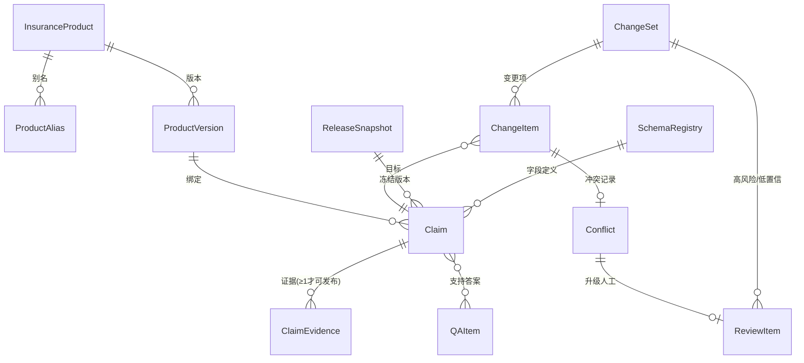

# 03 · 寿险知识模型设计

> [!WARNING]
> **本文地位（2026-07-29）：** Claim、Evidence、ChangeSet、冲突与版本语义仍是
> 可复用的领域设计输入；本文不再是 serving Release 数据层的唯一实现依据。
> 下文 `ReleaseSnapshot`、`CurrentRelease`、P-1 active alias、Projector 和旧
> publisher/reader 的 serving 语义均为历史设计。当前实现必须服从
> [Sole Serving Active Release Authority ADR](../superpowers/specs/2026-07-29-weknora-sole-serving-active-release-authority-adr.md)、
> [Authority Amendment 2](../superpowers/specs/2026-07-29-enterprise-llm-wiki-authority-amendment-2.md)
> 与适用 OpenSpec。
>
> - 架构边界与插件划分见 [02-architecture.md](02-architecture.md)；本文定义的所有对象**持久化在 Harness 自有 PostgreSQL schema 中**，不建表进 WeKnora 的数据库。
> - 抽取管道如何产出这些对象，见 [04-extraction-harness.md](04-extraction-harness.md)。
> - 术语与 master plan §3.2 保持一致；历史方案中的 Go/WeKnora 数据落点已由 ADR-001 废止，所有保险领域对象均落到 Harness 自有 schema，不得恢复旧落点。

---

## 1. 设计原则

1. **事实是一等公民，页面是权威消费投影**。内部语义与治理 SSOT 是 Claim + Evidence + ChangeSet + Revision + ReleaseSnapshot，不是可直接编辑的 Wiki 页面；当前 snapshot 编译出的 Wiki 与同快照 MCP 是人和 Agent 的默认消费权威。页面可重编、回滚、重新渲染；直接改页面不产生 ChangeSet 属于违规操作。
2. **每条事实必须可溯源**。没有 Evidence 的 Claim 不允许进入 `published` 状态。
3. **正确归属优先于自动化**。产品归属置信度不足的事实进 `unassigned` 候选池，不污染产品知识。
4. **权威度与有效期优先于内容完整度**。培训/销售材料再详细也不能覆盖正式条款。
5. **未抽取 ≠ 不存在**。所有字段采用三态（`present / absent_explicitly / unknown`），杜绝"没抽到豁免"被解读为"该产品无豁免"。
6. **一切变更经由 ChangeSet**。不存在绕过变更集的直接写入；自动裁决全部留痕、可翻案。
7. **所有身份与约束先按 Space 闭合**。本章所有领域对象都必须携带 `space_id`；外键、唯一键、幂等键、review key、release pointer 和查询条件必须包含 Space。下文若为可读性省略 `space_id`，不代表允许全局身份或跨 Space 关联。

---

## 2. 领域对象模型

### 2.1 对象总览



### 2.2 产品主数据（InsuranceProduct / ProductAlias / ProductVersion）

产品是知识归属的锚点。**产品身份用稳定 UUID，绝不用 Wiki 路径、slug 或产品名作身份**（名称会变、路径会调整）。

| 对象 | 关键字段 | 说明 |
|---|---|---|
| `InsuranceProduct` | `space_id`、`id`、`product_code`（Space 内唯一）、`canonical_name`、`category`（重疾/医疗/寿险/年金/意外/车险…）、`status`（在售/停售/归档）、`regulatory_filing_no`（监管备案号）、`business_owner` | 产品主数据，一个 Space 内一个产品一行；UQ(`space_id`, `product_code`) |
| `ProductAlias` | `space_id`、`product_id`、`alias`、`alias_type`（历史名/简称/别称/渠道名/口语名）、`source` | 实体对齐的确定性依据。抽取时先按 code/标准名/别名做确定性匹配，向量与弱模型只做候选召回与判别（master plan P0-1） |
| `ProductVersion` | `space_id`、`id`、`product_id`、`version_label`（如"2024版"）、`terms_revision`（条款修订号）、`effective_from`、`effective_to`、`channels[]`、`regions[]` | "同一产品不同条款版本"的载体。回答历史保单问题时按 `as_of_date` 选版本 |

### 2.3 Claim（事实）

一条 Claim = 一条可独立验证、可独立审核、可独立版本化的最小事实。

```yaml
Claim:
  space_id: uuid
  id: uuid
  subject_type: product_version | concept | product_concept   # 主语类型
  subject_ref:                       # 主语引用（实体ID，非名称）
    product_version_id: uuid | null
    concept_id: uuid | null          # 概念（如"在线问诊"），见第4节
  predicate: string                  # 属性或关系，取自 SchemaRegistry 字段字典（如 waiting_period_days / premium_waiver_insured）
  value_state: present | absent_explicitly | unknown   # 三态，见 2.3.1
  value: jsonb | null                # value_state=present 时必填；结构由 schema 字段类型约束
  effective_from: date | null       # 事实自身的生效期（如"2024-01-01 起等待期改为90天"）
  effective_to: date | null
  status: draft | candidate | published | superseded | retracted
  confidence: float                  # 抽取置信度（多证据一致会提升）
  extraction_method: llm | structured_import | manual | derived
  schema_version: string             # 抽取时依据的 schema 注册表版本串（如 v1.1+hash）；
                                     # schema_registry 表落库后升级为 schema_version_id uuid
  current_revision: int              # 修订号，见第5节
  current_revision_id: uuid           # 指向冻结 producer lineage 的同 Space ClaimRevision
  pending_judge: bool                # 历史字段名：多弱模型共识/人工审核未完成标记；为 true 时禁止自动通过门禁，强模型 queue 不得用于生产
```

**2.3.1 三态语义（必须严格执行）**

| 状态 | 语义 | 下游行为 |
|---|---|---|
| `present` | 文档明确给出该字段的值 | 正常发布、可被引用 |
| `absent_explicitly` | 文档**明确说没有**（如"本产品无投保人豁免责任"），本身要有 Evidence | 可发布；回答"该产品无 X" 必须引用这条，而不是引用"查无" |
| `unknown` | 未抽到，不知道有没有 | **禁止**发布为"无"；自动生成缺口任务（含候选证据与重试建议），进完整度矩阵的缺口格 |

**2.3.2 状态机**

```
draft ──(通过校验)──> candidate ──(字段审核/低风险候选准入)──> published(快照资格)
                          │                             │
                          └──(驳回)──> draft            ├─(被新版本取代)──> superseded
                                                        └─(来源撤回/证据失效)──> retracted
```

- `published` 只表示 Claim **具备进入快照的资格**；生产问答、Wiki、QA、关系与 MCP 只允许消费 WeKnora active alias 指向、approval 仍有效且 seal/manifest 核对一致的 `ReleaseSnapshot.claim_set`，本地 `CurrentRelease` 仅作 receipt 镜像。未被该快照收录的 `published` Claim 仍不得进入在线口径；`candidate`/`draft` 需显式授权才可见。
- `superseded` 保留全部内容与证据，指向取代它的 Claim（`superseded_by`），支撑历史问答与审计。

### 2.4 Evidence（证据）

```yaml
ClaimEvidence:
  space_id: uuid
  id: uuid
  claim_id: uuid
  source_revision_id: uuid    # Harness 冻结的 SourceRevision，所有 Evidence 必填
  provenance_kind: document | structured
  document:                   # provenance_kind=document 时必填
    knowledge_id: string      # WeKnora RAW 文档 ID
    chunk_id: string | null
    quote: text               # 必须能在冻结 revision/chunk 原文中回验
    location: {page, section, table_ref, timestamp_ms}
  structured:                 # provenance_kind=structured 时必填，跳过 docreader 但不跳 provenance
    source_system: string
    external_record_id: string
    source_revision: string
    content_hash: sha256
    json_pointer: string      # 或等价 CSV 行/列、FAQ key 定位器
    record_snapshot_hash: sha256
    value_snapshot: jsonb     # 冻结记录中该定位器的规范化值
  authority_level: int        # 来源权威等级，见第6节
  doc_role: terms | official_desc | approved_faq | internal_ops | training | sales | external   # 内容角色
  extraction_method: llm | structured_import | manual
  extracted_at: timestamptz
```

规则：
- 一条 Claim 可有多条 Evidence（多份文档相互印证 → `confidence` 上调）。
- 文档 Evidence 的 `quote` 必须回冻结 revision/chunk 匹配；结构化 Evidence 的 `content_hash + record_snapshot_hash + json_pointer/value_snapshot` 必须回冻结记录一致。任一失败都在入库前拦截，数据层再约束兜底。
- Evidence 是不可变历史，不物理删除或原地失效。来源删除/取代时追加 `EvidenceLifecycleEvent`（invalidated/superseded/retracted）并生成 ChangeSet；按**仍有效** Evidence 计数：还有其他权威证据则 Claim 保留，清零则 Claim 新 revision 转 `retracted`。
- `SourceRevision` 同样是 Space-scoped、append-only 的冻结输入：至少记录 `space_id/id/source_identity/provenance_kind/source_revision/content_hash/payload_snapshot_ref/ingest_trust_policy_id+version/observed_at`。`authority_level` 必须由已批准的来源注册与接入信任策略派生并冻结，分类模型只能建议 `doc_role`，不能授予或提升权威等级。

### 2.5 ChangeSet / ChangeItem / Conflict（变更集）

每一批导入（一份文档、一批 JSON、一次人工编辑）产生**一个 sealed、不可变的 ChangeSet 内容根**，是回滚与审计的基本单位。它的处理状态不原地改写，而由 append-only `ChangeDecisionEvent` 折叠成可重建投影。

```yaml
ChangeSet:
  space_id: uuid
  id: uuid
  idempotency_key: string     # 所有 kind 必填的规范键，不以 nullable provenance 字段充当唯一键
  source_batch:               # 触发来源
    kind: document | structured_import | manual_edit | recompile | rollback
    knowledge_ids: []         # 涉及的 WeKnora 文档
    external_record_id: string | null    # 结构化导入幂等键的一部分
    source_revision: string | null
  content_hash: sha256
  created_by: string          # 系统组件名或操作者
  created_at: timestamptz
  sealed_at: timestamptz

ChangeItem:
  space_id: uuid
  id: uuid
  change_set_id: uuid
  action: add | enrich | supersede | conflict | retract
  target_claim_id: uuid | null  # 比较时的现有 Claim；add 时为空，永不回填
  proposed: jsonb             # 提议的 Claim 内容（含证据引用）
  producer_lineage:           # tagged union；proposal_hash 覆盖全部 identity/receipt
    kind: compilation | structured_import | manual
    compilation: {job_id, stage_run_ids, attempt_ids, agent_receipt_ids, schema_identity, template_stack_identity, model_prompt_manifest_hash} | null
    structured_import: {source_revision_id, connector_identity, normalizer_identity, mapping_approval_id} | null
    manual: {actor, request_id, review_decision_id} | null
  proposal_hash: sha256

ChangeDecisionEvent:
  space_id: uuid
  id: uuid
  change_set_id: uuid
  aggregate_type: change_set | change_item
  aggregate_id: uuid          # 永不为空；item 分支必须同属 change_set_id
  event_type: proposed | auto_eligible | review_requested | approved | rejected | candidate_applied | rolled_back
  resulting_claim_id: uuid | null
  decision_basis:             # 固定六步的结构化 receipt；未执行的后续步骤显式 null
    identity_cmp: {product, product_version, subject, result}
    authority_cmp: {old_level, new_level, trust_policy_id, trust_policy_version, result}
    effective_time_cmp: {old_range, new_range, source_times, reliability, result}
    evidence_cmp: {old_evidence_ids, new_evidence_ids, quote_or_record_checks, result}
    weak_agent_receipt_ids: []
    human_review_decision_id: uuid | null
    completed_through_step: 1 | 2 | 3 | 4 | 5 | 6
  policy_identity: {id, version, content_hash}
  actor: string
  causation_id: string
  occurred_at: timestamptz
```

`idempotency_key` 按来源类型规范生成并持久化：document 绑定有序 `SourceRevision` 集合与输入 manifest；structured_import 绑定 connector/source/external record/revision；manual 绑定客户端 command/request id；recompile 绑定来源快照 + schema/template identities；rollback 绑定原 snapshot/change set + rollback command id。数据库使用 `UQ(space_id, kind, idempotency_key)`，不依赖 PostgreSQL 对 NULL 的默认唯一语义。`ChangeDecisionEvent` 使用 `UQ(space_id, aggregate_type, aggregate_id, event_type, causation_id)`，set/item 事件都不可产生 NULL 重试洞。

候选来源不能只存在日志里：`ChangeItem.producer_lineage` 的 scoped FK、receipt/identity manifest 与 `proposed` 共同进入 `proposal_hash`；应用后完整复制到不可变 `ClaimRevision.producer_lineage_manifest_hash` 及关联表。`Claim.current_revision_id` 只能指向同 Space 的该 revision。LLM 分支必须闭合到 job/stage/attempt/AgentReceipt 与冻结 schema/template/model/prompt/params；structured/manual 分支使用自己的 typed receipt，禁止伪造模型调用。

`ChangeSetStatus`、`ChangeItemDecision` 只是由事件计算的查询投影（pending/partially_applied/applied/rejected/rolled_back 等），可丢弃重建；不得作为独立真相源。模型意见只能通过不可变 `AgentReceipt` ID 进入第 5 步，禁止单一自由文本 `llm_verdict` 替代证据或六步顺序。

五种 action 的语义（与 master plan P0-4 一致）：

| action | 触发条件 | 默认处理 |
|---|---|---|
| `add` | 新事实，已有库中无同 (subject, predicate, 版本) | 低风险可按批准策略自动形成/应用为 `candidate` Claim；不等于生产发布 |
| `enrich` | 与现有 Claim 值一致，补充新证据 / 补 `unknown` 字段 | 可自动形成候选 revision，confidence 上调；仍随新 snapshot 走真人批准 |
| `supersede` | 新值取代旧值且裁决序判定新值胜出 | **高风险字段一律进审核**；低风险最多自动形成候选 revision，旧 Claim 只有进入已批准新 snapshot 后才退出当前口径 |
| `conflict` | 新旧值矛盾且裁决序无法自动分出胜负 | 生成 `Conflict` 记录，进 ReviewItem，**冲突未决的 Claim 不得进入生产问答** |
| `retract` | 来源删除/证据失效/人工撤回 | 按证据计数产生候选 retract revision；高风险/策略要求进审核，生产变化仍须 release 批准 |

### 2.6 ReviewItem（人工审核项）

审核模型按本项目权限与审计需求独立定义两个约束（不以受限上游实现为规格来源）：

1. **内容派生稳定 ID**：`review_key = hash(type :: 规范化主题 :: subject_ref)`。pipeline 重跑、文档重传时同一逻辑审核项不会重复出现，**已决状态不丢失**。
2. **受限动作集**：每个 ReviewItem 只允许枚举动作（如 `采纳新值 / 保留旧值 / 双值并存标注适用范围 / 退回重抽 / 驳回`），不允许自由文本动作，防止"审核意见无法执行"。

```yaml
ReviewItem:
  space_id: uuid
  id: uuid
  review_key: string              # 内容派生稳定ID；UQ(space_id, review_key)
  type: product_attribution | conflict | low_confidence | high_risk_change | schema_change | research_writeback
  subject: jsonb                   # 关联的 ChangeItem / Conflict / Claim
  allowed_actions: []              # 受限动作集
  risk_level: high | medium | low
  created_at: timestamptz

ReviewDecision:
  space_id: uuid
  id: uuid
  review_item_id: uuid
  action: string                   # 必须属于 allowed_actions
  actor: string
  reason: text
  subject_content_hash: sha256     # 审的是哪一版，漂移后旧决定失效
  decided_at: timestamptz
```

`ReviewItem` 与 `ReviewDecision` 都 append-only；open/resolved/dismissed 是可重建投影。最终责任主体是有权限的人。多个生产弱模型 Agent 可以提供带证据的结构化建议，但不能冒充审核人或直接关闭高风险项；低风险动作可以按批准策略自动形成 ChangeSet 候选并保留可翻案记录，但每个生产 ReleaseSnapshot 仍须经过授权人的 release 级最终批准。

### 2.7 Harness 运行对象与告警

一次编译不能只留日志。以下对象把“可恢复、多 Agent 多次尝试、预算、失败告警”变成持久合同：

```yaml
CompilationJob:                       # sealed 输入定义，不原地改业务身份
  space_id: uuid
  id: uuid
  source_revision_ids: []
  input_manifest_hash: sha256
  schema_identity: {id, version, content_hash}
  template_stack_identity: {layers: [{template_version_id, approval_id, content_hash, approval_hash, rights_receipt_hash}], content_hash}
  approved_model_pool: [{provider, model_id, deployment_id, identity_proof_hash}]
  budget_policy: {token_limit, cost_limit, attempt_limit, timeout}
  created_by: string
  created_at: timestamptz

StageRun:
  space_id: uuid
  id: uuid
  job_id: uuid
  stage: intake | route | extract | verify | validate | gapfill | merge | compile | publish_stage
  ordinal: int
  input_hash: sha256
  started_at: timestamptz

WorkerLease:                           # StageRun 的可重建租约投影；队列不是事实源
  space_id: uuid
  stage_run_id: uuid
  lease_generation: int               # 每次领取/重领单调递增
  fencing_token_hash: sha256
  owner_id: string
  acquired_at: timestamptz
  heartbeat_at: timestamptz
  expires_at: timestamptz

Attempt:
  space_id: uuid
  id: uuid
  job_id: uuid
  stage_run_id: uuid
  role: intake | router | extractor | gap | validator | consensus | merge
  admitted_model_identity: {provider, model_id, deployment_id, identity_proof_hash}
  prompt_hash: sha256
  params_hash: sha256
  reservation_id: string
  input_hash: sha256
  attempt_no: int
  lease_generation: int
  fencing_token_hash: sha256

AgentReceipt:                         # 每次成功/失败都写，不只记录“最终答案”
  space_id: uuid
  id: uuid
  attempt_id: uuid
  outcome: succeeded | retryable_failed | terminal_failed | uncertain
  output_hash: sha256 | null
  structured_output: jsonb | null
  evidence_candidate_ids: []
  token_usage: jsonb
  cost: decimal
  error_class: string | null
  completed_at: timestamptz

RuntimeEvent:
  space_id: uuid
  id: uuid
  aggregate_type: job | stage | attempt
  aggregate_id: uuid
  event_type: queued | lease_acquired | lease_renewed | lease_expired | lease_reclaimed | started | checkpointed | succeeded | retryable_failed | terminal_failed | awaiting_review | cancelled
  causation_id: string
  details_hash: sha256
  occurred_at: timestamptz

Alert:
  space_id: uuid
  id: uuid
  alert_key: string                    # UQ(space_id, alert_key)，同根因去重
  type: template_miss | attribution_ambiguous | evidence_broken | no_consensus | budget_exhausted | quality_regression | publish_failed
  severity: critical | high | medium | low
  context:                          # 版本化 typed object；不适用字段显式给 reason
    tenant_id: uuid
    job_id: uuid | null
    stage_run_id: uuid | null
    attempt_id: uuid | null
    source_revision_ids: []
    product_id: uuid | null
    product_version_id: uuid | null
    predicate: string | null
    page_or_artifact_ref: string | null
    evidence_ids: []
    schema_identity: {id, version, content_hash} | null
    template_stack_identity: {version_ids, approval_ids, content_hash} | null
    model_identity: {provider, model_id, deployment_id, identity_proof_hash} | null
    prompt_hash: sha256 | null
    change_set_id: uuid | null
    review_item_id: uuid | null
    release_snapshot_id: uuid | null
    attempted_path_receipt_ids: []
    attempt_count: int
    attempt_limit: int | null
    budget_snapshot_hash: sha256 | null
    not_applicable_reasons: {field_name: reason}
  error_code: string
  error_detail_hash: sha256
  blocking_effect: string
  suggested_actions: []
  created_at: timestamptz

AlertEvent:
  space_id: uuid
  id: uuid
  alert_id: uuid
  event_type: opened | claimed | escalated | resolved | reopened
  actor: string
  reason: text
  causation_id: string
  occurred_at: timestamptz

KnowledgeHealthSnapshot:
  space_id: uuid
  id: uuid
  release_snapshot_id: uuid
  template_stack_hashes: []
  metrics: jsonb
  gap_manifest_hash: sha256
  alert_manifest_hash: sha256
  computed_at: timestamptz
```

状态机均由 append-only event/receipt 折叠：Job `queued → running → awaiting_review | succeeded | failed | cancelled`；Stage/Attempt 失败只有在原 identity、预算与策略仍有效时可重试；Alert 未 resolved 前阻断范围不能被 UI 或 worker 私自清除。强模型 identity 不得进入 `approved_model_pool`；`NS-RIGHTS` 未记录、027 未 verified、未知/rolling identity、预算未预留或适用 admission 非 READY 时，必须在首次 provider 调用前失败并开 Alert。

Alert 不是任意 `subject_refs` JSON。每个 `type` 都有数据库/Pydantic 条件约束：例如 `template_miss` 必须带 schema/template/source/job/stage；`evidence_broken` 必须带 source/evidence/field；`publish_failed` 必须带 release/artifact/stage；budget/no-consensus 必须带 attempt/模型/prompt/尝试路径/预算。所有可能不适用的字段必须有明确 reason，不能因缺上下文而省略。`alert_key` 由 type + typed context identity + error code 规范生成。

Worker 领取 runnable StageRun 时使用单事务 `FOR UPDATE SKIP LOCKED`，递增 `lease_generation`、签发随机 fencing token 并追加 `lease_acquired`。续租、checkpoint、Attempt/AgentReceipt 写入、merge commit 和 terminal event 都必须以当前 `(stage_run_id, lease_generation, fencing_token_hash)` 条件更新；过期或被重领的 worker 即使稍后返回，也因 fence 不匹配被拒绝，不能合并迟到结果。崩溃、续租丢失、expiry/reclaim 与 stale-worker-after-merge 都必须有故障注入测试。

---

## 3. QA：一等知识对象（不是实体字段）

**决策（已定稿）**：QA 不做成产品实体的一个字段。理由：QA 生命周期与产品事实不同、会无限膨胀无法单独审核、答案会与事实口径分叉。

```yaml
QAItem:
  space_id: uuid
  id: uuid
  question: text
  question_intent: string          # 归一化意图（相似问合并的键）
  qa_kind: authoritative | derived
  answer: text
  supporting_claim_ids: []         # 答案必须由同一 ReleaseSnapshot.claim_set 支持，不允许纯 LLM 文本
  related_entities: []             # 产品/版本/概念，多对多
  effective_from/to, status, source_refs, quality_score
```

- **权威 QA**（`authoritative`）：来自已批准 FAQ 或人工确认的官方口径，有独立版本与审核状态。
- **派生 QA**（`derived`）：编译器从 Claim 自动生成；**支撑它的 Claim 更新时自动标脏并重编译**，从机制上消灭"事实改了、QA 还是旧答案"。
- 展示：产品页/概念页聚合渲染关联 QA——人看到的效果等同"QA 字段"，底层是关联。
- 检索：已发布 QA 作为高精度候选进入 RAG，仍过权限、版本、有效期过滤（master plan P1-2）。

---

## 4. 三层页面模型（人类友好的 Wiki 形态）

Wiki 页面是 Claim 的**编译投影**，服务于"像真实维基百科一样给人看"的需求（含义项消歧）。

```
┌────────────────────────────────────────────────┐
│ ① 概念主页（canonical）  例：在线问诊              │
│    - 通用定义、公司统一口径（来自 concept 级 Claim）│
│    - 跨产品差异对比表（编译器从各限定页聚合生成）      │
│    - ③ 义项索引：链向所有产品限定页                 │
└──────────────┬─────────────────────────────────┘
               │ 义项（消歧按"产品"维度，结构化、非自由文本）
     ┌─────────┴──────────┬───────────────────┐
┌────▼─────────┐  ┌───────▼──────┐  ┌─────────▼────┐
│ ② 产品限定页   │  │ ② 产品限定页    │  │ ② 产品限定页    │
│ 在线问诊@安心保 │  │ 在线问诊@平安福  │  │ 在线问诊@e生保  │
│ (facet page)  │  │              │  │               │
│ 承载具体事实：   │  │  各自独立的：   │  │               │
│ 次数/人群/除外  │  │  版本链        │  │               │
│ 全部来自Claim  │  │  来源引用       │  │               │
│               │  │  审核状态      │  │                │
└───────────────┘  └──────────────┘  └───────────────┘
```

规则：

1. **事实一律落在产品限定页层**（Claim 的 `subject_type = product_concept`）；概念主页只放概念级通用口径（`subject_type = concept`）和聚合内容。
2. 抽取出的每条事实必须携带 `(product_id, concept/predicate, evidence)` 才能入库——"一份文件涉及多个产品"的路由问题由此变成显式的实体对齐步骤，对齐不了进 `unassigned` 池。
3. 概念主页的差异对比表、义项索引由编译器生成，**不允许人工直接编辑**（改了也会被下次编译覆盖）；要改内容去改 Claim。
4. 产品实体页（如"安心保2024版"总览页）同理：从目标 `ReleaseSnapshot.claim_set` 中该产品版本的 Claim 按 schema 分组渲染，附同快照证据链接与 QA 聚合区。
5. 页面互链：正文 `[[slug]]` 由编译器在发布期注入（概念名→概念主页、产品名→产品页），死链在发布前校验。

---

## 5. 版本模型与回滚

两级版本，各管一件事：

### 5.1 Claim/页面级：revision 链

- 每次 ChangeItem 应用产生一条 `ClaimRevision`（不可变）：`{claim_id, revision_no, before, after, change_item_id, producer_lineage_manifest_hash, schema_identity, template_stack_identity, model_prompt_manifest_hash, receipt_ids, actor, reason, at}`。其中 producer 是 compilation/structured/manual tagged union；适用的 scoped FK 必须闭合到 `CompilationJob/StageRun/Attempt/AgentReceipt` 或对应 import/manual receipt，且全部被 revision content hash 覆盖。
- changelog 必含：**系统/操作者、时间、来源（ChangeSet→文档/批次）、变更前后值、合并原因、审核记录**（master plan P0-4 验收项）。
- Wiki 页面不单独维护语义版本——页面由 Claim 集合决定，页面"历史"即其支撑 Claim 集合的历史；发布器在 `page_metadata` 中记录本次渲染依据的 snapshot_id 与 claim 清单。

### 5.2 库级：ReleaseSnapshot（发布快照）

```yaml
ReleaseSnapshot:
  space_id: uuid
  id: uuid
  label: string                 # 如 2026-07-15-r1
  claim_set: 冻结的 (claim_id, revision_no) 集合   # 物化或按水位线记录
  qa_set: 冻结的 (qa_id, revision_no) 集合
  wiki_artifact_manifest: 内容寻址的页面产物（logical_slug/title/content/refs/metadata/hash）
  relation_manifest: 冻结的页面/实体关系及其 hash
  directory_manifest: 冻结的目录投影及其 hash
  mcp_read_manifest: MCP 可读对象、schema 与资源 hash
  index_generation: 本快照专属、未复用的检索索引 generation
  schema_identities: [{schema_id, version, content_hash}]
  template_stack_identities: [{template_id, version, content_hash}]
  model_identities: [{provider, model_id, deployment_id, identity_proof_kind, identity_proof_hash, prompt_hash, params_hash}]
  content_hash: sha256           # 覆盖以上全部 manifest 与 identity
  sealed_at: timestamptz
  sealed_by: string
  notes: text | null

ReleaseApproval:
  space_id: uuid
  id: uuid
  snapshot_id: uuid
  decision: approved             # 驳回记录在 ReleaseReviewDecision/ReviewItem，不伪装成 approval
  policy_id: string
  policy_version: string
  snapshot_content_hash: sha256  # 必须与被批准快照逐字节一致，变更后原批准失效
  approved_by: string            # 具备该 Space release 权限的真人身份
  approved_at: timestamptz
  valid_until: timestamptz | null  # 不可变策略期限；NULL 表示策略未设置期限，不表示不可撤销
  reason: text

ApprovalLifecycleEvent:
  space_id: uuid
  id: uuid
  approval_id: uuid
  event_type: revoked | expired
  authority: string                # 具备该 Space 撤销/到期执行权限的主体
  causation_id: string
  occurred_at: timestamptz
  details_hash: sha256

ReleaseEvent:
  space_id: uuid
  id: uuid
  snapshot_id: uuid
  event_type: staging_started | namespace_sealed | approval_attached | activation_requested | activated | activation_failed | superseded | rollback_preflight_passed | gc_authorized | gc_completed
  causation_id: string
  actor: string
  occurred_at: timestamptz
  details_hash: sha256

CurrentRelease:                     # 逻辑契约；在线 serving pointer 由 WeKnora P-1 active alias 承载
  space_id: uuid
  tenant_id: uuid
  wiki_kb_id: uuid                  # target KB；(tenant_id, wiki_kb_id) 只能绑定一个 Space
  snapshot_id: uuid
  approval_id: uuid
  active_release_id: string         # WeKnora release namespace identity
  manifest_hash: sha256
  provider_etag: string             # activate-release CAS 返回值
  activated_at: timestamptz
```

- `ReleaseSnapshot`、`ReleaseApproval`、`ApprovalLifecycleEvent` 与 `ReleaseEvent` 都是 append-only 不可变制品；snapshot 不保存可原地修改的 status/approval/published_at 字段，生命周期由事件折叠成可重建投影。任何 Claim/QA/页面/关系/目录/MCP/index/schema/template/model identity 变化都必须生成**新 snapshot、新 content_hash 与新人工批准**，不得复用旧批准。每个生产 snapshot 均须有授权人的最终批准，策略不能把该要求降级为纯模型或自动批准。在线读取、激活与回滚还必须检查 `valid_until` 和 lifecycle event，曾被批准不等于当前仍有效。
- active alias 的唯一地址是 `(tenant_id, target_wiki_kb_id)`；数据库强制 bound Space 的 `UQ(tenant_id, wiki_kb_id)`，publication capability 还强制 `UQ(tenant_id, staging_wiki_kb_id)`，target 与 staging 不同且都不可跨 Space 复用。staging/seal/activate/query 前逐次重验一一绑定。
- 发布采用 staging + seal + activation 协议：先把 Wiki 物化页、QA、关系、目录、MCP manifest 与独立索引 generation 写入 WeKnora P-1 的不可见 `release_id` namespace，并逐项回读/hash 校验；再调用 `seal-release(expected_write_etag, manifest_hash)`。平台须在同一原子操作中重算物理 namespace/index hash 并冻结写入；sealed release 禁止 PUT/DELETE，任何变化创建新 release。验证批准仍有效且 hash 匹配后追加 `activation_requested`，再调用 `activate-release(expected_active_release, release_id, manifest_hash)` 做一次 CAS；activate 再验证 release 所属 target KB、seal 与物理 hash。逐页写完、`draft` 状态或 Harness 本地事务都不等于上线。
- **唯一在线 serving identity 是 WeKnora P-1 的 `active_release_id + manifest_hash + ETag`**。普通页面 list/get/search/index/graph/RAG/UI 由平台默认过滤到该 namespace；MCP 每次请求先读取 active alias，再验证 Harness 中同 snapshot/hash 的 `ReleaseApproval`。本地 `current_release` 是该外部 alias 的审计/缓存镜像，不能单独决定在线版本；镜像、alias 或批准任一不一致时 MCP fail closed 并生成 blocking Alert，而不是返回另一个版本。
- staging、回读、批准或 alias CAS 失败时 active alias 保持原值，半成品对普通用户/Agent 不可见。若外部 alias 已成功而本地 ack/event 写入失败，reconciler 只依据 provider 返回的签名/ETag receipt 补记；不可反向猜测或回退 alias，MCP 在完成批准校验前拒绝回答。
- sealed/activated namespace、index generation 与内容制品不可变。当前 release 及所有仍有有效 rollback approval/保留资格的 release 必须 pin，禁止 GC。GC 只允许未激活失败 staging，或经授权人显式撤销回滚资格且已超过审计保留期的 release；先追加 `gc_authorized`，执行后记录被删制品 hash 与 provider receipt 的 `gc_completed`，活动 release 永不可删。
- 回滚 = 先逐项验证旧 release 的有效批准、seal receipt、页面/关系/目录/MCP manifest、内容制品和 index generation hash；缺失或漂移即 fail closed + blocking Alert，禁止重新调用模型生成。preflight 全绿后，才在相同 CAS 门禁下把 WeKnora active alias 原子切回该 namespace；所有投影随 serving identity 一起切换，不得只回滚其中一部分。
- **P-1 前 fail closed**：当前 WeKnora 逐页 REST 和页面状态不能隔离整套 staging。只能写 ACL 隔离、禁生产检索的 staging KB，并由 Harness 只读 current-release reader 预览/服务批准 snapshot；不得把直接 WeKnora Wiki UI 宣称为生产完成。
- 按批次回滚：`rolled_back` 的 ChangeSet 生成一个反向 ChangeSet（同样留痕），保证"回滚本身也可审计、也可再回滚"。
- 回滚后一致性要求（master plan P0-4 验收）：Claim、Wiki 页、QA、关系、目录、MCP、检索索引七者来自同一 snapshot；任何消费者发现 manifest/snapshot 不一致都必须 fail closed 并告警。

### 5.3 来源级：SourceHead / SourceEvent（021）

- 来源身份固定为 `(space_id, tenant_id, raw_kb_id, knowledge_id)`；不同 Space 即使
  `knowledge_id` 相同也互不影响。
- `SourceHead` 是当前已裁决 root，记录 revision、`generation | processed_at` ordering、
  `active | deleted` state 与 CAS version；所有 notify/import/delete/reactivate 共用同一
  PostgreSQL per-source advisory lock。
- `SourceEvent` 是 append-only 裁决账本，记录 before/after head、desired state、decision、
  causation 与业务聚合链接。stale、blocked、idempotent 也留审计事件，但不得执行不属于该
  decision 的业务写入。
- 同 identity 时 delete 胜过 active；旧 revision 不得复活；只有严格更新的 active revision
  可以把 deleted head re-activate。业务写入与 head/event 位于 caller-owned nested transaction，
  任一步失败整单回滚且调用方 Session 仍可继续使用。
- 无法可靠还原 ordering 的历史来源只产生唯一 open `SourceLifecycleBackfillIssue`，不猜 head；
  open issue 阻断正常 lifecycle，须在同一 source lock 下显式解决并留 resolution event。

---

## 6. 权威序与冲突裁决

### 6.1 来源权威等级（authority_level，数值越小越权威）

| 级 | doc_role | 示例 |
|---|---|---|
| 1 | 正式条款 / 监管文件 | 备案条款、监管批复 |
| 2 | 已批准的产品说明与官方 FAQ | 产品说明书、官网口径 |
| 3 | 内部流程与操作口径 | 核保/理赔操作手册 |
| 4 | 培训材料 | 讲师课件、话术培训 |
| 5 | 销售/宣传材料 | 宣传折页、推广文案 |
| 6 | 外部/研究材料 | 行业报告、Deep Research 结果 |

允许租户级策略微调，但 **1、2 级不可被下调**。等级 4-6 的内容默认只能作"辅助解释"，不能生成正式结论型 Claim（正式口径与辅助解释分离）。

### 6.2 冲突裁决序（固定顺序，逐级短路）

```
① 产品/版本身份：身份不同则分流到各自实体；身份不明进 unassigned/ReviewItem，不进入同一事实裁决
② 权威等级：同一产品版本内，高权威胜出（低权威新值不能 supersede 高权威旧值）
③ 可靠时间：同权威级别，再比较事实生效期；必要时比较受信来源发布时间，两边都必须可验证
④ Evidence 完整性：仅在①②③均同等时比较证据的明确性、定位与支持强度，不比较文案长短/内容丰富度
⑤ 弱模型共识：多个生产弱模型 Agent 独立比对双方证据，只产生建议 + 理由，写入 decision_basis
   （未形成共识、身份/证据不完整或模型不可用时保持 pending_judge，不得降级通过）
⑥ 人工审核：⑤仍不确定，或字段/变更属于高风险 → ReviewItem
```

- 高风险字段（豁免、等待期、除外、理赔限制、保额给付比例）**跳过字段级自动候选准入并直接进⑥**，无论前序比较结果如何；这与所有 snapshot 都要真人 release approval 是两层门禁。
- 所有系统比较/建议（①-⑤）写 `decision_basis` 全量留痕，审核台可翻案；翻案生成新的 ChangeSet。
- 冲突未决期间：WeKnora active alias 不移动，本地 `CurrentRelease` receipt 镜像不变，当前 snapshot 中旧 Claim 继续服务（生产不中断）；新值停在 `candidate`，冲突按权限在完整度矩阵与产品页上可见。

---

## 7. 与 WeKnora 的映射（发布契约）

发布器（Harness 的 publisher 模块）将编译产物写入 WeKnora「寿险知识 Wiki」知识库，只用公开 REST API：

| WikiPage 字段 | 填法 |
|---|---|
| `logical_slug` / 物理身份 | manifest 中的逻辑 slug 稳定派生：概念主页 `concept/{concept-slug}`；产品限定页 `product/{product_code}/{version_label}/{concept-slug}`；产品总览 `product/{product_code}/{version_label}/overview`。P-1 的物理唯一键为 `(wiki_kb_id, release_id, logical_slug)`；生产 GET 先解析 active alias，身份仍以 `space_id + entity ID + snapshot_id` 为准 |
| `folder` / 展示路径 | `products/{product-code}/{version}/...`（master plan P0-1 约定），概念主页挂 `concepts/...` |
| `source_refs` | WeKnora 展示兼容摘要：document 为 `<knowledge_id>|<文档标题>`；structured 为 `<source_system>|<external_record_id>|<source_revision>`。它不是完整 provenance 真相源 |
| `chunk_refs` | 仅聚合 document Evidence 的 chunk UUID；structured Evidence 不伪造 chunk，不要求该字段非空 |
| `page_metadata` | `{space_id, entity_ids, snapshot_id, snapshot_content_hash, artifact_hash, claim_ids, qa_ids, provenance_refs[], compiled_at, harness_version, schema_identities, template_stack_identities}`；`provenance_refs` 是 document/structured tagged union，structured 分支至少含 `source_revision_id/source_system/external_record_id/source_revision/content_hash/record_snapshot_hash/json_pointer` —— 回滚与追溯的关键 |
| `content` | 编译生成的 Markdown（含 `[[slug]]` 互链、证据脚注、QA 聚合区） |
| `release_id` / 可见性 | 所有页面写入 snapshot namespace；只有 active alias 指向且 manifest hash 与人工批准匹配的 release 可经普通 UI/RAG 展示。`status=draft/published` 不能替代 namespace 隔离 |

约束（对应 02-architecture.md 的平台补丁）：
- 该 KB 的 WeKnora 内置 wiki 自动 ingest 必须关闭（`ingest_mode: manual` 补丁），Harness 独占写入，避免 slug 争用。
- P-1 必须保证 staging namespace 对普通 list/get/search/index/graph/chunk/RAG/UI 全部不可见，并提供 release-scoped 幂等写、原子 seal、manifest 回读、active alias CAS/ETag、pin/GC 与 rollback；契约测试须注入第 N 页失败、索引失败、seal-vs-write/delete race、批准到激活 TOCTOU、跨 Space/KB、并发激活、ack 丢失、批准撤销和 GC 竞争。
- P-1 未落地时，单发布者、稳定 slug 逐页覆盖或逐页 `draft→published` 都不具备原子性，只允许用于 ACL 隔离的 staging KB，禁止写面向普通用户的生产 Wiki KB。
- MCP/API 返回 Evidence 时必须保留同一 tagged union 和 snapshot_id；前端可把 structured provenance 跳转到记录审计视图，而不是错误跳到文档 chunk。

---

## 8. Harness PostgreSQL Schema 草案

独立数据库（或独立 schema）`insurance_kb`，与 WeKnora 库物理/逻辑隔离。**以下所有主键候选、外键、唯一键、幂等键和部分索引都先包含 `space_id`**；子对象必须通过 `(space_id, parent_id)` 复合外键闭合，数据库拒绝跨 Space 引用。表格中为简洁未重复书写的字段也受该规则约束，禁止仅靠 service filter 补救。表清单：

| 表 | 关键字段 | 索引要点 |
|---|---|---|
| `insurance_products` | space_id, id, product_code, canonical_name, category, status, filing_no, owner | UQ(space_id, id)；UQ(space_id, product_code)；(space_id, canonical_name) trgm |
| `product_aliases` | space_id, id, product_id FK, alias, alias_type, source | FK(space_id, product_id)；(space_id, alias) trgm；UQ(space_id, product_id, alias) |
| `product_versions` | space_id, id, product_id FK, version_label, terms_revision, effective_from/to, channels[], regions[] | FK(space_id, product_id)；UQ(space_id, id)；UQ(space_id, product_id, version_label) |
| `concepts` | space_id, id, slug, canonical_name, definition_claim_id, aliases[] | UQ(space_id, id)；UQ(space_id, slug)；FK(space_id, definition_claim_id)；name trgm |
| `claims` | 见 2.3；+ superseded_by FK | 全部 subject/superseded FK 带 space_id；UQ **部分唯一索引** (space_id, subject identity, predicate, effective_from) WHERE status='published'——同 Space/主语/谓词/生效期只允许一条具快照资格的事实；NULL 维度使用规范化 generated key，不依赖 PostgreSQL 默认 NULL 不相等语义；(space_id, status) |
| `claim_revisions` | space_id, claim_id FK, revision_no, before/after jsonb, change_item_id, actor, at | UQ(space_id, claim_id, revision_no)；复合 FK 闭合 Claim/ChangeItem |
| `source_revisions` / `evidence_lifecycle_events` | 冻结原始输入与 Evidence 生命周期事件，见 2.4 | UQ(space_id, source identity, source_revision/content_hash)；append-only；所有事件 FK 带 space_id |
| `claim_evidence` | 见 2.4 | FK(space_id, claim_id/source_revision_id)；(space_id, knowledge_id)——来源删除时反查；append-only |
| `change_sets` / `change_items` / `change_decision_events` / `proposal_lineage_manifests` | 见 2.5；内容根、proposal、producer lineage 与决策事件全部 append-only | UQ(space_id, source_kind, idempotency_key)；proposal lineage 以 scoped FK 闭合 job/stage/attempt/receipt 或 import/manual receipt；event UQ(space_id, aggregate_type, aggregate_id, event_type, causation_id)，aggregate 永不为 NULL |
| `change_status_projection` / `conflicts` | 可重建的 ChangeSet/Item 状态投影；conflict root + append-only resolution events | (space_id, projected_status)；复合 FK 闭合 ChangeItem/Claim；open conflict 由事件投影，不在不可变 root 原地改 status |
| `review_items` / `review_decisions` / `review_status_projection` | 见 2.6；root/decision append-only，状态为可重建投影 | UQ(space_id, review_key)；decision FK(space_id, review_item_id)；(space_id, projected_status, risk_level) |
| `compilation_jobs` / `stage_runs` / `worker_lease_projection` / `attempts` / `agent_receipts` / `runtime_events` | 见 2.7；冻结输入、每阶段/尝试、租约 fencing、预算与结果 receipt | 全部 FK/UQ 带 space_id；lease generation 单调递增且 token 只存 hash；UQ(space_id, stage_run_id, role, attempt_no)；checkpoint/receipt/merge/terminal 写都条件匹配当前 fence；reservation/input/model/prompt identities 可回验；roots/events/receipts append-only，lease projection 可重建 |
| `alerts` / `alert_events` / `alert_status_projection` | 见 2.7；去重 root + 认领/升级/关闭事件 | UQ(space_id, alert_key)；event UQ(space_id, alert_id, event_type, causation identity)；open/blocking 按 Space 查询 |
| `knowledge_health_snapshots` | 绑定一个 ReleaseSnapshot 的不可变质量、缺口与告警清单 | UQ(space_id, release_snapshot_id, id/content_hash)；FK(space_id, release_snapshot_id) |
| `qa_items` (+`qa_revisions`) | 见第 3 节 | UQ(space_id, id/revision)；(space_id, question_intent) trgm；GIN(related_entities)，关联 Claim 必须同 Space |
| `schema_registry` / `schema_versions` / `template_packages` / `template_versions` / `template_approvals` / `template_lifecycle_events` / `current_template_versions` | Space-scoped 字段字典、四级模板栈及不可变内容/指标/golden/rights hash；真人批准、撤销/retire 事件与 CAS 当前指针 | UQ(space_id, schema_id, version_no/content_hash)；UQ(space_id, template_id, version/content_hash)；approval 绑定 version content/metrics/golden/rights hash；lifecycle event 防重；current UQ(space_id, template_id, scope_key)，只能指向仍有效批准 |
| `release_snapshots` + `snapshot_claims` + `snapshot_qa` + manifests | 见 5.2，所有成员关系带 space_id | UQ(space_id, id/content_hash)；sealed 后不可变；manifest FK/内容哈希同 Space 闭合 |
| `release_approvals` / `approval_lifecycle_events` / `release_events` / `release_seal_receipts` / `release_activation_receipts` / `release_retention_events` / `current_release` | 不可变人工批准及撤销/到期、seal、pin/GC、activation receipt；本地 current 是 WeKnora active alias 的镜像，不是独立 serving pointer | approval UQ(space_id, snapshot_id, snapshot_content_hash)；lifecycle/event UQ(space_id, root id, event_type, causation_id)；seal/activation receipt 冻结 target KB/release/manifest/index hash 与 provider ETag；current UQ(space_id)，且 bound Space UQ(tenant_id, wiki_kb_id)，仅可镜像有效批准和 verified receipt |
| `unassigned_pool` | 归属失败的候选事实 + 候选产品列表 + 失败原因 | (created_at)；处理后落 review_items |
| `gap_tasks` | unknown 字段生成的缺口任务：subject, predicate, 候选证据, 重试建议, status | (status)；完整度矩阵直接由 claims 三态聚合，本表只管"待补"工作流 |
| `flywheel_checkpoints`（015，迁移 0012） | 主动反馈飞轮按 Space/source 的安全水位：space_id, source_id, cursor | UQ(space_id, source_id)；与 observation/gap 同一事务最后推进 |
| `flywheel_observations`（015，迁移 0012） | 已处理 trace ledger：space_id, source_id, trace_id/timestamp, 脱敏问题, signals, alignment reason/entity, gap_id 可空 | UQ(space_id, source_id, trace_id)；gap 引用用 (space_id, gap_id) 复合 FK 闭合；未对齐队列按 Space 查询 |
| `knowledge_gaps`（015，迁移 0012） | 主动反馈缺口真相源：space_id, gap_key, product/field/concept 粒度, hit_count, 最近样例≤5, first/last_seen/resolved_at, status | UQ(space_id, gap_key)；apply 失败时与 observation/checkpoint 整批回滚 |
| `source_heads`（021，迁移 0006） | Space-scoped 来源当前 root：source identity、revision、ordering kind/value、active/deleted、CAS version、last_event_id | UQ(space_id, tenant_id, raw_kb_id, knowledge_id)；复合 FK 闭 Space；per-source advisory lock + CAS |
| `source_events`（021，迁移 0006） | append-only 来源裁决：input identity、desired state、decision、before/after head、causation、聚合链接 | UQ(source identity, causation_id)；PostgreSQL trigger 拒绝 UPDATE/DELETE；按 source/decided_at 查询 |
| `source_lifecycle_backfill_issues`（021，迁移 0006） | 无法从历史来源可靠推导 ordering 时的显式阻断项：observed revisions、open/resolved、resolution identity/event | 每 source 仅一个 open issue；resolver 与正常 lifecycle 共用 source lock，exact retry 返回原事件 |
| `suppressed_observations`（025 规划，迁移 0011） | 弱值门槛抑制的 root 不可变快照：space_id, change_set_id, product_version_id, predicate, existing_claim_id+existing_revision_no, 候选快照（value/value_state/value_hash）+ Evidence/来源身份（knowledge_id/source_revision）, 双方 authority/effective 区间, 特征向量/两分/comparator_version/rule_id, actor, proposal_fingerprint | UQ(space_id, change_set_id, proposal_fingerprint, existing_claim_id, existing_revision_no, comparator_version)——exact-once；Space 复合 FK 闭合；(change_set_id) 批次计数 |
| `suppressed_observation_events`（025 规划，迁移 0011） | 观察生命周期事件流：observation_id FK, event_type（suppressed/readjudicated/invalidated/source_superseded）, causation_id（基线 revision 变更/021 SourceEvent/change_set）, reason, occurred_at, ordering, event_fingerprint；状态仅由事件确定性折叠（invalidated/source_superseded 终态），无可改写 status 列 | UQ(space_id, observation_id, event_type, causation_id)——事件防重放；root 与首条 suppressed 事件同事务 |

通用约定：全表带 `created_at`；只有可丢弃重建的工作流投影、本地 alias 镜像和 CAS 当前模板指针带 `updated_at`。不可变表（source/evidence lifecycle、revisions + producer lineage、change_sets/items/decision events、template versions/approvals/lifecycle、snapshot manifests、release approvals/lifecycle/events/seal/activation/retention receipts、evidence、suppressed observations/events、Agent receipts）**无 UPDATE/DELETE 权限**（数据库角色与触发器双层强制，对齐 018 release_guard 模式）；所有跨表身份采用 `(space_id, entity_uuid)` 复合外键。`current_release` 仅可 CAS 镜像经过验证的 WeKnora active alias，每次变化都追加独立审计事件；任何在线读取不得只信本地镜像。

---

## 9. Schema 基线接入（预留）

用户侧将提供一批**初步 schema**（业务整理的字段清单），处理流程：

1. 业务方有权 schema + 领域专家/有权资料 + 经 provenance 审计的第一方工程元数据合并去重 → 新 `schema_registry` 基线；每字段标注险种适用范围、必填/条件必填、三态适用性、风险等级、同义词与 permitted source roles。迁移内容必须经过新 OpenSpec、留出集与人工批准；字段规则只能限制来源使用范围，不能授予 authority。
2. 编译器评估发现的重要缺失字段（如等待期重算、宽限期与效力中止、复效条件、减额缴清、犹豫期退费口径等）以**扩展提案**进入：字段名 + 来源依据（哪类文档哪章节支撑）+ 风险等级 + 抽取难度 → `schema_change` 类型 ReviewItem → 确认后并入新 schema 版本。
3. 抽取时模型产出的 schema 外字段一律走 **extras 候选通道**（不入正式 Claim），按第 2 步流程转正。
4. Schema 换版只产生**再编译计划**（哪些产品哪些字段需重抽），不隐式重写已发布知识（master plan P1-3）。

---

## 附：与 master plan 对象表（§3.2）的对应

| master plan 对象 | 本文落点 |
|---|---|
| 产品主数据与别名 | §2.2 `insurance_products` / `product_aliases` / `product_versions` |
| Claim | §2.3 `claims`（含三态与状态机） |
| Evidence | §2.4 `claim_evidence` |
| Change set | §2.5 `change_sets` / `change_items` / `conflicts` |
| Review item | §2.6 `review_items`（内容稳定ID + 受限动作集） |
| QA item | §3 `qa_items`（一等对象，Claim 支持答案） |
| SchemaRegistry / TemplatePackage / TemplateApproval | §8 `schema_registry/schema_versions/template_packages/template_versions/template_approvals/template_approval_events/current_template_versions`，接入流程见 §9 |
| CompilationJob / StageRun / Attempt / AgentReceipt / Alert | §2.7 与 §8 对应运行/告警表 |
| ClaimRevision / EvidenceLifecycleEvent | §2.3～2.4 与 §8 revision/lifecycle 表 |
| ReleaseSnapshot / WikiArtifact / ReleaseApproval / CurrentRelease | §5.2、§7 与 §8 release/manifests/pointer 表 |
| KnowledgeHealthSnapshot | §2.7 与 §8 `knowledge_health_snapshots` |
