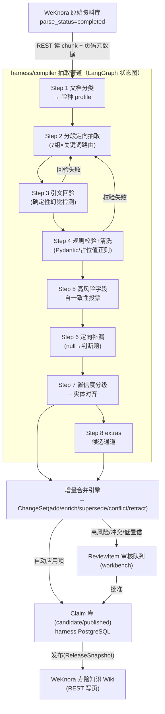

# 04 · 弱模型抽取 Harness 设计

> **本文定位**：`harness/compiler` 的核心工程设计——如何用 minimax 2.5 / qwen 3.6 / qwen-VL 级弱模型，通过 harness 结构逼近强模型直读文档的抽取效果。
>
> **与其他文档的关系**：
> - 本文产出的数据对象（Claim / Evidence / ChangeSet / 三态 / 裁决序）的定义**全部以 [03-knowledge-model.md](03-knowledge-model.md) 为准**，本文只描述"怎么生产它们"，不重复定义；
> - "逼近强模型"是否达标由 [05-golden-set-eval.md](05-golden-set-eval.md) 的金标评测判定，本文管道的每个可调参数（采样次数、阈值、profile）都以 eval 分数为调参依据；
> - 目录布局、与 WeKnora 的边界纪律见 [02-architecture.md](02-architecture.md) §3/§7。

---

## 0. 设计总纲：为什么弱模型 + Harness 能行

弱模型单次长输出的三个致命弱点：**长输出中途崩坏**（旧 pipeline "中间断了就断了"的根因）、**开放任务幻觉率高**、**隐性信息（如豁免）召回差**。Harness 的对策是把"一次大抽取"结构性拆解：

| 弱模型缺陷 | Harness 对策 | 落点 |
|---|---|---|
| 长输出不稳定 | 分段 + 每次调用只抽少量字段，输出永远短 | Step 2 |
| 幻觉 | 每字段强制原文引文 + **字符串回验（零成本确定性检测）** | Step 3 |
| 格式错误 | Pydantic 硬校验 + 对抗性解析器 + 重试 | Step 4 / §2 |
| 单次判断不可靠 | 高风险字段自一致性投票；DeepSeek v4 只在票不齐时当裁决 | Step 5 |
| 隐性字段抽不到 | 开放题改判断题：同义词检索候选 chunk → 定向提问 | Step 6 |
| 不知道自己不知道 | 三态输出 + 置信度分级路由，低置信绝不自动发布 | Step 7 |
| 要么乱发挥要么被 schema 框死 | extras 候选通道，字段可长大但不污染正式 schema | Step 8 |

**核心原则：确定性代码做一切能确定性做的事（切分、路由、校验、回验、合并、裁决序前四级），LLM 只出现在真正需要语义判断的节点，且每个 LLM 节点的输出都被确定性关卡验收。**

---

## 1. 管道总览



管道以**文档**为处理单元（一个文档一次 LangGraph run），以 **(tenant, kb, product_id, product_version)** 为合并分片单元。抽取阶段可全并行；合并阶段同分片串行（§5）。

---

## 2. 横切机制（先于八步说明，所有步骤共用）

### 2.1 LLM 调用规范

所有 LLM 调用经由统一的 `LLMGateway`（`harness/compiler/llm/`）：

- **输出短**：单次调用目标输出 ≤ 1.5K token；prompt 中明确字段数上限（每次 ≤ 8 个字段）。
- **重试**：指数退避（1s/4s/16s，抖动），网络/超时错误最多 4 次；**内容级失败**（解析不出、回验不过）换重试策略——第 2 次附上失败原因与错误片段，第 3 次缩小字段范围，3 次后该字段标 `unknown` 并生成缺口任务（见 03 §2.3.1），**绝不静默丢弃**。这是对 LLM-wiki-black "section 失败即丢弃、无重试"缺陷（其 `extractFromSection` catch 后仅 warn 返回空）的直接修正。
- **死信**：文档级连续失败进 `dead_letter_jobs` 表，可带原始输入重放；重放使用当时的 schema/model 快照。
- **温度**：抽取 0.1；投票采样 0.7（要多样性）；裁决 0。
- 每次调用记录 Langfuse trace（`knowledge_id` + `harness_job_id` 关联，见 02 §9）。

### 2.2 对抗性输出解析

LLM 结构化输出解析按**对抗性任务**处理（思想借鉴上游 llm_wiki 的 parseFileBlocks，Python 重写，不复制代码）：

- 逐行状态机解析，不用贪婪正则；容忍 CRLF、标记大小写/空格变体、代码围栏内的假标记；
- 首选让模型输出 JSON，但解析器同时接受"字段表格"降级格式（弱模型表格输出成功率高于嵌套 JSON——LLM-wiki-black 的 Group-Round 经验）；
- **截断检测**：输出末尾无终止标记/JSON 未闭合 → 判定截断，记 `parse_warnings` 表（不静默），触发内容级重试；
- 所有解析产物过 Pydantic 之后才允许进入下游。

### 2.3 险种 Profile（配置即行为）

Profile 是管道的"基因"，存 `extraction_profiles` 表（版本化，见 03 §8），每个险种一份：

```yaml
profile: critical_illness          # 重疾险（首期试点）
schema_fields: [...]               # 绑定 schema_registry 中的字段子集（BASE + CRITICAL_ILLNESS 组）
required_fields: [...]             # 必抽字段（缺失即缺口）
high_risk_fields: [premium_waiver_insured, premium_waiver_policyholder,
                   waiting_period, exclusions, claim_limits]   # 进入 Step 5 投票
group_keywords: {...}              # 7 组 × 关键词/正则路由表（继承自 LLM-wiki-black）
synonyms: {...}                    # 字段同义词库（Step 6 补漏检索用）
prompts: {...}                     # 各步 prompt 模板引用
quality_gates: {field_p: 0.9, evidence_acc: 0.95}   # 未达标的 profile 只产 candidate，禁自动发布
```

---

## 3. 八步管道详解

### Step 1 · 文档分类 → 险种 Profile 选择

| | |
|---|---|
| **输入** | 文档标题、目录页/前 3 页 chunk、文件名、WeKnora 元数据 |
| **输出** | `doc_type`（条款/产品说明书/费率表/FAQ/宣传材料/混合）+ `line_of_business`（重疾/医疗/寿险/年金/意外）+ 候选产品列表（初步）+ 选定 profile |
| **失败处理** | 分类置信度 < 阈值 → 文档进"待分类"审核队列，不进入抽取（**正确归属优先于自动化**，master plan 原则 1.2） |

实现：确定性规则优先（文件名模式、监管备案号正则、条款固定章节结构），LLM 只在规则无命中时兜底分类。`doc_type` 同时决定**来源权威等级**（03 §6.1），在源头绑定，后续裁决直接用。

### Step 2 · 分段定向抽取（管道主体）

| | |
|---|---|
| **输入** | 全文 chunk（带页码）+ profile |
| **输出** | 字段级候选值列表：`(field, raw_value, evidence_quote, chunk_id, page)` |
| **失败处理** | 单 section 失败按 §2.1 重试；重试尽后该 section 涉及字段标 `unknown` |

三层拆分，保证每次 LLM 调用又短又专：

1. **章节切分**（确定性）：按标题层级/条款序号切 section，目标 4~6K 字/段（LLM-wiki-black v2.3 的教训：25K→6K 后稳定性显著提升）；
2. **组路由**（确定性）：7 个抽取组按序处理（basic_info → coverage → cost_rules → exclusion_uw → claim_service → contract_admin → disease_definition，继承 GROUP_ORDER），每组用 `group_keywords` 正则过滤出相关 section——**无关 section 不调 LLM**（LLM-wiki-black 实测降 ~70% 调用量）；
3. **字段分批**（确定性）：组内字段按 ≤8 个/批切分，同一 section × 字段批 = 一次 LLM 调用。

prompt 要求：模型**只输出字段值 + 逐字引文 + 页码**，禁止输出解释和原文复述（原文由代码注入，避免模型转写引入错漏——继承"LLM 只出关键字段表格、原文 100% 代码注入"的经验）。

**多产品文档**：section 切分时同时做产品锚点检测（产品名/产品代码出现处），每个候选值携带 `product_candidates[]`；一个 section 归属多产品时字段值对每个候选产品分别成立或由 Step 7 对齐判定。

### Step 3 · 引文回验（本管道最重要的一道关卡）

| | |
|---|---|
| **输入** | Step 2 的候选值（含 evidence_quote、chunk_id） |
| **输出** | 通过：候选值 + 已验证 Evidence；不通过：打回 |
| **失败处理** | 回验失败 → 内容级重试（附"引文在原文中不存在"的反馈）；3 次不过 → 丢弃该候选值（宁缺勿假），字段回落 `unknown` |

**机制**：`evidence_quote` 必须能在所引 chunk 原文中做**归一化后子串匹配**（去空白/全半角/常见 OCR 混淆字符归一）。纯字符串操作，零模型成本，**确定性地杀掉"值是编的""引文是编的""张冠李戴引错位置"三类幻觉**。匹配成功才允许写 Evidence（03 §2.4 规定 Evidence 必须携带 quote + chunk_id + 页码，本步是其唯一生产入口）。

允许模糊度：OCR 文档开启编辑距离容差（≤ 5% 字符差异），并把匹配得分写入 Evidence 的 `extraction_method` 元数据。

### Step 4 · 规则校验 + 清洗

| | |
|---|---|
| **输入** | 回验通过的候选值 |
| **输出** | 类型化字段值（Pydantic 模型实例）或打回 |
| **失败处理** | 校验失败 → 内容级重试（附具体校验错误）；重试尽 → `unknown` + 缺口任务 |

- **Pydantic 硬校验**：字段类型、枚举值域、日期格式与合理区间（生效日不得晚于失效日）、数值区间（给付比例 0~100%、免赔额非负）、跨字段一致性（等待期天数 vs 文本描述）；
- **占位值清洗**：继承 LLM-wiki-black 的 30+ 正则（"未明确/未提及/N/A/详见费率表"等），命中即转 `unknown`（**不是空字符串**——三态纪律）；"详见 X"类命中额外记录指针供 Step 6 使用；
- **单位/格式归一**：金额、百分比、年龄段、日期统一规范化（结构化导入路径共用同一归一化器）。

### Step 5 · 高风险字段自一致性投票

| | |
|---|---|
| **输入** | profile `high_risk_fields` 中已产出候选值的字段 |
| **输出** | 投票后的值 + `agreement` 得分（写入 Claim.confidence 的构成项） |
| **失败处理** | 票不齐且裁决模型也无法定 → 该字段直接进审核队列 |

- 同一 (section, 字段) 用 temperature 0.7 **独立采样 3 次**（不同 prompt 变体：直接问 / 表格式 / 逐条款式）；
- 值语义等价判定用确定性归一比较（数值/枚举/日期），文本型字段用嵌入相似度 + 阈值；
- 3/3 一致 → 高置信；2/3 → 中置信，采纳多数；三票各异 → **DeepSeek v4 裁决**（输入三个候选 + 各自引文，输出选择及理由）；裁决仍不确定 → 审核队列。
- 成本控制：投票只作用于高风险字段（重疾 profile 约 12~18 个），非高风险字段单次采样。占比见 §7 成本模型。

### Step 6 · 定向补漏（豁免问题的正解）

| | |
|---|---|
| **输入** | 至此仍为 `unknown` 的 required 字段 |
| **输出** | `present`（补抽成功）/ `absent_explicitly`（明确说没有）/ 维持 `unknown` |
| **失败处理** | 维持 `unknown` → 自动生成缺口任务（候选证据 + 重试建议随附） |

把"开放抽取"改成"针对性判断题"——弱模型答判断题远比答开放题准：

1. **同义词检索**（确定性）：用 profile 同义词库（豁免 → 免交保险费/免除交费义务/保费豁免/无需再交…）对全文 chunk 做关键词 + BM25 检索，取 top-N 候选段落；Step 4 记录的"详见 X"指针也在此消解；
2. **定向判断**（LLM）：对每个候选段落问三选一判断题："该段落是否说明本产品【包含 / 明确不包含 / 未提及】投保人豁免责任？若包含或明确不包含，给出逐字引文"；
3. 回答仍走 Step 3 引文回验 + Step 5 投票（补漏字段天然多为高风险字段）；
4. **三态纪律**：所有候选段落都"未提及" → 字段维持 `unknown`，**绝不因"没找到"输出"无豁免"**（`absent_explicitly` 必须有自己的 Evidence，见 03 §2.3.1）。

### Step 7 · 置信度分级 + 实体对齐

| | |
|---|---|
| **输入** | 全部通过校验的字段值 |
| **输出** | Claim 草稿（绑定 product_id + product_version + confidence）分流：自动 → 合并引擎；存疑 → 审核队列 |
| **失败处理** | 产品对齐失败的事实进 `unassigned` 候选池，**禁止猜测归属** |

**置信度合成**（0~1）：引文匹配得分 × 投票一致度 × 校验通过质量 × 分类置信度 × 来源权威系数。阈值双档（写入 profile，由金标评测调）：`auto_threshold` 以上自动进入合并；以下进 ReviewItem（type=low_confidence）。

**实体对齐**（多产品文档的落点）：候选产品名/代码 → 产品主数据 + 别名表（03 §2.2）确定性匹配优先；无精确命中 → 向量召回候选 + LLM 判别；同分/低置信 → ReviewItem（type=product_attribution）。对齐结果决定 Claim 的 `subject_ref`。

### Step 8 · extras 候选通道

| | |
|---|---|
| **输入** | 抽取过程中模型标记的"重要但 schema 外"信息（prompt 允许每次调用附带 ≤2 条 extras 建议） |
| **输出** | `extras_candidates` 表记录：建议字段名、值、证据、出现频次 |
| **失败处理** | 无（本通道只进不出，不影响主管道） |

extras **不进 Claim 库、不进发布**。当同名建议字段跨文档出现 ≥ K 次，workbench 聚合成"schema 扩展提案"（附证据样本），人工确认后经 schema 版本流程转正（03 §9），下次编译才生效。既防模型乱发挥污染正式知识，也防 schema 成为天花板。

---

## 4. 增量合并引擎

抽取产物（Claim 草稿）**不直接写库**，一律经合并引擎生成 ChangeSet（03 §2.5 的五种 action 及自动/审核策略以 03 为准，此处只述引擎流程）：

1. 按分片键锁定：`(tenant, kb, product_id, product_version)`（§5）；
2. 逐 Claim 草稿与库内同 `(subject_ref, predicate)` 的现有 Claim 比对（值归一化后比较）：
   - 库内无 → `add`；
   - 值一致 → `enrich`（追加 Evidence，confidence 按证据数与权威度上调）；补 `unknown` 字段也是 `enrich`——**这就是"第二、三批材料自动补全第一批"的机制**；
   - 值不一致 → 走 03 §6.2 裁决序（权威等级 → 生效时间 → 完整度 → LLM 裁决 → 人工）。前三级为确定性比较；LLM 裁决用 DeepSeek v4 且必须输出依据引用；裁决出胜者 → `supersede`（高风险字段仍强制进审核），裁决不出 → `conflict`；
   - **弱值不覆盖强值**：新值信息量低于旧值（更粗略/更短/枚举父类）时忽略新值只做 `enrich` 证据追加——继承 shouldReplaceFieldValue / informationScore 思想，判定函数确定性实现 + 金标用例回归；
3. ChangeSet 不可变落库；自动应用项立即执行，其余进 ReviewItem。全部留痕可回滚（03 §5）。

---

## 5. 编排、并发与限流

### 5.1 LangGraph 状态图外壳

- 每文档一个 graph run，节点 = 上述 Step（含重试子环），**状态机是确定性的，LLM 只存在于节点内部**；节点间状态经 Pydantic 模型传递；
- **PostgreSQL checkpointer 持久化**：进程崩溃/升级后从断点恢复，不重跑已完成节点（直接治愈"中间断了就断了"）；
- **人工中断点**：Step 1 分类存疑、Step 7 归属存疑可配置为 interrupt 节点——暂停等 workbench 决策后恢复，graph 状态不丢；
- 任务分发：首期 FastAPI BackgroundTasks + DB 任务表（`compile_jobs`）即可；吞吐上来后平移到独立 worker + 队列（arq/Celery），graph 定义不变。

### 5.2 五级并发与限流

| 层级 | 控制 | 目的 |
|---|---|---|
| 全局 | harness 总并发 LLM 调用数 | 保护模型网关 |
| 租户 | 每租户配额 | 多租户公平 |
| KB | 每 KB 在途文档数 | 防单库淹没 |
| 产品分片 | `(tenant,kb,product_id,product_version)` 合并串行锁（PG advisory lock） | **不丢更新**；迟到的 worker 结果必须重新与最新库内值比较，不得盲目覆盖 |
| 模型 provider | 每 provider RPM/TPM 令牌桶 | 弱模型网关限流是常态 |

抽取阶段（Step 1~8）不同文档、同文档不同组全并行；只有合并阶段按分片串行。千份文档场景：不同产品完全并行，失败文档只影响自身分片。排队原因写入 `compile_jobs.blocked_reason`，workbench 可见。

### 5.3 与 WeKnora 的交互（经 `harness/adapters/weknora`）

1. **感知解析完成**：轮询 `parse_status`（间隔 30s，指数放宽）；上游 webhook 补丁合并后切事件驱动（02 §5 补丁 2）；
2. **读**：REST 拉 chunk（含页码/位置元数据）——Evidence 的 `chunk_id` 即 WeKnora chunk UUID，保证证据可跳转原文；
3. **写**：仅发布流程写 Wiki 页（03 §7 的发布契约），带 `source_refs`/`chunk_refs`/`page_metadata`；在乐观锁补丁（02 §5 补丁 1）合并前，**以"单发布者"纪律规避并发覆盖**：只有 release 流程的单一 worker 允许写生产 Wiki KB。

---

## 6. 编译优先级：几十万片段不全量编

编译是**按需、按优先级**的持续过程，不是一次性全量任务：

```
priority = 产品状态权重(在售 1.0 / 停售有存量保单 0.6 / 归档 0.2)
         × 风险权重(条款/核保/理赔类 1.5 / 说明书 1.0 / 宣传 0.5)
         × 流量权重(问答日志命中该产品的频次分位)
```

- 队列按 priority 出队；`unknown` 缺口任务与用户点踩/无法回答信号会**提升**对应产品的优先级（数据飞轮入口）；
- 归档级文档默认只入 WeKnora 原始资料库（可检索），不编译成 Claim，被查询命中且频次达阈值时才触发编译。

## 7. 成本估算模型

单文档 LLM 调用量（以 60 页重疾条款、~40 个 section、重疾 profile 78 字段为例）：

```
calls ≈ Σ_组( 命中section数 × ceil(组字段数/8) )        # Step 2，关键词路由后命中率~30%
      + 回验/校验重试 (~15% 打回率 × 1 次)               # Step 3/4
      + 高风险字段数 × (3 采样 + 0.2 裁决)               # Step 5
      + unknown必抽字段数 × topN(3) 判断题               # Step 6
      + 分类/对齐 (~3)                                   # Step 1/7
≈ 60~90 次调用，单次均值 in 3K + out 0.8K token
→ 单文档 ≈ 25~35 万 token（弱模型价位下可忽略；瓶颈是网关 RPM，见 §5.2）
```

此公式落地为 `harness/compiler` 的 dry-run 估算器：批量导入前给出预计调用数/token/时长，写入批次预检报告（对应 master plan P0-2 的 dry-run 要求）。参数（命中率、打回率）随金标评测与生产数据持续校准。

## 8. 技术栈与代码落点

- **FastAPI + Pydantic v2 + LangGraph(PG checkpointer) + PostgreSQL + httpx**；Langfuse 观测；
- 代码位于 `harness/compiler/`（目录布局见 02 §7）：`pipeline/`（八步节点）、`llm/`（Gateway/解析器/prompt 模板）、`merge/`（合并引擎）、`profiles/`（险种 profile YAML）、`adapters/` 引用 `harness/adapters/weknora`；
- **TDD 要求**：确定性组件（切分、路由、回验、清洗、informationScore、裁决序前四级）全部单测先行；LLM 节点用录制回放（vcr 式 fixture）测试；管道端到端用金标文档做集成测试，quality_gates 未达标的 profile 在 CI 中禁止开启自动发布。

## 9. 首期交付切片（对齐 02 §6 的 S0~S3）

1. **S0 前置**：本管道的 dry-run 估算器 + 确定性组件（切分/路由/回验/清洗）可独立交付并先行测试；
2. **S1**：Step 1/2/3/4/7（分类、抽取、回验、校验、对齐）跑通重疾试点，产出 candidate Claim；
3. **S2**：Step 5/6/8 + 合并引擎 + ChangeSet；
4. **S3**：审核回路 + 发布到 WeKnora Wiki + 回滚演练。
