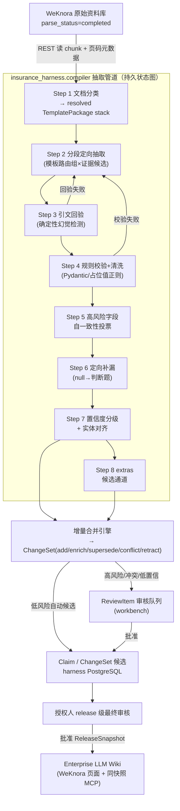

# 04 · 弱模型抽取 Harness 设计

> [!CAUTION]
> **本文是企业目标架构，不等于现有旧管道已经获得生产准入。** 项目权利人已确认 `LLM-wiki-black` 为第一方完整著作权资产，可按 provenance 把其 TypeScript 能力选择性迁移/重构到统一 Python Harness；原 TS 不作为第二套生产 runtime。`nashsu/llm_wiki` 等第三方资产仍单独遵守许可证。旧 004/006/024 只有在 027 模型硬门禁、028 新运行时合同和 030 MVP slice 验收通过后，才能作为生产能力使用。
>
> **本文定位**：`harness/src/insurance_harness/compiler/` 的核心工程设计——如何只用 MiniMax M2.5 / Qwen 3.x / Qwen-VL 级生产弱模型，通过模板、多 Agent、持久 attempt/checkpoint、证据回验与人工门禁逼近离线金标质量。强模型不能成为生产 fallback、judge 或发布前置。
>
> **与其他文档的关系**：
> - 本文产出的数据对象（Claim / Evidence / ChangeSet / 三态 / 裁决序）的定义**全部以 [03-knowledge-model.md](03-knowledge-model.md) 为准**，本文只描述"怎么生产它们"，不重复定义；
> - 是否逼近已批准离线金标由 [05-golden-set-eval.md](05-golden-set-eval.md) 判定，本文管道的每个可调参数（采样次数、阈值、TemplatePackage）都以冻结 eval 制品和分数为调参依据；
> - 目录布局、与 WeKnora 的边界纪律见 [02-architecture.md](02-architecture.md) §3/§7。

---

## 0. 设计总纲：为什么弱模型 + Harness 能行

弱模型单次长输出的三个致命弱点：**长输出中途崩坏**（旧 pipeline "中间断了就断了"的根因）、**开放任务幻觉率高**、**隐性信息（如豁免）召回差**。Harness 的对策是把"一次大抽取"结构性拆解：

| 弱模型缺陷 | Harness 对策 | 落点 |
|---|---|---|
| 长输出不稳定 | 分段 + 每次调用只抽少量字段，输出永远短 | Step 2 |
| 幻觉 | 每字段强制原文引文 + **字符串回验（零成本确定性检测）** | Step 3 |
| 格式错误 | Pydantic 硬校验 + 对抗性解析器 + 重试 | Step 4 / §2 |
| 单次判断不可靠 | 高风险字段由多个弱模型 Agent 独立取证；票不齐或无共识时阻断自动候选推进并进入人工审核 | Step 5 |
| 隐性字段抽不到 | 开放题改判断题：同义词检索候选 chunk → 定向提问 | Step 6 |
| 不知道自己不知道 | 三态输出 + 置信度分级路由，低置信绝不自动推进；任何生产 release 均须真人批准 | Step 7 |
| 要么乱发挥要么被 schema 框死 | extras 候选通道，字段可长大但不污染正式 schema | Step 8 |

**核心原则：确定性代码做一切能确定性做的事（切分、身份锚定、规范化、类型/引文校验、权威度与有效期比较、幂等合并），弱模型只出现在真正需要语义判断的节点，且只产带证据的候选/建议。多弱模型共识不是确定性组件；无共识必须阻断并进入 ReviewItem。**

---

## 1. 管道总览



文档抽取路径以一个冻结 `SourceRevision` 为处理单元；结构化直入有自己的确定性验证节点但汇合到同一 ChangeSet/merge。合并分片身份固定为 **`(space_id, subject_type, subject_id)`**，产品事实通常是 `(space_id, product_version_id)`；锁、幂等键、查询和迟到结果重比较都使用同一复合身份。抽取阶段可全并行；同分片合并串行（§5）。

---

## 2. 横切机制（先于八步说明，所有步骤共用）

### 2.1 LLM 调用规范

所有 LLM 调用经由统一的 `LLMGateway`（`harness/src/insurance_harness/compiler/llm.py`；后续拆包也保持单一公开 gateway）：

- **输出短**：单次调用目标输出 ≤ 1.5K token；prompt 中明确字段数上限（每次 ≤ 8 个字段）。
- **重试**：指数退避（1s/4s/16s，抖动），网络/超时错误最多 4 次；**内容级失败**（解析不出、回验不过）换重试策略——第 2 次附上失败原因与错误片段，第 3 次缩小字段范围，3 次后该字段标 `unknown` 并生成缺口任务（见 03 §2.3.1），**绝不静默丢弃**。
- **死信**：文档级连续失败追加 terminal `RuntimeEvent` 并生成 blocking Alert；重放创建引用原 `CompilationJob` identity 的新 StageRun，使用原 source/schema/template/model identity，不能覆写旧 job。
- **温度**：抽取 0.1；投票采样 0.7（要多样性）；裁决 0。
- 每次调用先写 durable Attempt/预算 reservation，结束后写不可变 AgentReceipt；Langfuse trace 只是可选观测副本，以 `(space_id, job_id, attempt_id)` 关联，绝不能代替本地 receipt 或影响恢复。

### 2.2 对抗性输出解析

LLM 结构化输出解析按**对抗性任务**独立设计；不以受限上游函数、格式或实现表达作为规格来源：

- 逐行状态机解析，不用贪婪正则；容忍 CRLF、标记大小写/空格变体、代码围栏内的假标记；
- 首选让模型输出 JSON；是否允许简化字段表格格式由当前生产弱模型的独立 golden A/B 决定，解析格式本身也进入 TemplatePackage identity；
- **截断检测**：输出末尾无终止标记/JSON 未闭合 → 判定截断，写入 AgentReceipt.error_class + RuntimeEvent（不静默），触发内容级重试；
- 所有解析产物过 Pydantic 之后才允许进入下游。

### 2.3 四级 TemplatePackage（配置即行为）

本节以[北极星设计 §6](../superpowers/specs/2026-07-21-enterprise-llm-wiki-north-star-design.md)为准。历史“每个险种一份 Profile”和 006 的文档族 fast path 都只是完整模板体系的局部层，不得被视为 TemplatePackage 已整体实现。

> **当前门禁**：004/routing/cleaning 是可审计的第一方迁移输入，但历史分数、接口和运行路径不证明当前生产质量。执行 PR 必须记录 source commit/path，并按 027/028 重构；027 未 verified、适用 admission 未 READY 前不得用任何旧或新资产生成真实生产候选。

运行时按固定顺序叠加四层批准版本：

```text
generic-insurance
  → line-of-business（寿险/年金/医疗/重疾/意外/护理…）
  → document-type（条款/说明书/FAQ/费率表/培训/监管…）
  → product-family（同版式/同产品族的可选专门化）
```

后一层只能收紧/专门化前层，不得放松证据、风险或人工审核门禁；字段/validator/来源准入策略冲突、层版本未批准或适用范围不明确时 fail closed，并产生模板告警。模板只能限制“哪些已注册来源角色可用于哪些字段”，不能自行给来源授予或提升权威等级；权威等级只来自 Space 内已批准、版本化的 ingest trust policy。最终解析结果以内容哈希形成 `template_stack_identity`，写入每个 CompilationJob、AgentReceipt、Claim 候选和 ChangeSet。

`TemplatePackage` 不是 prompt 别名，而是完整可发布制品：

```yaml
template_package:
  id: critical-illness-terms
  version: 1.2.0
  extends: [generic-insurance@2, critical-illness@4, terms@3]
  scope: {line_of_business: critical_illness, doc_type: terms, product_family: null}
  schema:
    fields: [...]
    required_fields: [...]
    high_risk_fields: [premium_waiver_insured, waiting_period, exclusions, claim_limits]
    three_state_policy: present_absent_unknown
  routing: {task_partition_policy: {...}, evidence_locator_policy: [...], product_assignment_policy: [...]}
  prompts: {intake: ..., extract_groups: {...}, gap: ..., consensus: ...}
  validators: {types: [...], cross_field: [...], normalizers: [...]}
  evidence_policy: {required: true, permitted_source_roles: [...], trust_policy_ref: ingest-trust@7, quote_match: exact_or_normalized}
  attempts: {max_per_field: 3, consensus: 3, token_budget: ..., timeout_seconds: ...}
  quality_gates: {field_p: 0.9, evidence_acc: 0.95, contamination_max: 0.0}
  alerts: {template_miss: block, no_consensus: block, budget_exhausted: block}
  golden: {release: gs-v1.0, slices: [...], approved_metrics: {...}}
  rights_receipt_hash: sha256
  content_hash: sha256
```

模板内容与批准分离，禁止在可修改 YAML 中写 `status: approved`：

```yaml
TemplateApproval:
  space_id: uuid
  id: uuid
  template_version_id: uuid
  template_content_hash: sha256
  metrics_manifest_hash: sha256
  golden_slice_manifest_hash: sha256
  rights_receipt_hash: sha256
  approved_by: string              # 具备模板批准权限的真人
  approved_at: timestamptz
  reason: text

TemplateLifecycleEvent:
  space_id: uuid
  approval_id: uuid
  event_type: revoked | retired
  actor: string
  causation_id: string
  occurred_at: timestamptz

CurrentTemplateVersion:
  space_id: uuid
  template_id: uuid
  scope_key: string
  template_version_id: uuid
  approval_id: uuid
  pointer_etag: string
```

`TemplateVersion`、批准与 lifecycle event 全部 append-only，版本 content hash 覆盖 schema、路由、prompt、validator、Evidence/attempt/quality/alert 策略、golden 指标和 rights receipt。`CurrentTemplateVersion` 只能用 expected ETag CAS 到内容 hash 完全匹配、批准仍有效的版本；撤销/retire 后新 job 不得解析到它，运行中的 job 仍保留冻结 identity 但不能在批准失效后进入 merge/release。任何内容、指标、golden 或权利状态变化都创建新版本并重新由真人批准。

TemplatePackage stack 在执行前解析：专用层 miss 时只选择已批准上层，不算一次运行时失败。进入运行后，固定失败阶梯为：重定位/重切分 → 针对缺口缩小上下文并定向补抽 → 多弱模型 Agent 独立尝试 → 通用 schema-driven agentic 路径 → 仍失败或预算耗尽时停止自动候选并生成 Alert + ReviewItem。禁止自由生成、强模型 fallback 或静默空结果。

所有阶段的 terminal failure 都必须先追加 `RuntimeEvent`，再按冻结 `alerts` 策略产生可去重、可认领的 Alert；required/high-risk 字段、来源/身份、Evidence、预算、产品归属、模板或发布前置失败一律是 blocking Alert，并同时生成 ReviewItem。非关键可选字段可以生成 warning Alert + GapTask，但也不得以空值伪装成功。

---

## 3. 八步管道详解

### Step 1 · 文档分类 → TemplatePackage stack 解析

| | |
|---|---|
| **输入** | 文档标题、目录页/前 3 页 chunk、文件名、WeKnora 元数据 |
| **输出** | 候选 `doc_role/doc_type`（条款/产品说明书/费率表/FAQ/宣传材料/混合）+ `line_of_business`（重疾/医疗/寿险/年金/意外）+ 候选产品列表（初步）+ 四级 `resolved_template_stack` 与内容哈希；另附分类证据和置信度，不输出 authority_level |
| **失败处理** | 分类置信度 < 阈值 → blocking Alert + “待分类” ReviewItem，文档不进入抽取（**正确归属优先于自动化**） |

实现：确定性规则优先（文件名模式、监管备案号正则、条款固定章节结构），弱模型只在规则无命中时提供分类候选。`authority_level` **不由文件内容、文件名、分类模型或 TemplatePackage 决定**，而是在接入时由已批准的来源注册、签名/连接器身份和版本化 ingest trust policy 绑定；分类结果只能保持或降低可用范围，绝不能把宣传/培训材料“识别”为条款后提升权威。来源身份或策略无法验证时默认最低权威、阻断正式结论，并生成 Alert + ReviewItem。

### Step 2 · 分段定向抽取（管道主体）

| | |
|---|---|
| **输入** | 全文 chunk（带页码）+ resolved TemplatePackage stack |
| **输出** | 字段级候选值列表：`(field, raw_value, evidence_quote, chunk_id, page)` |
| **失败处理** | 单 section 失败按 §2.1 重试；重试尽后相关字段标 `unknown`，追加 RuntimeEvent；required/high-risk 产生 blocking Alert + ReviewItem，其余产生 warning Alert + GapTask |

三层拆分，保证每次 LLM 调用又短又专：

1. **章节切分**（确定性）：按标题层级/条款序号切 section，初始目标 4~6K 字/段；具体上限由 provider capability probe 与各 TemplatePackage golden slice 标定并冻结；
2. **组路由**（确定性）：SchemaRegistry 按字段依赖、证据角色和风险生成短任务组，TemplatePackage 只提供经来源/provenance 与质量门禁批准的章节及术语线索；无候选证据的 section 不调用模型。组数、名称和顺序是新系统的版本化设计；允许从第一方 LLM-wiki-black 选择性迁移，但必须记录 source commit/path、映射到当前 schema，并以 Golden Slice 冻结新版本；
3. **字段分批**（确定性）：组内字段按 ≤8 个/批切分，同一 section × 字段批 = 一次 LLM 调用。

prompt 要求：模型**只输出字段值 + 逐字引文 + 页码**，禁止输出解释和原文复述；原文由代码注入，避免模型转写引入错漏。该行为由独立 evidence 测试验证，不以旧实现表达为来源。

**多产品文档**：section 切分时同时做产品锚点检测（产品名/产品代码出现处），每个候选值携带 `product_candidates[]`；一个 section 归属多产品时字段值对每个候选产品分别成立或由 Step 7 对齐判定。

### Step 3 · 引文回验（本管道最重要的一道关卡）

| | |
|---|---|
| **输入** | Step 2 的候选值（含 evidence_quote、chunk_id） |
| **输出** | 通过：候选值 + 已验证 Evidence；不通过：打回 |
| **失败处理** | 回验失败 → 内容级重试；3 次不过 → 候选隔离、字段回落 `unknown`、RuntimeEvent + Alert；required/high-risk 同时进入 ReviewItem，禁止把失败引文写成 Evidence |

**机制（文档 Evidence 入口）**：`evidence_quote` 必须能在所引冻结 revision/chunk 原文中做**归一化后子串匹配**（去空白/全半角/常见 OCR 混淆字符归一）。纯字符串操作，零模型成本，**确定性地杀掉“值是编的”“引文是编的”“张冠李戴引错位置”三类幻觉**。匹配成功才允许写 document Evidence。结构化直入不经过本步，但必须由独立确定性 verifier 校验 `source_revision + content_hash + record_snapshot_hash + json_pointer + value_snapshot` 后才能写 structured Evidence（03 §2.4）；跳过 docreader 绝不等于跳过 provenance 回验。

允许模糊度：OCR 文档仅在 TemplatePackage 明确批准时开启编辑距离容差（≤ 5% 字符差异），并把匹配得分与 normalization rule version 写入 Evidence 校验 receipt；`extraction_method` 仍只表示 llm/structured_import/manual 等来源方式。

### Step 4 · 规则校验 + 清洗

| | |
|---|---|
| **输入** | 回验通过的候选值 |
| **输出** | 类型化字段值（Pydantic 模型实例）或打回 |
| **失败处理** | 校验失败 → 内容级重试；重试尽 → `unknown` + GapTask + RuntimeEvent/Alert；required/high-risk 同时阻断并进 ReviewItem |

- **Pydantic 硬校验**：字段类型、枚举值域、日期格式与合理区间（生效日不得晚于失效日）、数值区间（给付比例 0~100%、免赔额非负）、跨字段一致性（等待期天数 vs 文本描述）；
- **占位值清洗**：可审计并选择性迁移第一方 LLM-wiki-black 的占位/资料指针/弱值规则、字段表、映射、prompt、正则与测试向量；迁移项必须按 [06](06-asset-migration.md) 记录 provenance，适配当前三态和 Claim/Evidence 合同，并由独立业务样本验证。命中缺失或资料指针语义时转 `unknown`（**不是空字符串**）；资料指针另存结构化引用供 Step 6 消解；
- **单位/格式归一**：金额、百分比、年龄段、日期统一规范化（结构化导入路径共用同一归一化器）。

### Step 5 · 高风险字段自一致性投票

| | |
|---|---|
| **输入** | resolved TemplatePackage stack 的 `schema.high_risk_fields` 中已产出候选值的字段 |
| **输出** | 投票后的值 + `agreement` 得分（写入 Claim.confidence 的构成项） |
| **失败处理** | 多弱模型 Agent 票不齐、证据不一致或无法形成共识 → blocking Alert + ReviewItem，停止该字段自动候选推进 |

- 同一 (section, 字段) 用 temperature 0.7 **独立采样 3 次**（不同 prompt 变体：直接问 / 表格式 / 逐条款式）；
- 值语义等价判定用确定性归一比较（数值/枚举/日期），文本型字段用嵌入相似度 + 阈值；
- 3/3 一致且引文均通过回验 → 高置信候选；2/3 → 中置信候选并按字段风险决定是否审核；三票各异或证据不一致 → **停止自动候选推进并进入审核队列**。多个 Agent 只能提供建议，不能替代人对高风险字段的最终审核或 release 批准。
- 成本控制：投票只作用于解析后模板栈中的高风险字段（重疾险通常约 12~18 个），非高风险字段单次采样。占比见 §7 成本模型。

### Step 6 · 定向补漏（豁免问题的正解）

| | |
|---|---|
| **输入** | 至此仍为 `unknown` 的 required 字段 |
| **输出** | `present`（补抽成功）/ `absent_explicitly`（明确说没有）/ 维持 `unknown` |
| **失败处理** | 维持 `unknown` → GapTask + RuntimeEvent；required/high-risk 产生 blocking Alert + ReviewItem，其余产生 warning Alert |

把"开放抽取"改成"针对性判断题"——弱模型答判断题远比答开放题准：

1. **同义词检索**（确定性）：用 resolved TemplatePackage stack 的同义词库（豁免 → 免交保险费/免除交费义务/保费豁免/无需再交…）对全文 chunk 做关键词 + BM25 检索，取 top-N 候选段落；Step 4 记录的"详见 X"指针也在此消解；
2. **定向判断**（LLM）：对每个候选段落问三选一判断题："该段落是否说明本产品【包含 / 明确不包含 / 未提及】投保人豁免责任？若包含或明确不包含，给出逐字引文"；
3. 回答仍走 Step 3 引文回验 + Step 5 投票（补漏字段天然多为高风险字段）；
4. **三态纪律**：所有候选段落都"未提及" → 字段维持 `unknown`，**绝不因"没找到"输出"无豁免"**（`absent_explicitly` 必须有自己的 Evidence，见 03 §2.3.1）。

### Step 7 · 置信度分级 + 实体对齐

| | |
|---|---|
| **输入** | 全部通过校验的字段值 |
| **输出** | Claim 草稿（绑定 product_id + product_version + confidence）分流：自动 → 合并引擎；存疑 → 审核队列 |
| **失败处理** | 产品对齐失败的事实进 `unassigned` 候选池并产生 blocking Alert + ReviewItem，**禁止猜测归属** |

**置信度合成**（0~1）：引文匹配得分 × 投票一致度 × 校验通过质量 × 分类置信度。抽取置信度与来源权威度是两条独立轴：前者描述“是否抽对”，后者只参与准入与冲突裁决，禁止互相替代。阈值双档写入 resolved TemplatePackage stack 并由冻结金标评测标定：`auto_threshold` 以上可自动进入 ChangeSet 比较；以下进 ReviewItem（type=low_confidence）。无论哪档都不能直接进入生产 snapshot。

**实体对齐**（多产品文档的落点）：候选产品名/代码 → 产品主数据 + 别名表（03 §2.2）确定性匹配优先；无精确命中 → 向量召回候选 + LLM 判别；同分/低置信 → ReviewItem（type=product_attribution）。对齐结果决定 Claim 的 `subject_ref`。

### Step 8 · extras 候选通道

| | |
|---|---|
| **输入** | 抽取过程中模型标记的"重要但 schema 外"信息（prompt 允许每次调用附带 ≤2 条 extras 建议） |
| **输出** | `extras_candidates` 表记录：建议字段名、值、证据、出现频次 |
| **失败处理** | 无（本通道只进不出，不影响主管道） |

extras **不进 Claim 库、不进发布**。当同名建议字段跨文档出现 ≥ K 次，workbench 聚合成"schema 扩展提案"（附证据样本），人工确认后经 schema 版本流程转正（03 §9），下次编译才生效。既防模型乱发挥污染正式知识，也防 schema 成为天花板。

---

## 4. 增量合并引擎

抽取产物（Claim 草稿）**不直接写库**，一律经合并引擎生成 ChangeSet（03 §2.5 的五种 action 及自动/审核策略以 03 为准，此处只述引擎流程）：

1. 按 Space-scoped 分片键锁定：`(space_id, subject_type, subject_id)`；产品版本事实使用 `(space_id, product_version_id)`（§5）；
2. 逐 Claim 草稿与库内同 `(subject_ref, predicate)` 的现有 Claim 比对（值归一化后比较）：
   - 库内无 → `add`；
   - 值一致 → `enrich`（追加 Evidence，confidence 按证据数与权威度上调）；补 `unknown` 字段也是 `enrich`——**这就是"第二、三批材料自动补全第一批"的机制**；
   - 值不一致 → 走 03 §6.2 六步裁决序（产品/版本身份 → 权威等级 → 可靠生效/发布时间 → Evidence 完整性 → 多弱模型证据建议 → 人工）；值不一致**永远不得**把新 Evidence `enrich` 到旧值；
   - **弱值不覆盖强值，但也不能被丢弃**：新值信息量较低（更粗略/更短/枚举父类）时，生成不可变 `suppressed_observation`/ChangeItem，冻结候选值、原 Evidence、比较器/规则版本、现有 Claim revision 与判定理由。025 未实现前必须 fail closed 为 ReviewItem；禁止忽略候选，禁止把不支持旧值的 Evidence 挂到旧 Claim；
3. ChangeSet/observation 不可变落库；批准策略可自动推进低风险候选状态，其余进 ReviewItem。只有授权人最终批准的 ReleaseSnapshot 才进入生产，全部留痕可回滚（03 §5）。

---

## 5. 编排、并发与限流

### 5.1 LangGraph 状态图外壳

- 每文档一个 graph run，节点 = 上述 Step（含重试子环），**状态机是确定性的，LLM 只存在于节点内部**；节点间状态经 Pydantic 模型传递；
- **PostgreSQL checkpointer 持久化**：进程崩溃/升级后从断点恢复，不重跑已完成节点（直接治愈"中间断了就断了"）；
- **人工中断点**：Step 1 分类存疑、Step 7 归属存疑可配置为 interrupt 节点——暂停等 workbench 决策后恢复，graph 状态不丢；
- 任务分发：MVP 先以持久 `CompilationJob/StageRun/Attempt/AgentReceipt/Alert` 和单进程 2～4 worker 走通可恢复主链，FastAPI BackgroundTasks 不承载 durable 任务；完整 PostgreSQL lease generation、fencing token、公平调度和迟到 worker 拒绝属于 M2/M3 企业运行时。吞吐上来后可加 arq/Celery 作为投递优化，但队列消息始终不是事实源。

### 5.2 五级并发与限流

| 层级 | 控制 | 目的 |
|---|---|---|
| 全局 | harness 总并发 LLM 调用数 | 保护模型网关 |
| Space | 每 Space 配额（可再按 tenant 聚合公平） | 多租户/多知识空间公平且身份一致 |
| 来源/批次 | 每 Space 的 source/batch 在途数 | 防单批或单库淹没 |
| 产品分片 | `(space_id, subject_type, subject_id)` 合并串行锁；产品事实通常为 `(space_id, product_version_id)` | **不丢更新、不跨 Space**；迟到 worker 必须重读 `CurrentRelease`/最新 candidate revision 后重比较 |
| 模型 provider | 每 provider RPM/TPM 令牌桶 | 弱模型网关限流是常态 |

抽取阶段（Step 1~8）不同文档、同文档不同组可并行；只有合并阶段按分片串行。千份文档场景：不同产品并行，失败文档只影响自身 job/分片。排队原因由 RuntimeEvent + Alert 投影到 `CompilationJob.blocked_reason` 查询模型，workbench 可见且可认领。

### 5.3 与 WeKnora 的交互（经 `harness/src/insurance_harness/adapters/weknora/`）

1. **感知解析完成**：轮询 `parse_status`（间隔 30s，指数放宽）；上游 webhook 补丁合并后切事件驱动（02 §5 补丁 2）；
2. **读**：REST 拉 chunk（含页码/位置元数据）——Evidence 的 `chunk_id` 即 WeKnora chunk UUID，保证证据可跳转原文；
3. **写/激活**：仅发布流程按 03 §7 写 P-1 的 release-scoped staging，并用 `activate-release` CAS 激活；P-1 未落地时只可写 ACL 隔离且禁生产检索的 staging KB，由 Harness reader 预览。单发布者/per-slug lock 仅是 staging 写入卫生，绝不能允许写普通用户可见的生产 Wiki KB。

---

## 6. 编译优先级：几十万片段不全量编

编译是**按需、按优先级**的持续过程，不是一次性全量任务：

```
priority = 产品状态权重(在售 1.0 / 停售有存量保单 0.6 / 归档 0.2)
         × 风险权重(条款/核保/理赔类 1.5 / 说明书 1.0 / 宣传 0.5)
         × 流量权重(问答日志命中该产品的频次分位)
```

- 队列按 priority 出队；`unknown` 缺口任务与用户点踩/无法回答信号会**提升**对应产品的优先级（数据飞轮入口）；
- 归档级文档默认只入 WeKnora 原始资料库（可检索），不编译成 Claim，被查询命中且频次达阈值时才触发编译。

## 7. 成本估算模型

单文档 LLM 调用量（以 60 页重疾条款、~40 个 section、resolved template stack 共 78 字段为例）：

```
calls ≈ Σ_组( 命中section数 × ceil(组字段数/8) )        # Step 2，关键词路由后命中率~30%
      + 回验/校验重试 (~15% 打回率 × 1 次)               # Step 3/4
      + 高风险字段数 × (3 次独立尝试 + 0.2 追加共识)     # Step 5
      + unknown必抽字段数 × topN(3) 判断题               # Step 6
      + 分类/对齐 (~3)                                   # Step 1/7
≈ 60~90 次调用，单次均值 in 3K + out 0.8K token
→ 单文档 ≈ 25~35 万 token（弱模型价位下可忽略；瓶颈是网关 RPM，见 §5.2）
```

此公式落地为 `harness/src/insurance_harness/compiler/` 的 dry-run 估算器：批量导入前给出预计调用数/token/时长，写入批次预检报告（对应 master plan P0-2 的 dry-run 要求）。参数（命中率、打回率）随金标评测与生产数据持续校准。

## 8. 技术栈与代码落点

- **FastAPI + Pydantic v2 + LangGraph(PG checkpointer) + PostgreSQL + httpx**；Langfuse 观测；
- 现行代码根为 `harness/src/insurance_harness/`：抽取节点在 `compiler/`，合并/发布在 `knowledge/`，来源/结构化直入在 `sources/` 与 `structured_import/`，WeKnora 交互在 `adapters/weknora/`。四级 TemplatePackage 的新 `templates/` 包只能在 NS-A 正式 OpenSpec 后创建；旧 profile 只作显式兼容输入，不能冒充完整模板体系；
- **TDD 要求**：确定性组件（切分、身份/备案号路由、回验、清洗、类型与范围校验、authority/effective-time 比较、幂等与 CAS）全部单测先行；弱模型节点用录制回放（vcr 式 fixture）测试；多 Agent 共识单独测试“无共识必阻断”。管道端到端用金标文档做集成测试，quality_gates 未达标的 TemplatePackage stack 在 CI 中禁止自动形成低风险候选；任何模板栈都不能绕过授权人的 release 级最终审核。

## 9. MVP 与企业扩展切片

1. **MVP-0（当前 7～10 工作日）**：按 030 固定 23 来源/5 产品；027 封死强/未知/rolling model；028 用批准 TemplatePackage 与持久 job/stage/attempt/receipt/alert 连接分类、事实级路由、短任务多弱模型、Evidence 回验和现有合并主链；029/032/013 完成人审 hash、Human/Agent 同快照和回滚。MVP 只用单进程 2～4 worker，不把生产 WeKnora Wiki UI 作为完成条件。
2. **企业 M2**：扩为完整四级 Template registry、13 产品 canonical baseline、完整预算账本、PostgreSQL lease/fencing、多 worker 恢复和 P-1 原子发布。
3. **规模 M3**：千份文档分片、公平调度、五级限流、批次控制台和 Alert SLA。

MVP 固定长期对象与身份，不允许用临时 pipeline 绕过 SourceRevision、Evidence、ChangeSet、Review、ReleaseSnapshot；企业阶段只扩执行器、模板 registry、发布 adapter 和运营能力。
