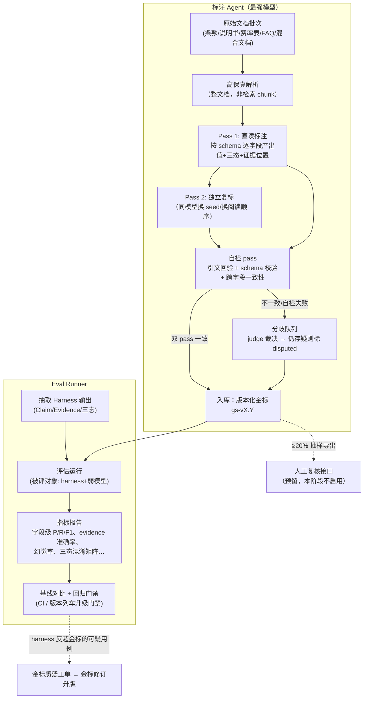

# 金标注 Agent 与评估子系统设计（Golden Set & Eval）

> 状态：设计稿 v1（2026-07-11）
> 前置阅读：[00-project-overview.md](00-project-overview.md)、[02-architecture.md](02-architecture.md)
> 关联文档：
> - [03-knowledge-model.md](03-knowledge-model.md) —— 金标标注的目标结构（Claim/Evidence/三态字段）以知识模型为准，本文不重复定义；
> - [04-extraction-harness.md](04-extraction-harness.md) —— 本子系统是抽取 Harness 的"考官"：Harness 产出什么，本文就评什么。两者**共享 schema 注册表，但实现互不依赖**——评估结论才有独立性。

---

## 1. 为什么是一个独立子系统

**核心决策（用户已拍板，2026-07-11）**：金标构建不是一次性脚本，而是一个**独立的、可持续升级维护的 Agent 子系统**。理由：

1. **金标是长期资产**：换抽取模型、改 prompt、升级 schema、跟进 WeKnora 版本列车，每一次都要重跑同一套评估。金标的生命周期比任何一版抽取 pipeline 都长。
2. **本阶段金标 = 最强模型直读文档的标注结果**（业务人工暂不介入，接口预留 ≥20% 抽样复核）。最强模型也会升级换代，标注 Agent 必须能带着同一套流程换模型重标、对比、升版。
3. **评测目标已定**：`harness + 弱模型（minimax 2.5 级）` 的抽取结果**逼近最强模型直读结果，达到即算达标**。这个目标本身就要求金标侧与抽取侧是两套独立实现——同一套代码既当运动员又当裁判，分数没有意义。

### 1.1 边界与目录

```
harness/
├── compiler/            # 抽取 Harness（04 文档）
├── goldenset/           # 本子系统（与 compiler 平级，互不 import 实现代码）
│   ├── annotator/       #   标注 Agent（最强模型直读）
│   ├── data/            #   金标数据（版本化，JSONL + manifest）
│   ├── evalrunner/      #   评估运行器
│   ├── reports/         #   评估报告输出（git 忽略，产物归档另存）
│   ├── cli.py           #   goldenset 命令行入口
│   └── README.md        #   子系统自述（含快速上手）
└── schemas/             # 共享 schema 注册表（两侧唯一的共享物，版本化）
```

**边界规则**：

| 规则 | 说明 |
|---|---|
| 共享且仅共享 schema 注册表 | 字段定义、三态语义、字段风险等级来自 `harness/schemas/`，双方引用同一版本号 |
| 实现零依赖 | `goldenset/` 不 import `compiler/` 的任何代码，反之亦然；文档解析也各自独立（见 §3.2） |
| 模型隔离 | 标注 Agent 只用最强模型（Claude Opus 级）；抽取 Harness 只用生产弱模型。DeepSeek v4 可在两侧作为裁决/judge 模型，但 judge prompt 各自维护 |
| 独立版本 | 金标数据有自己的 release（`gs-v1.0` 等）；标注 Agent 有自己的版本号；两者与 compiler 版本三者独立演进 |

---

## 2. 总体流程



---

## 3. 标注 Agent 设计

### 3.1 输入与任务定义

标注 Agent 的一次运行 = 一个 **AnnotationJob**：

```yaml
job:
  doc_batch: batch-2026-07-cix-pilot     # 文档批次 ID（见 §5.3）
  schema_version: schemas-v1             # 共享 schema 注册表版本
  annotator_model: claude-opus-latest    # 最强模型
  annotator_version: annotator-v1.2      # 标注 Agent 自身代码/prompt 版本
  task_types: [extraction, merge_conflict, qa]
```

### 3.2 直读原文档，不用检索 chunk

金标的价值在于**不受切片失真影响**。因此：

- 标注 Agent 用自己的高保真解析路径（PDF → 带页码锚点的 Markdown + 表格结构保留；扫描件走 VLM/OCR），**不复用 WeKnora 的 chunk**，也不复用 compiler 的解析代码；
- 长文档不做向量检索式截断，而是**agentic 阅读**：先读目录/结构生成阅读计划，再按章节完整读入，模型可以回翻——语义上等价于"人拿着整份条款直读"；
- 每条标注的证据必须落到 `(page_no, 原文摘录)`，摘录必须能在解析产物中做归一化字符串匹配命中（见 §3.4 自检）。

### 3.3 输出数据模型

与 [03-knowledge-model.md](03-knowledge-model.md) 的 Claim/Evidence 结构对齐，金标记录额外携带标注元数据：

```jsonc
// goldenset/data/<release>/extraction/<doc_id>.jsonl，每行一条
{
  "gold_id": "gs:cix-2024:waiting_period_days",      // 内容派生稳定 ID（doc+product+field 哈希）
  "doc_id": "doc-sha256-…",                           // 文档指纹（内容哈希，防换版错配）
  "product_ref": {"name": "某某重疾险(2024版)", "code": "CIX2024", "resolution": "explicit"},
  "field": "waiting_period_days",                     // schema 字段名
  "state": "present",                                 // present | absent_explicitly | unknown
  "value": 90,
  "value_normalized": 90,                             // 按 schema 归一化器（日期/金额/百分比/枚举）
  "evidence": [
    {"page_no": 12, "quote": "自本合同生效之日起90日内…", "section": "2.3 等待期"}
  ],
  "confidence": "high",                               // 双 pass 一致=high；judge 裁决=medium；disputed 单列
  "annotator": {"model": "claude-opus-…", "annotator_version": "annotator-v1.2", "passes_agreed": true},
  "review": {"sampled": false, "human_verdict": null} // 人工复核接口预留
}
```

三态语义（严格执行，与知识模型一致）：

- `present`：文档明确给出该字段的值；
- `absent_explicitly`：文档明确说明"无/不适用"（例：条款明确写"本合同无投保人豁免责任"）；
- `unknown`：文档未提及。**金标里的 unknown 是有效标注**——它用于惩罚抽取侧的幻觉（抽取侧答了值，金标是 unknown，即记幻觉）。

### 3.4 自检 pass（标注也要被校验）

最强模型同样会错，入库前强制三道确定性/半确定性检查：

1. **引文回验（确定性）**：每条 evidence 的 `quote` 归一化后（去空白/全半角/OCR 常见混淆字符表）必须在对应页的解析文本中命中；命不中 → 打回该字段重标，重标仍失败 → 标记 `evidence_unverifiable` 进分歧队列；
2. **schema 校验（确定性）**：值类型、枚举、区间、跨字段规则（如 `犹豫期 ≤ 等待期` 类约束，规则定义在 schema 注册表）；
3. **双 pass 一致性**：Pass 1 / Pass 2 用同一模型独立标注（打乱章节呈现顺序、不同随机性），字段级比对：
   - 一致 → `confidence: high` 直接入库；
   - 不一致 → DeepSeek v4（或次强模型）作为 judge，携带双方证据裁决；裁决置信不足 → 记 `disputed`，**disputed 字段不进入评估分母**（避免噪声金标扭曲分数），但保留在数据中并进入金标待修订清单。

> 成本说明：双 pass 只对**高风险字段与长文本字段**强制（豁免、等待期、除外、理赔限制、责任描述类）；低风险短字段（产品代码、犹豫期天数等）单 pass + 确定性校验即可。首批 20~30 份文档的标注成本以此控制在可接受范围。

### 3.5 人工复核接口（预留，不启用）

- `goldenset export-review --release gs-v1.0 --sample 0.2 --stratify field_risk,doc_type`：按风险分层抽样 ≥20%，导出为审核工作台可导入的格式（字段+值+证据原文对照）；
- 人工判定写回 `review.human_verdict`，与模型标注冲突时**人工优先**并触发金标修订（§8）。本阶段该命令存在但不排期使用。

---

## 4. 金标覆盖的三类任务

只考"抽取"考不出 harness 的真实价值，金标按三类任务构建：

### 4.1 任务一：字段抽取（extraction）

即 §3 的主产物：文档 × 产品 × schema 字段 → (三态, 值, 证据)。**注意多产品混合文档**：金标以"事实级产品归属"标注（一条事实属于哪个/哪些产品），这是产品归属正确率的依据。

### 4.2 任务二：合并 / 冲突判断（merge_conflict）

评的是 compiler 的增量合并与裁决能力（对应 master plan P0-4）。用例构造方式：

- **真实序列**：同一产品的多批次真实材料（如 2023 版条款 + 2024 修订版 + FAQ），标注 Agent 直读全部材料后给出期望的合并结论：每个字段最终应采信哪个来源、哪些构成 `supersede`、哪些是真冲突（`conflict`）应挂起待审；
- **注入冲突**：对部分文档制作受控变体（改等待期天数、删豁免条款、改除外表述），注入位置与期望检出结果记录在用例元数据中——这给"冲突检出率"提供了带真值的分母；
- 金标格式：`(claim_key, 批次序列) → expected_action ∈ {add, enrich, supersede, conflict, retract} + expected_winner + 裁决理由要素（权威度/生效时间/完整度）`。

### 4.3 任务三：端到端问答（qa）

评"知识进了库之后能不能答对"，覆盖版本与义项两个寿险特有难点：

- 常规事实问答："X 产品的等待期多少天？"（期望答案 + 必须引用的证据）；
- **历史版本适用性**："2023 年投保的 X 产品，癌症如何赔？"——期望命中当时有效版本，引用了 2024 版即判错（对应 master plan §1.3"版本正确率"）；
- 三态敏感问答："X 产品有投保人豁免吗？"——金标为 `unknown` 时，期望回答"资料未提及"而非"没有"；
- 跨产品义项："在线问诊在 A、B 两款产品里有什么区别？"——期望按产品限定页分别作答。

每条 QA 用例：`question + as_of_date(可选) + expected_answer要点 + required_evidence + 禁止性断言（answer_must_not 包含的错误说法）`。

---

## 5. 金标数据管理

### 5.1 版本化

- 金标以 **release** 为单位发布：`gs-v1.0`, `gs-v1.1` …，每个 release 一个目录 + `manifest.yaml`（文档清单、schema 版本、标注 Agent 版本、各任务用例数、变更日志）；
- **评估报告必须声明所用金标 release**，跨 release 的分数不直接可比；
- 修订走升版（§8），已发布 release 不可变——保证任何历史评估可复现；
- 标注 JSONL 进 git；**原始文档不进 git**（含业务敏感内容），以 `doc_id = sha256` 在 `manifest.yaml` 中登记指纹，文档本体存放位置由部署环境配置（对象存储/共享盘），eval runner 运行时按指纹校验。

### 5.2 分层抽样设计

维度：`文档类型 × 险种 × 难度`。难度分级口径：

| 难度 | 特征 |
|---|---|
| L1 | 单产品、原生 PDF、字段有显式结构（表格/条目） |
| L2 | 字段无显式结构（豁免藏在责任条款正文里）、嵌套规则表、长文档 |
| L3 | 多产品混合、扫描件 OCR、跨文档才能确定的字段、含冲突的批次序列 |

各难度层都必须有样本，**L2/L3 合计占比不低于 40%**——弱模型的差距恰恰在这两层暴露，全是 L1 的金标会给出虚高分数。

### 5.3 首批批次（batch-2026-07-cix-pilot，重疾险试点）

等用户提供的一批样例文档到位后按此构成登记（目标 20~30 份）：

| 文档类型 | 份数建议 | 覆盖点 |
|---|---|---|
| 条款 PDF（原生） | 5~8 | L1/L2 主力，豁免/等待期/除外全字段 |
| 条款 PDF（扫描件） | 2~3 | OCR 链路 |
| 产品说明书 | 4~6 | 与条款交叉验证、权威度次级来源 |
| 费率表 | 2~3 | 表格结构、只抽典型值 |
| FAQ / 结构化 JSON | 3~5 | 结构化直入路径 + QA 任务素材 |
| 多产品混合文档 | 3~5 | 产品归属（用户最头疼的问题） |
| 宣传材料 | 1~2 | 权威度降级用例（不得覆盖条款口径） |

同时从中选 2~3 个产品构造**多批次序列**（任务二用），并制作 3~5 份注入冲突变体。

---

## 6. 评估指标与计算口径

所有指标在**字段级**计算（一个"样本" = 一个 `(doc, product, field)` 三元组），`disputed` 金标不计入分母。

### 6.1 值比对规则（先于一切指标）

按 schema 中每个字段声明的 comparator：

| comparator | 适用 | 判定 |
|---|---|---|
| `exact` | 代码、枚举 | 归一化后全等 |
| `numeric` | 天数、金额、比例 | 归一化（单位统一）后数值相等，可配容差=0 |
| `date` | 生效/失效日期 | 解析为 ISO 后相等 |
| `set` | 除外列表、疾病列表 | 集合比较，输出元素级 P/R（列表字段的漏项/多项分别计） |
| `semantic` | 长文本（责任描述、理赔逻辑） | judge 模型（DeepSeek v4）判"同义/缺失要点/矛盾"，judge prompt 版本化并抽检 |

### 6.2 指标定义

设金标状态 `g ∈ {P, A, U}`（present/absent_explicitly/unknown），预测状态 `p` 同。

| 指标 | 口径 |
|---|---|
| **三态混淆矩阵** | 3×3 矩阵，所有样本按 (g, p) 计数。这是最基础的报表，其余指标是它的切片 |
| **字段级 Precision** | 在 `p=P` 的样本中，`g=P 且值比对通过` 的占比 |
| **字段级 Recall（覆盖率）** | 在 `g=P` 的样本中，`p=P 且值比对通过` 的占比 |
| **F1** | P/R 调和平均；按字段、按字段风险等级、按文档难度分层输出 |
| **幻觉率** | `p=P` 但（`g=U`）或（`g=P` 但预测 evidence 回验失败/不支持该值）的样本占 `p=P` 的比例。**注意：g=U 时答值一律记幻觉**，三态设计的意义就在于此 |
| **absent 混淆率** | `g=U` 被预测为 `A` 的占比（"未提及"被说成"明确没有"是寿险场景的高危错误，单列） |
| **evidence 准确率** | 在值比对通过的样本中，预测 evidence 满足：① quote 归一化后存在于源文档 ② 页码与金标证据页一致或相邻（±1，容忍解析分页差）③ judge 判定 quote 支持该值。三条全过才算对 |
| **产品归属正确率** | 多产品文档中，事实级 `product_ref` 与金标一致的占比；`低置信应入候选池却被自动路由` 单列为违规计数（master plan 原则：不得自动发布） |
| **冲突检出 Recall / Precision** | 任务二：注入+真实冲突中被正确标为 `conflict` 的占比 / 报告的 conflict 中真实为冲突的占比；`expected_action` 整体准确率单独输出 |
| **版本正确率** | 任务三带 `as_of_date` 的用例中，答案引用了适用版本证据且未引用不适用版本的占比 |
| **QA 事实正确率** | 任务三：要点命中 + 无 `answer_must_not` 断言 + 引用可跳转，三条全过 |

### 6.3 达标定义

- **总纲**：`harness + 弱模型` 的各项指标达到 `最强模型直读（即金标产出过程自身的双 pass 一致率所代表的上限）` 的约定比例即算达标；具体阈值在首次基线评估后与业务确认（先测出弱模型裸奔基线和最强模型上限，再定阈值——不拍脑袋定数）；
- **高风险字段单列门槛**（豁免、等待期、除外、理赔限制）：这四类字段各自计算 P/R/幻觉率，**任何一类不达标则整体不达标**，不允许被其他字段的高分平均掉（对应 master plan §1.3 最后一行）；
- **硬性红线（与比例无关）**：`g=U → p=P` 的幻觉、版本引用错误，这两类错误设绝对上限（如 ≤1%），超线一票否决。

---

## 7. Eval Runner

### 7.1 运行模型

```bash
# 一次评估 = 金标 release × 被评对象 × 任务集
goldenset eval \
  --release gs-v1.0 \
  --target compiler@<git-sha>+minimax-2.5+prompts-v3+schemas-v1 \
  --tasks extraction,merge_conflict,qa \
  --baseline runs/2026-07-15-baseline    # 可选：与历史运行对比
```

- **被评对象是一个完整配置指纹**：compiler 代码版本 + 抽取模型 + prompt 版本 + schema 版本（+ 端到端任务还含 WeKnora 版本与检索配置）。任何一项变化都是新的 run，报告中并排展示；
- 运行产物：`runs/<run-id>/`（原始预测、逐样本判定明细、指标 JSON、Markdown 对比报告）。逐样本明细必须可追溯——每个错误样本能看到金标值、预测值、双方证据，供 debug 与金标质疑（§8）；
- 端到端 qa 任务通过 WeKnora 的会话 API 走真实链路（含检索与 Agent），而非模拟。

### 7.2 作为回归门禁

eval runner 是三处流程的门禁：

1. **compiler CI**：prompt/schema/代码合并前跑 extraction 快速子集（L1+抽样 L2），全量每日跑；
2. **WeKnora 版本列车**：升级上游 tag 时全量三任务回归，指标回退超过阈值则不升级（对应 02-architecture.md 升级治理）；
3. **模型切换评估**：更换生产模型（如 qwen 3.6 → 新版本）时的准入评测。

### 7.3 报告形态

Markdown 报告固定结构：总分卡（对比基线的 Δ）→ 三态混淆矩阵 → 高风险字段单列表 → 分层切片（难度/文档类型/险种）→ Top 回退字段与样本链接。报告是给人看的第一现场，指标 JSON 是给 CI 门禁读的。

---

## 8. 金标错误的发现与修订（金标也会错）

发现渠道：

1. **评估分歧信号**：harness 与金标不一致、但 harness 的证据回验通过且 judge 认为证据更强 → 自动生成"金标质疑工单"（这是弱模型反超金标的合法通道，不能默认金标永远对）；
2. **抽样复核**（启用后）：人工判定与金标冲突 → 人工优先，直接立修订项；
3. **标注 Agent 升级重标**：最强模型升级后，对 disputed 与低置信子集重标，diff 出系统性错误；
4. **下游使用反馈**：知识发布后业务纠错回流（数据飞轮），若定位到金标本身错误则立修订项。

修订流程：质疑工单 → 标注 Agent 对该样本携带质疑证据重标（升级版模型）→ 裁决 → 修订记录写入 changelog → 打入下一个 `gs-vX.(Y+1)` release。**已发布 release 永不原地改**；历史评估引用旧 release 依然可复现，新评估用新 release。

---

## 9. 实施顺序

| 步骤 | 内容 | 依赖 |
|---|---|---|
| 1 | schema 注册表 v1 就绪（用户初步 schema + LLM-wiki-black 字段字典合并，见 06 文档） | 用户提供 schema 基线 |
| 2 | 标注 Agent MVP：解析 + 单 pass 标注 + 引文回验 + schema 校验 | 样例文档批次到位 |
| 3 | 双 pass + judge 裁决 + disputed 机制；产出 `gs-v0.1`（内部试标 3~5 份） | 步骤 2 |
| 4 | eval runner MVP（extraction 任务 + 核心指标 + Markdown 报告） | 步骤 3 |
| 5 | 全批次标注 → `gs-v1.0`；测弱模型裸奔基线 + 最强模型上限 → 与业务定达标阈值 | 步骤 4 |
| 6 | merge_conflict / qa 任务用例构造与评估接入 | `gs-v1.0` + compiler 合并能力就绪 |

## 10. 开放问题

1. 最强模型的具体选型与调用额度（Claude Opus 级；标注成本随双 pass 策略变化，步骤 3 试标后给出实测成本）；
2. semantic comparator 的 judge 模型是否需要双 judge 互检（首版单 judge + 人工抽检 judge 质量，视抽检结果决定）；
3. 端到端 qa 评估依赖 WeKnora 检索配置固化——检索参数纳入被评对象指纹的粒度待架构文档细化。
