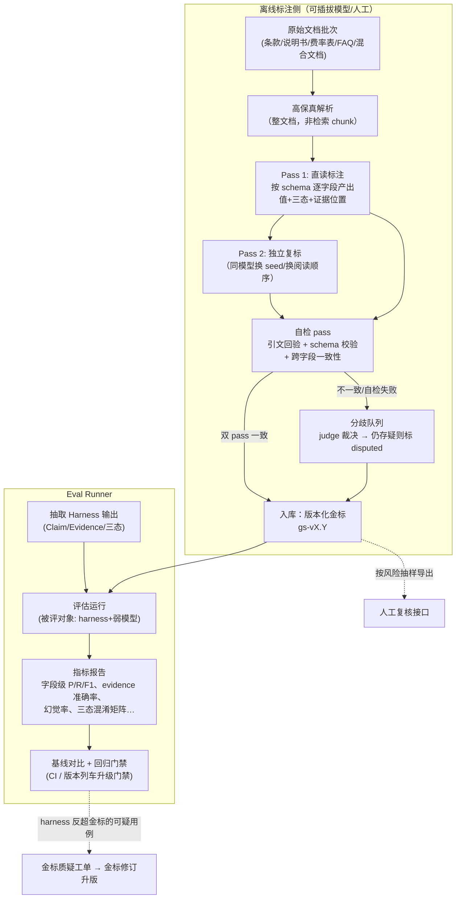

# 金标注 Agent 与评估子系统设计（Golden Set & Eval）

> 状态：设计稿 v1（2026-07-11；2026-07-21 按 Enterprise LLM Wiki 北极星修订模型边界）
> 前置阅读：[00-project-overview.md](00-project-overview.md)、[02-architecture.md](02-architecture.md)
> 关联文档：
> - [03-knowledge-model.md](03-knowledge-model.md) —— 金标标注的目标结构（Claim/Evidence/三态字段）以知识模型为准，本文不重复定义；
> - [04-extraction-harness.md](04-extraction-harness.md) —— 本子系统是抽取 Harness 的"考官"：Harness 产出什么，本文就评什么。两者**共享 schema 注册表，但实现互不依赖**——评估结论才有独立性。

---

## 1. 为什么是一个独立子系统

**核心决策**：金标构建不是一次性脚本，而是一个**独立的、可持续升级维护的离线评测子系统**。它可以使用最强可用模型、多个标注模型和/或人工，但永远不直接生成生产 Wiki，也不构成生产运行依赖。理由：

1. **金标是长期资产**：换抽取模型、改 prompt、升级 schema、跟进 WeKnora 版本列车，每一次都要重跑同一套评估。金标的生命周期比任何一版抽取 pipeline 都长。
2. **金标 = 经校验、版本化和批准的离线参考答案**。首批可以最强可用模型直读为主要候选来源，也可加入人工或其他标注模型；提供者升级时必须能重标、对比和升版。
3. **评测目标已定**：`Harness + 生产弱模型` 的结果逼近已批准金标并持续非退化。金标侧与抽取侧必须实现隔离——同一套代码既当运动员又当裁判，分数没有意义。

### 1.1 边界与目录

```text
harness/
└── src/insurance_harness/
    ├── compiler/        # 生产抽取 Harness（04；不得 import goldenset 实现）
    ├── goldenset/       # 本离线标注/eval 子系统（不得 import compiler 实现）
    └── schemas/         # 共享且版本化的 schema/协议类型；不共享 verifier/comparator 实现

dataset/ 或受控对象存储          # 版本化 JSONL + manifest；敏感原文不进 git
批准的 runs/artifacts 存储       # 内容寻址报告、comparator、baseline 与 admission 工件
```

**边界规则**：

| 规则 | 说明 |
|---|---|
| 共享且仅共享 schema/协议 | 字段定义、三态语义、风险等级和公开 test vector contract 来自 `harness/src/insurance_harness/schemas/`；双方引用同一内容 hash，但 verifier/comparator 分别实现 |
| 实现零依赖 | `goldenset/` 不 import `compiler/` 的任何代码，反之亦然；文档解析也各自独立（见 §3.2） |
| 运行隔离 | goldenset 只在离线评测环境运行，可用最强模型/多模型/人工；compiler 生产只用批准的弱模型。任何离线 judge 都不得被 compiler 当作生产 fallback |
| 独立版本 | 金标数据有自己的 release（`gs-v1.0` 等）；标注 Agent 有自己的版本号；两者与 compiler 版本三者独立演进 |

---

## 2. 总体流程



---

## 3. 标注 Agent 设计

### 3.1 输入与任务定义

标注 Agent 的一次运行 = 一个 **AnnotationJob**：

```yaml
job:
  doc_batch: batch-2026-07-canonical-13      # 当前跨险种 canonical 批次（见 §5.3）
  input_manifest_hash: sha256:...            # 文档指纹、顺序、解析器身份的冻结清单
  schema: {version: schemas-v1, content_hash: sha256:...}
  annotator:
    kind: model | human | hybrid
    provider: offline-provider-a              # 可选离线提供者；不是生产/CI 前置
    model_id: provider/model-family-version   # 禁止 latest/rolling alias
    deployment_id: immutable-deployment-id
    identity_proof:                          # 二选一：权重摘要或 provider 不可变部署证明
      kind: artifact_digest | provider_immutable_deployment_attestation
      value: sha256:...
    prompt_bundle_hash: sha256:...
    decoding_params_hash: sha256:...
  annotator_version: annotator-v1.2           # 标注器代码 commit + 依赖 lock hash
  task_types: [extraction, structured_import, merge_conflict, qa]
```

同一 `AnnotationJob` 的输入、解析器、schema、模型/人工身份、prompt、参数或代码任一变化都产生新 job identity。禁止 `latest`、滚动 deployment、只有展示名而无可验证版本的模型身份；人工标注同样记录 reviewer identity、规范版本和批准时间。

### 3.2 直读原文档，不用检索 chunk

金标的价值在于**不受切片失真影响**。因此：

- 标注 Agent 用自己的高保真解析路径（PDF → 带页码锚点的 Markdown + 表格结构保留；扫描件走 VLM/OCR），**不复用 WeKnora 的 chunk**，也不复用 compiler 的解析代码；
- 长文档不做向量检索式截断，而是**agentic 阅读**：先读目录/结构生成阅读计划，再按章节完整读入，模型可以回翻——语义上等价于"人拿着整份条款直读"；
- document fixture 的每条证据必须落到冻结 `SourceRevision + quote + location(page/section/table_ref/timestamp_ms)`；quote 必须能在解析产物中归一化匹配（见 §3.4）。table/image 仍是 `provenance_kind=document`，通过 `location.table_ref`、页码/区域和源资产 hash 定位，不新增第三种 provenance kind。
- structured fixture 不走 PDF 标注路径：输入 manifest 冻结 `source_revision_id/source_system/external_record_id/source_revision/content_hash/record_snapshot_hash/payload snapshot`；金标 Evidence 再冻结 `json_pointer + value_snapshot`。独立 verifier 必须在冻结记录上解析 pointer 并得到相同规范化值，才能进入 `structured_import` 任务分母。

### 3.3 输出数据模型

与 [03-knowledge-model.md](03-knowledge-model.md) 的 Claim/Evidence 结构对齐，金标记录额外携带标注元数据：

```jsonc
// goldenset/data/<release>/{extraction|structured_import}/<input_id>.jsonl，每行一条
{
  "gold_id": "gs:<input-hash>:waiting_period_days", // 内容派生稳定 ID（input+product+field 哈希）
  "input_ref": {
    "provenance_kind": "document",                  // document | structured
    "source_revision_id": "sr-…",
    "content_hash": "sha256:…"
  },
  "product_ref": {"name": "某某重疾险(2024版)", "code": "CIX2024", "resolution": "explicit"},
  "field": "waiting_period_days",                     // schema 字段名
  "state": "present",                                 // present | absent_explicitly | unknown
  "value": 90,
  "value_normalized": 90,                             // 按 schema 归一化器（日期/金额/百分比/枚举）
  "evidence": [
    {
      "provenance_kind": "document",
      "source_revision_id": "sr-…",
      "document": {
        "knowledge_id": "gold-source-…",
        "chunk_id": null,                              // gold 不依赖 WeKnora 切片；预测 Evidence 可带其 chunk_id
        "quote": "自本合同生效之日起90日内…",
        "location": {"page": 12, "section": "等待期", "table_ref": null, "timestamp_ms": null}
      }
    }
  ],
  "confidence": "high",                               // 双 pass 一致=high；judge 裁决=medium；disputed 单列
  "annotator": {
    "provider": "offline-provider-a",
    "model_id": "provider/model-family-version",
    "deployment_id": "immutable-deployment-id",
    "identity_proof": {"kind": "provider_immutable_deployment_attestation", "value": "sha256:…"},
    "prompt_bundle_hash": "sha256:…",
    "annotator_version": "annotator-v1.2+gitsha+lockhash",
    "passes_agreed": true
  },
  "review": {"sampled": false, "human_verdict": null} // 人工复核接口预留
}
```

structured 记录沿用同一顶层结构，但 `input_ref.provenance_kind="structured"`，且 Evidence 分支固定为：

```jsonc
{
  "provenance_kind": "structured",
  "source_revision_id": "sr-…",
  "structured": {
    "source_system": "approved-product-master",
    "external_record_id": "record-…",
    "source_revision": "2026-07-21T00:00:00Z",
    "content_hash": "sha256:…",
    "json_pointer": "/coverage/waiting_period_days",
    "record_snapshot_hash": "sha256:…",
    "value_snapshot": 90
  }
}
```

每个 structured golden slice 同时保存冻结输入 manifest 与 payload snapshot 的内容 hash；只保存期望值而没有可重放记录，不得计入 Evidence accuracy 或发布门禁。

三态语义（严格执行，与知识模型一致）：

- `present`：文档明确给出该字段的值；
- `absent_explicitly`：文档明确说明"无/不适用"（例：条款明确写"本合同无投保人豁免责任"）；
- `unknown`：文档未提及。**金标里的 unknown 是有效标注**——它用于惩罚抽取侧的幻觉（抽取侧答了值，金标是 unknown，即记幻觉）。

### 3.4 自检 pass（标注也要被校验）

离线模型与人工都可能出错，金标 release 前强制三道确定性/半确定性检查：

1. **引文回验（确定性）**：每条 evidence 的 `quote` 归一化后（去空白/全半角/OCR 常见混淆字符表）必须在对应页的解析文本中命中；命不中 → 打回该字段重标，重标仍失败 → 标记 `evidence_unverifiable` 进分歧队列；
2. **schema 校验（确定性）**：值类型、枚举、区间、跨字段规则（如 `犹豫期 ≤ 等待期` 类约束，规则定义在 schema 注册表）；
3. **双 pass 一致性**：Pass 1 / Pass 2 用同一模型独立标注（打乱章节呈现顺序、不同随机性），字段级比对：
   - 一致 → `confidence: high` 直接入库；
   - 不一致 → 进入离线 judge/人工复核队列，携带双方证据裁决；仍不足以确定 → 记 `disputed`。它不进入已裁决值准确率分母，但必须进入总样本分母、争议率和覆盖报告，保留在数据中并进入金标待修订清单；不得靠扩大 disputed 集合美化分数。

**争议率硬门禁**：golden release 的 `disputed / total` 整体、逐产品、逐高风险字段都必须 `≤ 5%`；任一切片超限则该 release 不具门禁资格。报告必须同时展示 `total_count / adjudicated_count / disputed_count`，所有 P/R/F1 都附有效覆盖率，CI 校验批准的 disputed key 清单 hash，禁止评估时临时排除样本。

> 成本说明：双 pass 只对**高风险字段与长文本字段**强制（豁免、等待期、除外、理赔限制、责任描述类）；低风险短字段（产品代码、犹豫期天数等）单 pass + 确定性校验即可。当前成本只按 canonical-13 manifest 的实际文档/字段与 admission reservation 计算，不沿用早期“20～30 份”试点估算。

### 3.5 人工复核接口

- `goldenset export-review --release gs-v1.0 --sample 0.2 --stratify field_risk,doc_type`：按风险分层抽样 ≥20%，导出为审核工作台可导入的格式（字段+值+证据原文对照）；
- 人工判定写回 `review.human_verdict`，与模型标注冲突时**人工优先**并触发金标修订（§8）。高风险字段的抽样比例和 release 批准人由 QualityProfile 固化。

---

## 4. 金标覆盖的三类任务

只考"抽取"考不出 harness 的真实价值，金标按三类任务构建：

### 4.1 任务一：字段抽取（extraction）

即 §3 的主产物：文档 × 产品 × schema 字段 → (三态, 值, 证据)。**注意多产品混合文档**：金标以"事实级产品归属"标注（一条事实属于哪个/哪些产品），这是产品归属正确率的依据。

### 4.2 任务二：合并 / 冲突判断（merge_conflict）

评的是 compiler 的增量合并与裁决能力（对应 master plan P0-4）。用例构造方式：

- **真实序列**：同一产品的多批次真实材料（如 2023 版条款 + 2024 修订版 + FAQ），标注 Agent 直读全部材料后给出期望的合并结论：每个字段最终应采信哪个来源、哪些构成 `supersede`、哪些是真冲突（`conflict`）应挂起待审；
- **注入冲突**：对部分文档制作受控变体（改等待期天数、删豁免条款、改除外表述），注入位置与期望检出结果记录在用例元数据中——这给"冲突检出率"提供了带真值的分母；
- 金标格式：`(space-scoped claim identity, 批次序列) → expected_action + expected_winner/expected_escalation + expected_decision_path`。`expected_decision_path` 严格覆盖六步：产品/版本/主语身份、来源 authority + trust policy、可靠生效/来源时间、Evidence 支持强度与定位、多弱模型 receipt 是否只应给建议、是否必须人工；不得用泛化“内容更完整”或单一 judge 文本代替固定顺序。

### 4.3 任务三：端到端问答（qa）

评"知识进了库之后能不能答对"，覆盖版本与义项两个寿险特有难点：

- 常规事实问答："X 产品的等待期多少天？"（期望答案 + 必须引用的证据）；
- **历史版本适用性**："2023 年投保的 X 产品，癌症如何赔？"——期望命中当时有效版本，引用了 2024 版即判错（对应 master plan §1.3"版本正确率"）；
- 三态敏感问答："X 产品有投保人豁免吗？"——金标为 `unknown` 时，期望回答"资料未提及"而非"没有"；
- 跨产品义项："在线问诊在 A、B 两款产品里有什么区别？"——期望按产品限定页分别作答。

每条 QA 用例：`question + as_of_date(可选) + expected_answer要点 + required_evidence + 禁止性断言（answer_must_not 包含的错误说法）+ fallback_allowed/required_gap_state`。运行器在提问前读取并冻结 `expected_current_snapshot_id`；答案、Wiki 引用、QA、MCP resource 与 relation 都必须返回该 snapshot。若使用 RAW 兜底，必须有明确 `uncompiled_low_assurance` 标记、对应 gap ID，且不得与当前 Wiki Claim 冲突或覆盖它。

---

## 5. 金标数据管理

### 5.1 版本化

- 金标以 **release** 为单位发布：`gs-v1.0`, `gs-v1.1` …，每个 release 一个目录 + `manifest.yaml`（文档清单、schema 版本、标注 Agent 版本、各任务用例数、变更日志）；
- **评估报告必须声明所用金标 release**，跨 release 的分数不直接可比；
- 修订走升版（§8），已发布 release 不可变——保证任何历史评估可复现；
- 标注 JSONL 进 git；**原始文档不进 git**（含业务敏感内容），以 `doc_id = sha256` 在 `manifest.yaml` 中登记指纹，文档本体存放位置由部署环境配置（对象存储/共享盘），eval runner 运行时按指纹校验。

### 5.2 分层抽样设计

维度：`文档类型 × 险种 × 难度`。难度分级口径：

| 难度 | 特征 |
|---|---|
| L1 | 单产品、原生 PDF、字段有显式结构（表格/条目） |
| L2 | 字段无显式结构（豁免藏在责任条款正文里）、嵌套规则表、长文档 |
| L3 | 多产品混合、扫描件 OCR、跨文档才能确定的字段、含冲突的批次序列 |

各难度层都必须有样本，**L2/L3 合计占比不低于 40%**——弱模型的差距恰恰在这两层暴露，全是 L1 的金标会给出虚高分数。

### 5.3 当前 canonical 批次与持续扩面

当前执行批次固定为 `batch-2026-07-canonical-13`，对应 020 run-admission 管理的现有 **13 产品跨险种样本**；其产品/文件指纹、schema、解析器、输入顺序与 provenance 必须全部来自批准 manifest，不能临时替换。它覆盖终身寿、年金、两全、医疗、意外、失能收入等第一波，是当前可复现基线，不是“重疾险单点试点”，也不代表全险种目标已经完成。

北极星验收是企业全险种知识编译。后续按 TemplatePackage slice 把重疾、护理、补充养老、意外医疗、多产品混合文档与扫描件纳入新 golden release；每个切片独立报分，任何已有险种高分不得掩盖未覆盖切片。每个拟取得低风险自动候选资格的险种切片目标结构如下，样本未到位时保持明确 `unsupported/pending-sample`，不得伪报通过：

| 文档类型 | 份数建议 | 覆盖点 |
|---|---|---|
| 条款 PDF（原生） | ≥3 | L1/L2 主力；按该险种高风险字段覆盖 |
| 条款 PDF（扫描件） | ≥1（适用时） | OCR/VLM 链路 |
| 产品说明书/正式产品材料 | ≥2 | 与条款交叉验证、来源信任降级 |
| 费率表/规则表 | ≥1（适用时） | 表格结构、跨页/嵌套规则 |
| FAQ / 外部结构化 JSON | ≥2 | 结构化直入路径 + QA 任务素材 |
| 多产品混合文档 | 组合批次 ≥3 | 事实级产品归属与污染红线 |
| 培训/宣传材料 | 组合批次 ≥2 | 不得被分类模型提升权威、不得覆盖条款 |

每个进入自动候选准入范围的险种至少选择 2 个产品构造**多批次序列**，并包含受控冲突、来源删除和新版本 supersede 用例。样本不足的险种只能保持“人工审核候选”状态，不能借用其他险种分数取得自动化资格。

---

## 6. 评估指标与计算口径

所有指标在**字段级**计算（一个“样本” = 一个 `(doc, product, field)` 三元组）。值准确率/P/R 的主表使用 `adjudicated_count` 分母，但每张表必须并列展示 `total_count`、`disputed_count`、有效覆盖率与 `disputed ≤ 5%` 门禁；总样本/争议率分母永远包含 disputed，禁止通过改排除集提高成绩。

### 6.1 值比对规则（先于一切指标）

按 schema 中每个字段声明的 comparator：

| comparator | 适用 | 判定 |
|---|---|---|
| `exact` | 代码、枚举 | 归一化后全等 |
| `numeric` | 天数、金额、比例 | 归一化（单位统一）后数值相等，可配容差=0 |
| `date` | 生效/失效日期 | 解析为 ISO 后相等 |
| `set` | 除外列表、疾病列表 | 集合比较，输出元素级 P/R（列表字段的漏项/多项分别计） |
| `semantic` | 长文本（责任描述、理赔逻辑） | 消费 golden release 内已冻结的 `required_keypoints`、`forbidden_claims`、接受变体与 comparator 版本做确定性判定；离线模型/人工可生成或修订这些制品，但 CI 不实时调用 judge |

### 6.2 指标定义

设金标状态 `g ∈ {P, A, U}`（present/absent_explicitly/unknown），预测状态 `p` 同。

| 指标 | 口径 |
|---|---|
| **三态混淆矩阵** | 3×3 矩阵，所有样本按 (g, p) 计数。这是最基础的报表，其余指标是它的切片 |
| **字段级 Precision** | 在 `p=P` 的样本中，`g=P 且值比对通过` 的占比 |
| **字段级 Recall（覆盖率）** | 在 `g=P` 的样本中，`p=P 且值比对通过` 的占比 |
| **F1** | P/R 调和平均；按字段、按字段风险等级、按文档难度分层输出 |
| **幻觉率** | `p=P` 但（`g=U`）或（`g=P` 但预测 evidence 回验失败/不支持该值）的样本占 `p=P` 的比例。**注意：g=U 时答值一律记幻觉**，三态设计的意义就在于此 |
| **absent 混淆率** | `g=U` 被预测为 `A` 的占比（"未提及"被说成"明确没有"是寿险场景的高危错误，单列） |
| **evidence 准确率** | 按 Evidence tagged union 独立判定。`document`：quote 在冻结 SourceRevision/chunk 中归一匹配，text/table/image 的页码、区域或 `table_ref` 满足批准容差并命中冻结支持片段；`structured`：source revision/content/record snapshot hash 全匹配，json pointer 在冻结记录上解析到同一 value snapshot。对应分支全部条件通过才算对，禁止给 structured Evidence 伪造 chunk/页码；未被 comparator 覆盖的样本进离线争议队列，不在线调用强 judge |
| **产品归属正确率** | 多产品文档中，事实级 `product_ref` 与金标一致的占比；`低置信应入候选池却被自动路由` 单列为违规计数（master plan 原则：不得自动推进，只能进入审核；任何生产发布仍须授权人批准） |
| **冲突检出 Recall / Precision** | 任务二：注入+真实冲突中被正确标为 `conflict` 的占比 / 报告的 conflict 中真实为冲突的占比；`expected_action` 整体准确率单独输出 |
| **版本正确率** | 任务三带 `as_of_date` 的用例中，答案引用了适用版本证据且未引用不适用版本的占比 |
| **QA 事实正确率** | 任务三：要点命中 + 无 `answer_must_not` 断言 + 引用可跳转，三条全过 |
| **snapshot 一致率** | 任务三：响应顶层 snapshot、每个 Claim/QA/Evidence/关系引用、Wiki 链接 metadata 全部等于提问前冻结的 `expected_current_snapshot_id` 的占比；文本答对但 snapshot 错仍判失败 |
| **RAW fallback 违规数** | RAW 仅在 golden 用例允许且当前 snapshot 确有 gap 时可用；缺少低保证标记/gap ID、覆盖或矛盾于已发布 Wiki、把 RAW 当正式 Claim，任一即计违规 |

### 6.3 达标定义

- **总纲**：`Harness + 生产弱模型` 的各项指标达到已批准 golden release 的约定门槛并相对基线非退化才算达标；具体阈值在首次基线评估后与业务确认，不以单一模型的自一致率冒充绝对真值；
- **高风险字段单列门槛**（豁免、等待期、除外、理赔限制）：这四类字段各自计算 P/R/幻觉率，**任何一类不达标则整体不达标**，不允许被其他字段的高分平均掉（对应 master plan §1.3 最后一行）；
- **硬性红线（与比例无关）**：`g=U → p=P` 的幻觉、版本引用错误，这两类错误设绝对上限（如 ≤1%），超线一票否决。
- **消费权威红线**：snapshot 一致率必须 `100%`，RAW fallback 违规数必须 `0`；正确文本不能抵消错误快照或未标注兜底。
- **金标健康红线**：整体、逐产品、逐高风险字段 disputed rate 均 `≤ 5%`，且排除 key 必须与批准 comparator artifact 的 hash 一致；超线时先修金标，不得发布门禁成绩。

每个可用于门禁的 golden release 必须预先物化并批准 comparator artifact（接受变体、长文本要点、禁止命题、证据支持片段和 disputed 排除清单）。生产/CI 门禁只读取该冻结制品并执行确定性比较；离线标注或 judge 服务不可用时，既有批准门禁仍可运行，新争议保持 pending，不得临时改用生产强模型。

---

## 7. Eval Runner

### 7.1 运行模型

```bash
# 一次评估 = 金标 release × 被评对象 × 任务集
goldenset eval \
  --release gs-v1.0 \
  --target-manifest runs/manifests/<content-addressed-target>.json \
  --target-manifest-sha256 <sha256> \
  --tasks extraction,structured_import,merge_conflict,qa \
  --baseline runs/2026-07-15-baseline    # 可选：与历史运行对比
```

- **被评对象是内容寻址的完整 target manifest**：compiler git tree/依赖 lock、解析器与 normalization 版本、resolved TemplatePackage stack/content hash、schema hash、prompt/参数 hash、provider/model/deployment identity 与权重 digest 或 provider immutable-deployment attestation；端到端任务再冻结 WeKnora image/tag digest、检索配置、P-1 release contract version 与 MCP build。禁止缩写模型名、`latest`/rolling alias 或只写展示版本；任一 identity/hash 变化都产生新 run，报告中并排展示；
- 运行产物：`runs/<run-id>/`（原始预测、逐样本判定明细、指标 JSON、Markdown 对比报告）。逐样本明细必须可追溯——每个错误样本能看到金标值、预测值、双方证据，供 debug 与金标质疑（§8）；
- 端到端 qa 任务通过 WeKnora 的会话 API 走真实链路（含检索与 Agent），而非模拟。

### 7.2 作为回归门禁

eval runner 是三处流程的门禁：

1. **compiler CI**：prompt/schema/代码合并前跑 extraction 快速子集（L1+抽样 L2），全量每日跑；
2. **WeKnora 版本列车**：升级上游 tag 时全量三任务回归，指标回退超过阈值则不升级（对应 02-architecture.md 升级治理）；
3. **模型切换评估**：更换生产模型（如 qwen 3.6 → 新版本）时的准入评测。

这三处门禁都必须是**可离线、可复现、零实时强模型依赖**的：只消费固定 golden release、comparator artifact 和已录制/已批准的预期结果。可选的强模型只在门禁之外异步提出金标/要点修订候选，其不可用不得阻塞 CI、生产编译或发布审核。

### 7.3 报告形态

Markdown 报告固定结构：总分卡（对比基线的 Δ）→ 三态混淆矩阵 → 高风险字段单列表 → 分层切片（难度/文档类型/险种）→ Top 回退字段与样本链接。报告是给人看的第一现场，指标 JSON 是给 CI 门禁读的。

---

## 8. 金标错误的发现与修订（金标也会错）

发现渠道：

1. **评估分歧信号**：Harness 与金标不一致、但 Harness 的证据回验通过且独立比较认为证据更强 → 自动生成“金标质疑工单”（这是生产弱模型反超旧金标的合法通道，不能默认金标永远对）；
2. **抽样复核**（启用后）：人工判定与金标冲突 → 人工优先，直接立修订项；
3. **标注器升级重标**：离线标注模型或人工规范升级后，对 disputed 与低置信子集重标，diff 出系统性错误；
4. **下游使用反馈**：知识发布后业务纠错回流（数据飞轮），若定位到金标本身错误则立修订项。

修订流程：质疑工单 → 标注 Agent 对该样本携带质疑证据重标（升级版模型）→ 裁决 → 修订记录写入 changelog → 打入下一个 `gs-vX.(Y+1)` release。**已发布 release 永不原地改**；历史评估引用旧 release 依然可复现，新评估用新 release。

---

## 9. 实施顺序

| 步骤 | 内容 | 依赖 |
|---|---|---|
| 1 | 保留已完成的 schema/eval 工具与 `gs-v0.1` 11/13 产品资产，不重做、不把历史 3 产品实验当当前基线 | 已有 002/005/019 地基 |
| 2 | `NS-RIGHTS=recorded` 已完成；当前完成 027 运行时硬门禁，并分别解除 030 MVP admission 或 020 canonical admission 的预算/审批/provenance/输入/不可变模型身份 blockers；适用门禁前零真实模型 | 019/021/T1 软件已合入但不解除运行门禁 |
| 3 | 仅在 `NS-RIGHTS=recorded ∧ NS-0=verified ∧ applicable admission=READY` 后，按对应 execution surface 运行 030 MVP 或 020 企业 canonical slice | 步骤 2 门禁 |
| 4 | 产出新的批准 golden release、comparator artifact、逐险种/文档类型/结构化 slice 与 baseline；disputed/identity/证据门禁全过 | 步骤 3 |
| 5 | 后续按 TemplatePackage 支持矩阵持续补样本并升版；旧 release 永不原地改 | 步骤 4 |

## 10. 开放问题

1. 离线标注提供者组合与调用额度（可用最强模型、多个模型或人工；成本随双 pass 与抽样策略变化）；
2. semantic comparator 是否需要双 judge/双人互检，以及各风险层的人审抽样比例；
3. 端到端 qa 评估依赖 WeKnora 检索配置固化——检索参数纳入被评对象指纹的粒度待架构文档细化。
