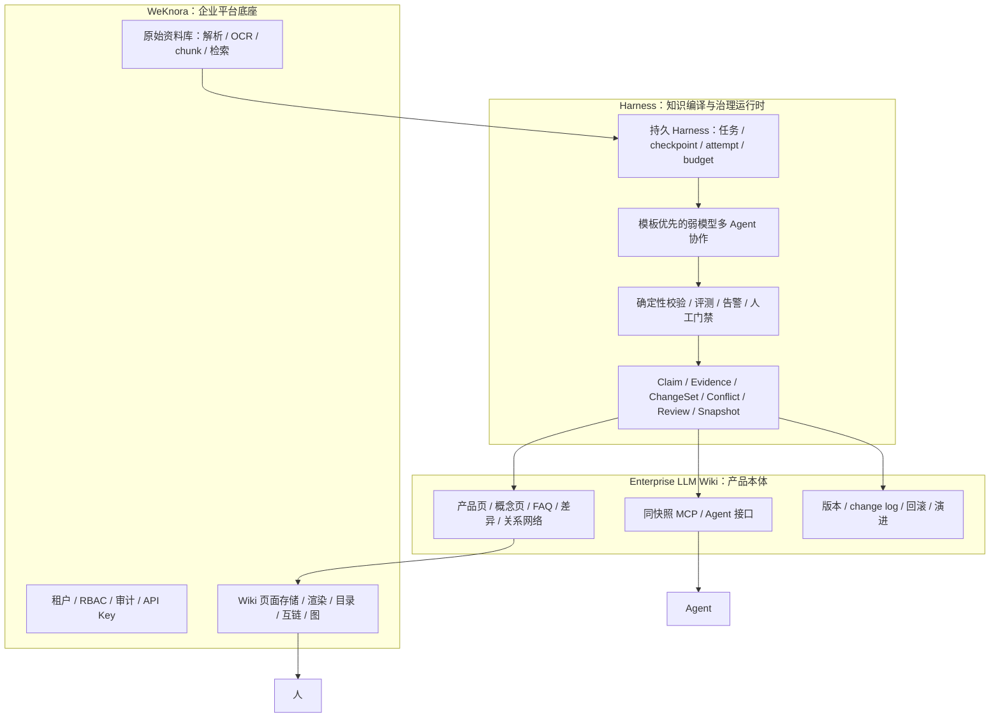
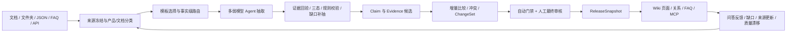

# 企业级 LLM Wiki 北极星设计

> 状态：**产品、Integration-first MVP 与完整企业路线已由业务方批准（2026-07-21）；功能实施须按 OpenSpec 分包**
> 地位：本项目的产品与架构最高层设计基准。所有 Roadmap、OpenSpec、实现、评测、前端和会话调度都必须与本文一致；如有冲突，以本文为准并先修订冲突文档。
> 关联：[项目总览](../../insurance-kb/00-project-overview.md) · [架构基准](../../insurance-kb/02-architecture.md) · [知识模型](../../insurance-kb/03-knowledge-model.md) · [功能继承](../../insurance-kb/09-llm-wiki-feature-migration.md)

> **当前运行阻断**：① 现有 production CLI/config 尚未硬禁用 Claude/DeepSeek/未知或滚动模型身份，NS-0 完成前禁止真实生产编译、judge、merge 与 release；② 独立 MVP slice admission 尚未 READY，READY 前零真实模型运行。业务方已声明 `LLM-wiki-black` 为项目方完整著作权资产，第一方迁移权利不再是阻断；第三方许可证仍逐项清点。本文批准不等于解除模型与运行准入门禁。

## 1. 产品北极星

**LLM Wiki 是产品本体和最终价值，不是 WeKnora 的一个附属页面功能。**

本项目要建设的是运行在 WeKnora 企业底座上的 **Enterprise LLM Wiki（企业级知识编译系统）**：把文档、结构化产品库、FAQ、规则和后续反馈持续编译为有证据、有关系、有版本、可审核、可回滚、可演进的知识。

它必须改变传统知识库的工作方式：

- 知识不再是上传后静止的文档或检索时临时拼接的 chunk；
- 同一事实可被新来源补全、纠错、取代、撤回，并保留完整版本与 change log；
- 冲突不会被静默覆盖，而是自动裁决或进入人工审核；
- 人看到产品时，应在一个 Wiki 产品页获得当前完整知识、关联概念、FAQ、差异、来源与历史；
- Agent 默认消费与人类页面相同 release snapshot 的结构化知识，而不是另起一套答案口径；
- 文档与 raw chunk 保留为证据和长尾兜底，但不能覆盖已发布 Wiki 的权威结论。

一句话定义：

> **WeKnora 负责企业平台；Harness 负责可靠地编译知识；Enterprise LLM Wiki 负责成为人和 Agent 共同使用、持续进化的企业知识权威。**

## 2. 三个参考体系的关系

| 来源 | 继承什么 | 不直接继承什么 |
|---|---|---|
| Karpathy 思想 / [`nashsu/llm_wiki`](https://github.com/nashsu/llm_wiki) | 持久 Wiki、`raw/wiki/schema` 分层、持续 ingest、query、lint、index、log、知识随使用复利的范式 | GPL 代码、个人桌面/剪藏产品形态、一次性自由生成语义 |
| [`LLM-wiki-black/feature/product-catalog-domain`](https://github.com/silvielala412-lab/LLM-wiki-black/tree/feature/product-catalog-domain) | 项目方第一方保险产品能力：schema/模板、长文档分组路由、融合、provenance、身份关系、冲突更新、批次幂等与审核语义 | 与前端/localStorage/Markdown 事实库耦合的结构、双审核、治理旁路和巨型单体 extractor |
| [Tencent WeKnora](https://github.com/Tencent/WeKnora) | 多租户、权限、审计、知识空间、解析/OCR/chunk、检索、页面存储与渲染、链接图、部署和企业集成 | 内置简单 Wiki 生成对保险语义、冲突、版本、审核与发布的控制权 |

目标承接原则是 **first-party capability migration with architectural refactoring**：第一方旧资产可以直接阅读、审计和复用，但每项迁移必须记录 source commit/path，经 OpenSpec/TDD 重新落到 Python Harness 的稳定边界，并用当前真实样本与 Golden Slice 验收。权利已确认不等于旧实现自动达到生产质量；现有 routing/cleaning 与 004/006/024 仍须补齐模型边界、Evidence、ChangeSet、Alert 和同快照门禁。

### 2.1 语言收敛裁决（已批准）

`LLM-wiki-black` 的 TypeScript 实现只作为第一方**能力迁移来源**，不得作为第二套生产业务运行时、sidecar 或长期依赖。所有保险领域的模板解析、文档路由、抽取/校验、融合/冲突、版本/发布编排和任务状态，统一迁移或重构到 **Python 3.12 Harness**；可迁移 schema、prompt、规则、算法语义与测试向量，但最终生产执行、持久状态和治理入口只有一套 Python 实现。

WeKnora 上游自身的 Go/Vue/TypeScript 保持平台边界，不因本裁决重写；自有前端若使用 TypeScript，只能做展示与 API client，不得持有知识事实、合并规则、发布权威或独立任务状态。MVP 不引入 Node/TS 领域服务、TS queue、localStorage 事实库或 Python↔TS 双运行时调用；任何例外必须另立 ADR，且不进入当前 MVP。

`nashsu/llm_wiki`、Tencent WeKnora 与其他第三方资产继续按各自许可证管理。未经兼容决定，不复制第三方 GPL 实现表达；第一方权利声明不能覆盖第三方代码。详细工程边界见 `docs/insurance-kb/06-asset-migration.md`。

## 3. 不可妥协的系统边界

### 3.1 三层职责



- WeKnora 只提供通用企业能力，不承载保险业务语义。
- Harness 是可恢复、可审计的编译运行时，不是遇错即断的一次性 pipeline。
- Enterprise LLM Wiki 拥有知识语义、页面编译、关系、冲突、版本和发布生命周期。
- WeKnora 的内置自动 Wiki 生成在保险知识库中必须关闭；只复用其页面载体和通用平台能力。
- Harness 与 WeKnora 只通过公开 REST/MCP 交互，不直读数据库或队列。
- 直接复用 WeKnora Wiki UI 的生产前置是通用 **release namespace + atomic active alias** 契约：staging 页面按 `release_id` 隔离，普通 list/get/search/index/graph/RAG/UI 只解析一个原子激活的 release。当前逐页 REST 写、`draft/published` 状态或单发布者纪律都不能证明同快照，不得作为替代。
- 该通用补丁落地并通过 live 契约前，WeKnora 只能作为受限 staging/预览载体；普通用户的当前批准快照由 Harness 只读 reader 提供，Agent 走同快照 MCP。此状态不能宣称“生产 Wiki UI 已完成”。

### 3.2 生产模型边界

**生产编译、校验、冲突处理和发布不得依赖强模型。** 生产可用能力按 MiniMax M2.5、Qwen 3.x、Qwen-VL 等弱模型设计；模型名可以替换，但能力预算不得偷偷提高。

- 生产质量来自模板、短任务、角色分工、多次独立尝试、证据回验、确定性规则、共识、门禁和人工审核；
- 强模型不得作为生产 fallback、在线 judge、模板生成前置或发布前置；
- 可选的离线金标/评测可使用当时最强模型或人工标注，但其不可用不能阻塞生产运行，且其产物不能直接发布；
- 所有模型必须使用可证明不可变的 provider/model/deployment identity（权重摘要或 provider attestation），并与模板、prompt、参数、attempt、输入 hash 和成本一起记录；禁止 `latest`/rolling alias，保证可复现。

现有文档、配置或代码中把 Claude session、DeepSeek v4/pro 等强模型写成生产 judge、升级模型或 fallback 的路径，均视为**待迁移的历史能力**：在专门 OpenSpec 完成审计、替换和回归前必须保持生产禁用，不得因为“代码已经存在”而获得例外。

## 4. 知识权威与消费规则

本系统存在两个不同层次的“真相源”，不可混为一谈：

1. **内部语义与治理 SSOT**：`Claim + Evidence + ChangeSet + Revision + ReleaseSnapshot`。任何语义修改都必须在这里发生；Wiki 页面不能成为绕过治理的编辑入口。
2. **默认消费权威**：WeKnora 原子 `active_release_id` 指向、approval 仍有效且 seal/manifest hash 核对一致的 `ReleaseSnapshot` Wiki，以及绑定同一 snapshot 的 MCP/Agent 接口。Harness `CurrentRelease` 只保存批准 snapshot/hash/ETag receipt 镜像；MCP 每次请求先读取 serving alias 并与批准 manifest 核对，任何失配都 fail closed。人和 Agent 必须看到同一版本、同一证据、同一冲突状态。

原始文档与 chunk 是不可变证据层和未覆盖知识的兜底检索层。消费顺序固定为：

```text
当前已发布 Wiki / 同快照 MCP
        ↓ 缺失时产生 gap 与补编任务
受权限约束的 RAW 证据检索（明确标注“未编译/低保证”）
        ↓
不得用 RAW 临时答案覆盖已发布 Wiki 结论
```

## 5. 持续知识编译闭环



每个阶段都必须可 checkpoint、幂等重放、单独重试和人工接管。任何失败必须成为可查询状态、dead letter、ReviewItem 或 Alert，不得以空结果伪装成功。

## 6. 模板优先的弱模型 Harness

### 6.1 模板层级

模板按由泛到专的层级叠加：

```text
通用保险模板
  └─ 险种模板（寿险/年金/医疗/重疾/意外/护理…）
      └─ 文档类型模板（条款/说明书/FAQ/费率表/培训/监管…）
          └─ 产品族模板（版式与语义稳定的一组产品）
```

模板不是一段 prompt，而是一个可版本化、可评测、可回滚的 `TemplatePackage`：

- schema 与字段三态定义；
- 分类、章节定位、事实路由和多产品拆分规则；
- 角色化 prompt 与示例；
- 证据要求、对已注册 trusted source role 的准入限制和高风险字段策略；模板只能收紧来源使用范围，不能授予或提升 authority；
- 确定性 validator、归一化器和跨字段约束；
- 重试/投票/预算配置；
- 低风险自动形成/推进 ChangeSet 候选的阈值、字段审核阈值、release 人工批准策略和告警阈值；
- golden slice、留出集指标、适用范围和已知失败模式。

模板内容、指标、golden slice 和 rights receipt 必须一起内容寻址并冻结为不可变 `TemplateVersion`；批准由真人 `TemplateApproval` 单独绑定完整 hash，撤销/retire 只追加 lifecycle event，当前版本只可用 expected ETag CAS。模板只有批准仍有效且通过版本化留出集与回归门禁后才能用于自动生成低风险 ChangeSet；未达到门槛只能生成待审核候选。任何 ChangeSet 无论如何产生，都必须经过授权人的 release 级最终审核，才能进入新的生产 ReleaseSnapshot。

### 6.2 Agent 角色与写入纪律

| 角色 | 责任 | 禁止事项 |
|---|---|---|
| Intake Agent | 文档/险种/产品候选分类，选择模板 | 直接写 Claim |
| Router Agent | 把章节或事实候选路由到产品版本与字段 | 低置信时强行归属 |
| Extractor Agents | 按字段组独立抽取值、三态和证据 | 输出无引文结论 |
| Evidence Verifier | 通过字符串、坐标、表格与页码回验引用 | 用主观分数替代回验 |
| Gap Agent | 对 unknown、必填缺失和同类产品异常定向补抽 | 把未抽到改成不存在 |
| Validator Agents | 交叉字段、时间、数值、枚举和业务规则校验 | 越权修改原候选 |
| Consensus/Judge | 汇总多个弱模型独立意见并给出结构化提议 | 直接发布或静默裁决高风险冲突 |
| Merge Agent | 生成 add/enrich/supersede/conflict/retract 提案 | 绕过 ChangeSet |
| Wiki Compiler | 从已批准 snapshot 确定性生成页面和关系 | 读取未发布候选补正文 |

Agent 只能产生带 receipt 的候选或建议；知识状态只能由治理服务按规则与审核决定。

### 6.3 效果不佳时的降级阶梯

固定按以下顺序执行，禁止直接换成强模型：

1. 重切分、重定位章节/表格/产品锚点；
2. 针对缺失字段缩小上下文并定向补抽；
3. 由多个弱模型 Agent 使用不同角色/prompt/采样独立尝试并做证据共识；
4. 回退到通用 schema-driven agentic 路径，不使用不适配的专用模板；
5. 达到尝试、预算或时间上限后停止自动形成/推进候选，生成 Alert + ReviewItem，由人接管；生产 release 本来就必须由授权人最终批准。

## 7. 七类核心问题的系统解法

| 核心问题 | 系统能力 | 不可缺少的门禁 |
|---|---|---|
| 1. 弱模型准确率与覆盖率 | 模板层级、多角色短任务、独立多次尝试、定向补漏、持久 checkpoint、attempt ledger | 引文回验、高风险字段共识、字段级 golden 回归、失败不发布 |
| 2. 结构化知识融合与冲突 | JSON/JSONL/CSV/FAQ/API 直入标准化器，直接生成 Product/Claim/QA 候选 | 跳过文档解析但不跳过产品对齐、Evidence/来源快照、ChangeSet、冲突与审核 |
| 3. 自动校验 | schema/type/三态/引文/跨字段/时间/数值/同类产品异常等确定性与弱模型交叉校验 | 校验 receipt 可审计；高风险、低置信、无共识必须人工最终审核 |
| 4. 智能分类与多产品文档 | 文档级分类 + 章节级模板选择 + 事实级产品/版本路由 | 模糊归属进入 unassigned；禁止跨产品污染 |
| 5. 更新、删除与版本 | SourceRevision、ClaimRevision、不可变 ChangeSet、ReleaseSnapshot、change log、retract 与回滚 | 权威度/生效期优先；删除按剩余证据计数；回滚保持 Wiki/MCP/QA/索引一致 |
| 6. 仪表盘与 Schema 工作台 | 产品知识全貌、完整度、Wiki 质量、缺口批量补全、schema/prompt/template 预览编辑与生成草案 | 草案需留出集评测和人工批准；schema 换版只生成重编计划 |
| 7. 百千文档并发 | 三级任务、按产品版本分片、五级限流、幂等键、lock/CAS、失败隔离与 dead letter | 抽取可并行，同一产品版本 merge 串行；迟到结果必须重新比较 |

## 8. 核心对象与状态

除现有知识模型外，实施必须显式承载以下运行对象：

| 对象 | 用途 |
|---|---|
| `SourceRevision` | 冻结来源内容、解析结果、结构化原始记录与 ordering |
| `SourceTrustPolicy/TrustedSourceRegistration` | 由连接器/签名/人工登记绑定来源身份、角色与 authority；分类模型和模板无权提权 |
| `TemplatePackage/TemplateVersion/TemplateApproval` | 模板完整制品、适用范围、指标、rights receipt、不可变真人批准/撤销与 CAS 当前指针 |
| `CompilationJob/StageRun/WorkerLease/Attempt` | 持久任务、阶段 checkpoint、带 generation/fencing token 的租约、每次模型/工具尝试、预算与错误 |
| `AgentReceipt` | 输入哈希、输出、证据、模型/prompt/template 身份和裁决理由 |
| `Claim/Evidence` | 内部原子事实与证据 SSOT |
| `ChangeSet/Conflict/ReviewItem` | 所有语义变更、冲突与人工门禁 |
| `ReleaseSnapshot/WikiArtifact` | 人和 Agent 共同消费的冻结版本及确定性页面产物 |
| `ReleaseApproval/ApprovalLifecycleEvent` | 绑定完整 snapshot hash 的真人最终批准，以及 append-only 撤销/到期审计 |
| `ReleaseSealReceipt/ReleaseRetentionEvent/CurrentRelease` | namespace seal、物理制品 pin/GC 审计与每 Space 的 active-alias receipt 镜像 |
| `Alert` | 有类型约束和完整 job/source/product/field/template/model/attempt/evidence/budget 上下文、可路由认领关闭的异常，而非任意 JSON/日志文本 |
| `KnowledgeHealthSnapshot` | 产品/版本/字段/页面质量及趋势 |

状态不得由 UI 文本或模型自由输出决定；必须由显式状态机、数据库约束和幂等命令推进。

## 9. 冲突、更新、删除与发布

### 9.1 冲突裁决顺序

1. 产品与版本身份是否相同；
2. 来源权威等级；
3. 可靠生效时间与来源发布时间；
4. 证据完整性与明确程度（只能在前三级同等时比较）；
5. 多个弱模型 Agent 对双方证据的结构化意见；
6. 无共识、高风险或政策要求时进入人工审核。

完整度永远不能压过权威度和有效期。模型意见是审核材料，不是事实本身。

### 9.2 发布原子性

- `published` 只表示 Claim/QA 具备被选入 snapshot 的资格；未被目标 snapshot manifest 收录的对象不得进入该版本消费口径；
- 每个生产 ReleaseSnapshot 必须有授权人的最终批准；低风险自动化可以减少逐字段操作，但不能绕过 release 级人审；
- Wiki 页面、关系、目录、Agent/MCP 读模型必须绑定同一个 snapshot；
- active alias 的作用域固定为 `(tenant_id, target_wiki_kb_id)`；一个 bound Space 独占一个 target Wiki KB，target/staging KB 都不得被另一个 Space 复用。每次 staging、seal、activate、query 都重新核对 tenant/Space/KB 一一绑定，跨域 fail closed；
- 发布先把完整制品写入不可被普通 UI/RAG 发现的 `release_id` namespace，逐项回读并校验 manifest hash；随后调用 `seal-release(expected_write_etag, manifest_hash)`。seal 必须在平台原子事务中重算页面、目录、关系与 index generation 的物理 hash，成功后 namespace/index 永久禁止普通 PUT/DELETE；任何变化只能创建新 `release_id`；
- 仅在批准 hash 完全匹配、批准仍有效且 seal receipt 匹配时，调用 WeKnora 通用 `activate-release(expected_alias, release_id, manifest_hash)` 做一次 CAS；activate 再次验证 release 属于目标 tenant/Space/KB、sealed manifest 和物理 index hash，消除批准到激活之间的 TOCTOU；
- WeKnora 的 active alias 是所有在线消费者的 serving identity。Harness 的 `CurrentRelease` 记录批准 snapshot 与 alias ETag/ack；MCP 必须在线核对 alias，双写/ack 失配时拒绝回答并告警，因此不会向人和 Agent 分别返回新旧知识；
- staging、校验或 alias CAS 失败不得改变 serving alias；补偿和重试不能留下对普通用户可见的半套版本。仅逐页 `PUT` 成功不算发布成功；
- 批准可由有权主体通过 append-only lifecycle event 撤销，或按不可变策略到期；在线读取与回滚每次都验证其仍有效，不能只看曾经存在过 approval；
- 当前 release 及所有仍有有效回滚批准/保留资格的 sealed namespace、index generation 和内容寻址制品必须 pin，禁止覆盖和 GC。GC 只允许未激活失败 staging，或已明确失去回滚资格且超过审计保留期的 release；必须由授权人批准并追加不可变 GC event/删除 receipt；
- 回滚前必须对旧 release 的 seal receipt、页面/关系/目录 manifest、内容制品和 index generation 逐项 hash preflight；缺一项即阻断并告警。通过后才把 active alias 原子切换到仍有有效批准的旧 namespace，使 Claim/QA、页面、关系、目录、MCP 与索引同时恢复；不得重新让模型生成旧答案；
- 人工直接编辑 Wiki 页面只能形成 `manual_edit` ChangeSet，不能绕过 Claim 层。

在 release namespace/active alias 通用补丁完成前，生产直接 WeKnora Wiki UI **fail closed**：页面只可写入 ACL 隔离且不参与检索的 staging KB，由 Harness reader 预览/服务当前批准 snapshot。MVP 验收证明 Harness reader 与 MCP 同 `ReleaseSnapshot`；staging 隔离、激活中途故障、alias CAS 竞争、MCP alias 失配、pin/GC 和物理同快照回滚属于企业生产验收。

## 10. 告警与人工接管

以下事件至少产生 Alert；高风险事件同时产生 ReviewItem，并阻断该候选进入待批准 snapshot：

- 找不到适用模板或模板版本未批准；
- 文档/险种分类置信不足；
- 多产品归属歧义或疑似跨产品污染；
- 高风险字段缺失、unknown、矛盾或只有单一弱证据；
- Evidence 引用回验失败、来源断链或版本不匹配；
- 多 Agent 无共识；
- 重试、预算、时限或 provider 配额耗尽；
- 与已发布 Claim 冲突或同一产品分片 CAS 失败；
- 模板/模型/schema 回归退化；
- 产品完整度或 Wiki 页面质量跌破阈值。

每条 Alert 必含：tenant/space、产品与版本、字段/页面、来源、模板/schema/model/prompt 版本、失败阶段、attempt 数、证据候选、阻断影响、建议动作、关联 job/change/review ID。告警必须可去重、认领、升级、关闭和审计。

## 11. 人与 Agent 的产品体验

### 11.1 人类入口

产品页是默认入口，至少聚合：

- 当前版本与适用时间；
- schema 驱动的产品知识全貌；
- 保障、限制、除外、豁免、理赔等原子事实；
- 证据、来源权威度与 change log；
- 关联概念、跨产品差异与 FAQ；
- 缺口、冲突和待审核状态（按权限显示）；
- 历史版本与回滚入口。

### 11.2 Agent 入口

Agent 通过只读 MCP/API 查询产品对齐、按日期取事实、证据链、跨产品比较和页面关系。所有返回必须包含 snapshot、实体 ID、适用期、Claim ID、Evidence 引用和冲突/置信状态；禁止只返回无法审计的自由文本。

## 12. 质量与完成定义

“任务成功”不能只看模型调用成功或页面已生成。每次编译至少回答：

- 内容是否归到正确产品和版本；
- schema 要求字段的准确率、召回率与三态是否达标；
- 每条已发布 Claim 是否有可回验 Evidence；
- 新旧冲突是否已按规则处理且无静默覆盖；
- Wiki 与 MCP 是否读取同一 release snapshot；
- change log、更新、删除和回滚是否可重放；
- 失败是否可观测、可重试、可接管；
- 模板/模型变化是否通过固定 golden slice 的非退化门禁。

关键指标至少包括：分类正确率、产品归属正确率、字段级 precision/recall/F1、Evidence 准确率、unknown 召回、跨产品污染率、冲突发现率、低风险候选自动推进率、人工驳回率、模板命中率、attempt/成本、吞吐与时延、发布/回滚一致性、Alert 恢复时长。

## 13. 分阶段建设顺序

0. **先封运行阻断**：第一方权利决定已记录；NS-0 把强模型、未知/滚动 identity 和旧 judge/fallback 在所有生产入口硬封，并为 23 份来源建立独立 MVP admission；门禁前零真实模型运行；
1. **治理地基**：来源、Claim/Evidence、ChangeSet、Snapshot、权限与审计；
2. **可靠编译**：模板包、弱模型多 Agent、校验、attempt/checkpoint、告警；
3. **企业 Wiki 形态**：产品页、概念页、关系、FAQ、同快照 MCP；
4. **知识运营**：仪表盘、完整度、质量分、Schema/Template 工作台、批量补全；
5. **规模化**：百千文档调度、分片一致性、限流、成本与运维；
6. **持续演进**：反馈飞轮、模板扩展、更多险种与多模态。

每一阶段都必须交付可演示的端到端 Wiki 价值，不允许只建设平台组件而长期没有人/Agent 可消费的知识成果。

### 13.1 已批准的 MVP-0 Walking Skeleton

MVP-0 固定为 7–10 个工作日的 integration-first 交付：23 份来源、5 个产品、至少 3 类产品形态。它必须包含多文档产品归属、固定批准模板、弱模型多次短任务、Evidence 回验、ChangeSet/冲突、人审、ReleaseManifest/完整 hash 批准、Harness Reader 与 MCP 同快照、一次来源更新和一次回滚；并包含已知 schema 的 `product_meta.json`/FAQ 结构化直入。

MVP-0 冻结最终对象和接口，但允许单进程持久 executor、2–4 worker、固定 attempt/time/token 上限、少量模板实例和 Harness Reader serving。P-1 原子 active alias、完整预算结算、分布式 lease/fairness、13 产品全 baseline、完整 Workbench/结构化平台和千份并发进入后续企业阶段，不得反向阻塞 MVP-0。

## 14. 开发与评审硬门禁

每个 OpenSpec proposal、PR 和 AI 会话必须先声明：

1. 它推进了哪一项 Enterprise LLM Wiki 核心能力；
2. 读写哪一层权威数据，是否保持同 snapshot；
3. 对弱模型、模板、证据、校验和失败告警有什么设计；
4. 是否引入 WeKnora 上游污染或绕过 REST/MCP；
5. 是否有结构化直入、更新、冲突、删除、回滚和并发影响；
6. 用哪些条款级测试与 golden 指标证明质量；
7. 哪些情况必须停止自动形成/推进候选并交给人；release 级真人批准如何绑定 content hash。
8. 若触及 Wiki 发布，是否证明 release namespace 隔离、active alias 原子切换、MCP alias 核对与 P-1 前 fail-closed 过渡。

若一个任务不能说明其如何服务本北极星，应暂停排期；若只是通用平台优化，必须证明它是 Wiki 主线的明确前置，而不是另起产品主线。

## 15. 明确不做

- 不把项目退化为“上传文档 + 普通 RAG”；
- 不让 WeKnora 内置简单 Wiki 生成成为保险知识生产链；
- 不以单次强模型长输出替代 Harness 工程；
- 不允许无证据、无版本、无 ChangeSet 的知识直接发布；
- 不为追求自动化强行归属产品或静默吞掉冲突；
- 不让人和 Agent 维护两套不同知识口径；
- 不在缺少许可证兼容决定时复制第三方 GPL 项目的实现代码；项目方自有 `LLM-wiki-black` 能力按 06 的 provenance 与重构流程迁移。

## 16. 端到端验收故事

MVP-0 先通过 1–6 的精简真实故事以及第 8 条中的完整 hash 人审、Harness Reader/MCP 同快照和逻辑回滚；首个**企业生产里程碑**再同时通过以下全部故事：

1. 上传包含多个产品的文档，系统按事实路由到正确产品，歧义项进入人工队列；
2. 直入一批 JSON/FAQ，不经解析仍生成有来源、可审核、可回滚的 ChangeSet；
3. 上传同一产品新版本，自动补全或提出替换，冲突不静默覆盖；
4. 人在产品 Wiki 页看到当前完整知识、关系、证据、缺口、历史与 change log；
5. Agent 从 MCP 得到同 snapshot 的事实与证据，历史日期查询选择正确版本；
6. 模板失效或弱模型多次无共识时，自动候选推进停止并产生完整告警；
7. 在批量并发处理中，同一产品不丢更新，失败可隔离重放；
8. 授权人批准完整 snapshot hash 后才能上线；release 先原子 seal、staging 对普通 UI/RAG 不可见，active alias 激活后人和 MCP 命中同一 release；并发写/删、批准撤销、跨 Space/KB、GC 与 CAS 故障都 fail closed。回滚只切向 hash preflight 全绿且仍有有效批准、物理制品已 pin 的旧版本，Claim、Wiki、QA、关系、目录、MCP 与索引一致恢复。
