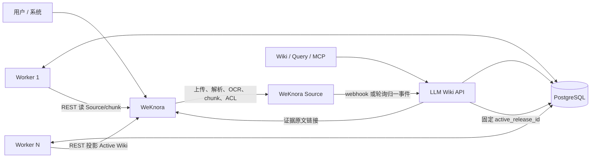
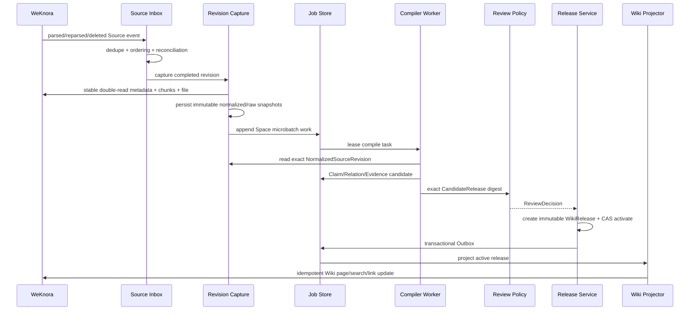

# Enterprise LLM Wiki 近期生产架构重置设计

> [!WARNING]
> **SERVING AUTHORITY 部分已被 2026-07-29 Amendment 2 取代。**
> 本文关于 PostgreSQL `Space.active_release_id + activation_epoch`、Outbox
> Projector、managed-page fenced projection 及 P11/P12 的执行授权仅作历史证据。
> 当前执行以
> [Sole Serving Active Release Authority ADR](2026-07-29-weknora-sole-serving-active-release-authority-adr.md)
> 和
> [Authority Amendment 2](2026-07-29-enterprise-llm-wiki-authority-amendment-2.md)
> 为准。本文的 Enterprise LLM Wiki 产品目标、Evidence/Conflict、弱模型、
> Candidate 批审、不可变 Release 和过程护栏仍保留。
>
> 日期：2026-07-24
>
> 状态：用户最终书面批准 2026-07-26；当前阶段 D0 实施（批准前独立 Spec、Security、Delivery/YAGNI 复核均为 C0/I0/M0）
>
> 基线：`origin/main = c3a833a482d0c1602f636b8e8df585fd64cb8765`
>
> 取代范围：本文取代旧北极星设计中关于强制人工终审、文件系统发布原子性、逐页补偿发布和过度运行准入的实现路线；未明确取代的知识语义、Evidence、Conflict、版本和 Release 原则继续有效。

## 1. 决策摘要

本轮不全面重写 Enterprise LLM Wiki，也不继续修补旧 029/031 的复杂发布与运行控制器。近期目标是：

> 在单地域、多应用实例、共享 PostgreSQL 的条件下，让用户通过 WeKnora 上传资料后自动完成知识编译、审核、Wiki Release 发布和带原文证据的查询，并能承受实际并发。

架构只保留支撑这个目标的最小生产能力：

- **充分复用 WeKnora** 的上传、多格式解析、OCR、chunk、原文件、Source 生命周期、身份、Space ACL、搜索、Wiki 页面和原文查看；
- **聚焦 LLM Wiki 核心**：Schema 驱动的知识编译、Claim/Relation/Evidence、冲突、可编辑候选、机器或人工审核、不可变 Wiki Release、回滚和 Active Release 查询；
- **PostgreSQL 是 LLM Wiki 权威状态库**，同时承载固定任务状态机、租约、Outbox 和每个 Space 的 `active_release_id`；
- **API 与 Worker 使用同一 Python 代码库、不同进程角色**，可横向扩容；不引入 Kafka、Redis、Temporal、通用工作流 DSL 或第二套基础设施平台；
- **审核策略可配置**：每个 Space 有版本化默认策略，并可按风险、来源可信度和冲突覆盖；机器高质量、可信结构化来源可自动发布，生产也可配置为必须人工终审；
- **人工审核是 Release 级批量动作**，默认一键批准完整候选，不要求逐页点击；
- **Wiki 是应用使用的知识权威，不是“只是一个页面投影”**。原始资料是证据真相，Active Wiki Release 是应用服务真相，两者通过可追溯的 ProvenanceAnchor 连接；
- **发布证据必须可长期回验**：SourceEvidence 永远保存 exact EvidenceFragment + digest，Release 还 pin 一个不可变 SourceRevisionArtifact，不能因 WeKnora 重解析或删除而静默断链；
- **知识语义先于页面和工作流**：SchemaVersion 必须冻结 Claim/Relation 类型、受限适用条件、确定性 identity/comparison key 和时间区间冲突语义；不把这些规则留给 extraction/compiler 实现时临场发明；
- **系统正确性与知识质量是双 P0**：先冻结并通过一个真实 Golden Product 的全纵切质量门禁，再扩展 Proposal UI、MCP transport 和 managed-page 投影等平台能力；
- **小 PR、单职责、前置威胁矩阵**，避免再次出现一个大 PR 在多轮外审中不断发现新不变量、反复推倒重来。

## 2. 为什么要重置

### 2.1 已验证正确的方向

当前项目不是普通 RAG。正确且必须保留的价值链是：

```text
原始资料
  → 可定位的证据
  → 结构化知识 IR
  → 冲突与变更候选
  → 审核
  → 不可变 Wiki Release
  → 人 / API / MCP 使用
```

Evidence-first、Schema/Template、Claim/Revision、Conflict、ReleaseSnapshot 和版本回滚都适合保险知识的多来源、多版本和高治理要求。

### 2.2 最近反复失败的根因

旧路线的失败不是模型算力不足，而是设计和交付方法共同失控：

1. **单个 PR 同时解决过多问题。** 031 把运行准入、文件系统原子发布、进程/FD 生命周期、密钥、恢复和 CLI 放在一个安全边界中，任何新发现都会重开整棵树。
2. **把部署级威胁引入领域请求路径。** inode、hardlink、fd、fsync、fork 等正确性本来不应成为 Wiki Release 的核心事务。
3. **不变量在实现后才由外审逐轮补充。** 每轮修复一个窗口，又暴露下一个状态窗口，说明威胁矩阵和事务边界没有在编码前冻结。
4. **强制人工最终批准被写成硬编码真理。** 它与 MVP 的机器审核自动发布、可信结构化资料批量发布不兼容。
5. **运行基础设施喧宾夺主。** 大量精力用于通用工作流、部署控制和文件制品，而不是验证知识编译质量及 Wiki 产品价值。
6. **本地平台能力复用不充分。** WeKnora 已经拥有上传、格式解析、OCR、chunk、文件、权限和 Wiki 基础能力，不应再复制一套。

因此，本轮不是“给原方案更高算力继续修”，而是缩小事务边界：让 PostgreSQL 负责原子状态，让对象/页面投影可重建，让 LLM Wiki 代码聚焦知识语义。

## 3. 产品语义与权威分层

### 3.1 四层真相

| 层 | 权威对象 | 作用 |
|---|---|---|
| 原始证据层 | WeKnora Source、文件、解析版本、chunk、页码/OCR | 证明知识来自哪里；保留原文和 ACL |
| 知识 IR 层 | ClaimRevision、RelationRevision、ProvenanceAnchor、ConflictSet | 表达可验证、可比较、可演进的语义知识 |
| 治理工作层 | CandidateRelease、ChangeProposal、ReviewDecision | 承载机器/人工决策、编辑、冲突和待发布内容 |
| 应用服务层 | Active WikiRelease | 人、API、MCP 和问答共同使用的当前知识权威 |

“原始资料是 source of truth”与“Wiki 是应用知识源头”并不冲突：

- 原始资料回答“这条知识凭什么成立”；
- Active Wiki Release 回答“应用现在应该使用哪一版知识”；
- Wiki 内容必须能回到原始资料，但应用不能绕过治理直接拿未发布 chunk 当确定结论。

### 3.2 Wiki 不是一次性生成物

Wiki 是一个可持续演进的知识产品：

- 按主题聚集相关 Claim、Relation、冲突、版本和来源；
- 有不可变页面修订、Release、change log 和回滚；
- 用户编辑 Published 页面时，不直接覆盖当前知识，而是创建绑定当前页面修订的 `ChangeProposal`；
- 新来源、人工编辑、机器建议都进入同一候选与审核流程；
- 真冲突可以以 `contested` 状态发布，页面并列展示双方证据，查询不得制造虚假确定性。

这延续了 Karpathy LLM Wiki 的核心思想：raw 是不可变来源，Wiki 是持续积累、可查询、可编辑、可链接和可版本化的长期知识资产。

## 4. 系统职责边界

### 4.1 WeKnora 负责

- 用户、租户、Space、RBAC、原始文件 ACL；
- 文件上传、存储、多格式解析、OCR、chunk、页码和原文查看；
- Source 状态、重解析、删除和原始向量/BM25 检索；
- Wiki 页面 CRUD、目录、搜索、链接图和展示载体；
- 现有 Wiki generation 可以作为交互和工程参考，但不拥有 LLM Wiki 的保险知识语义。

当前源码已有这些基础：

- Wiki 页面、目录、搜索、图、Issue 和路由：`internal/router/router.go`；
- Wiki 页面 source/chunk 引用、状态、类型、版本及并发配置：`internal/types/wiki_page.go`；
- 页面 CRUD 与 `[[slug]]` 链接：`internal/application/service/wiki_page.go`；
- PDF、Word、PPT、Excel/CSV、Markdown、HTML/MHTML、EPUB 和图片等格式注册：`docreader/parser/registry.py`；
- PaddleOCR/VL 等解析引擎：`internal/infrastructure/docparser/engine_registry.go`；
- 原文件安全读取、chunk/OCR 和 Space/KB 权限：`internal/router`、`internal/types/chunk.go`、`internal/router/rbac.go`。

### 4.2 LLM Wiki 服务负责

- WeKnora SourceRevision 的可靠接收与去重；
- Schema Registry、模板选择、弱模型编译和确定性验证；
- Claim/Relation/Evidence IR、冲突和受影响依赖闭包；
- Candidate Wiki、机器审核、人工批量审核和策略求值；
- 不可变 WikiPageRevision、WikiRelease、激活、回滚和审计；
- Active Release 只读查询、MCP 和证据下钻元数据；
- 固定的 PostgreSQL 任务状态机、租约、重试、Outbox 和可观测性。

### 4.3 明确禁止

- LLM Wiki 不直读或写 WeKnora 数据库、Redis/Asynq；
- 不复制上传、解析/OCR/chunk 算法、面向用户的原文件系统或 ACL；只为发布证据冻结最小 normalized snapshot，并在 WeKnora 无不可变 pin 能力时保留内容寻址原文件副本；
- WeKnora 内置 Wiki 生成不直接发布保险知识；
- WeKnora 页面内容不反向成为绕过 Claim/Evidence/Review 的事实库；
- 不建立通用 Workflow Engine、通用规则 DSL、部署控制器或文件系统发布事务；
- 不让 Python Harness 演化成另一套用户、租户、文件平台。

两边只通过版本化 REST 接口和统一 Source lifecycle event 交互。当前主线没有知识解析生命周期 webhook，因此 MVP 使用低并发轮询适配器生成内部事件：

- 上传后保存 `knowledge_id` 和稳定 source idempotency key；
- 单项解析 attempt 达到 `completed` 才物化 SourceRevision；attempt 的 `failed/cancelled` 只记录解析失败，不能撤回此前已完成的 SourceHead；
- 带外更新通过重叠时间窗、分页和去重扫描；
- 周期性按 ID、`file_hash`、`processed_at/updated_at` 做全量 reconciliation，捕获删除、重解析和时间窗遗漏；
- 内部事件身份至少包含 `(space_id, knowledge_id, lifecycle_kind, source_revision_key, upstream_updated_at)`；`lifecycle_kind` 明确区分 `revision_completed`、`parse_failed`、`parse_cancelled`、`source_deleted`、`source_disabled` 和 `source_withdrawn`，不同 kind 绝不能因 hash/processed_at 相同而互相去重；
- `source_revision_key` 由受控的文件 digest、处理时间和 parser/chunker identity 形成；若上游以后提供单调 generation，则 adapter 将其纳入 key，但上层合同不变化。

未来 webhook 只负责快速唤醒，reconciliation 继续作为最终一致性的补偿机制；切换连接方式不改变上层编译代码。Harness 不直连 WeKnora Redis、Asynq 或内部事件总线。

### 4.4 W0 WeKnora Revision Contract Spike

在 P4a/P4c 实现前必须完成只读的 `W0 WeKnora Revision Contract Spike`。它不能用设计假设代替源码/API 证据，必须在当前跟版基线冻结：

- stable source id 与单调 parse attempt/generation 的可见方式；
- completed attempt、parser/chunker 精确 identity 与原文件 revision 的绑定；
- chunk/structured record 的稳定排序、分页和完整 manifest digest；
- metadata 状态切换与 chunk 集合替换是否原子可见；
- source 删除/禁用的枚举方式以及 KB/Source ACL 粒度；
- 重解析、分页读取和删除并发时，客户端能否取得同一 attempt 的完整快照。

当前本地 WeKnora 的 span/trace API 暴露递增 processing `attempt`，但它是观测用 trace attempt，不是 chunk revision token；通用 chunk API 没有 attempt 字段，且 attempt 记录创建失败时重解析仍可继续，重解析路径也会删除并重建同一 knowledge 下的 chunks。因此 §7 的 metadata 双读只能是附加防线，不能在 W0 前被宣称为“绝不混版”的证明。

W0 必须分别冻结 `SourceLifecycleContract`（stable id、状态/删除枚举、ACL）和 `RevisionManifestContract`（exact attempt/snapshot/ordered manifest），并且只允许两个总体结论：

1. 现有公开 API 已能分别证明稳定 lifecycle identity 和绑定同一 completed attempt 的不可变 manifest/snapshot，P4a/P4c 直接消费并做双读复核；
2. 任一合同证据不足，则先交付独立的小 PR `W1 WeKnora Revision Manifest`：只补足 W0 证明缺失的版本化 lifecycle/manifest/snapshot API；revision response 至少返回 `knowledge_id + parse_attempt + file_digest + parser/chunker identity + ordered chunk manifest digest + completed_at`，并保证读取内容与该 manifest 绑定。W1 不引入 webhook、共享数据库、Asynq 耦合或第二套解析器。

未得到相应可执行合同时，P4a/P4c 分别保持 blocked，不能把时间戳、最终 M2 相等或客户端重试当作 lifecycle/revision 原子合同。

## 5. 最小生产拓扑



部署边界：

- 单地域；
- 一个 LLM Wiki API Deployment，可多副本；
- 一个 Worker Deployment，可独立配置副本与并发；
- 共享 PostgreSQL；
- WeKnora 沿用现有部署；
- 不承诺多地域 active-active、分布式事务或跨云容灾。

API 与 Worker 使用同一 wheel 和领域代码。API 不在请求进程里启动不可恢复的后台编译；Worker 不持有用户会话，只消费 PostgreSQL 任务。

### 5.1 容量包络

PostgreSQL 继续作为近期状态权威，但不能以“以后再压测”替代容量设计。D0 后先交付 `CAP0 Capacity Contract`；P2a/P2b 的表和索引合同获批前，首个上线环境必须冻结一个版本化 `CapacityProfile`，至少包含：

- Space 数、每个 Space 的 active/retained Source 数和 revision/day 峰值；
- 文档平均及 P95 字节、chunk/record 数；
- 每个 SourceRevision 的 Claim、Relation、ProvenanceAnchor 放大率；
- 每个 EvidenceFragment 的逻辑 byte 与 PostgreSQL inline byte 上限；
- Release/Page/Block 数、历史 Release 和 artifact 保留窗口；
- 每个 Candidate 的 changed Claim/Page/byte、总 manifest byte 上限，以及审核队列时长 SLO；
- Active Query 的持续/突发 QPS、P95 返回大小和延迟目标；
- Worker/provider 并发、最大队列积压及恢复 SLA。

Profile 使用三类证据档位，而不是固定拍脑袋的倍数：

- `launch`：来自首个上线环境的资料规模、并发和 SLA，是生产切换阻断门禁；
- `contracted_forecast`：来自已承诺的客户增长/容量区间；只有发布画像包含该承诺时才阻断；
- `stress_breakpoint`：逐步加压寻找瓶颈和降级点，默认只形成扩容证据，不作为上线阻断。

每档必须记录输入来源、测量时间和适用发布画像；未填写真实输入时状态是 `INSUFFICIENT_CAPACITY_EVIDENCE`，不能用“100 万 Claim”或固定 `10x` 一类无工作负载假设替代。

容量合同只驱动必要的数据决策，不提前建设新平台：

- 原文件和大型 normalized/page snapshot 不进入 PostgreSQL；小 JSONB 的 inline 上限由 Profile 决定；
- 大型 table/image/structured EvidenceFragment 同样不直接塞入 JSONB，只在行内保存 typed metadata、digest 和薄 EvidenceArtifactStore 的内容寻址引用；
- P2a/P2b 只建立其所属的 Space/Source/Release 索引；subject/predicate、applicability 和有效期索引归 P5a2/P9a，不能跨 PR 偷建未来表；
- P9a 必须把过滤、排序和分页下推到 SQL，禁止先加载整个 Release 再在 Python 中筛选；
- 默认不分库、不分片、不引入第二状态数据库；只有 `contracted_forecast` 或 `stress_breakpoint` 证据证明单 PostgreSQL 不能满足已承诺目标时才另立设计；
- P15 在真实生产切换前必须验证 `launch`；只有所选发布画像声明了客户增长承诺时才同时阻断验证 `contracted_forecast`，并记录非阻断的 `stress_breakpoint`。

## 6. 自动编译数据流



### 6.1 触发与微批

- 文档解析完成后自动进入编译，不依赖逐文档“点击编译”；
- 手动按钮只保留为有权限的重放/修复入口；
- 按 Space 将短时间内的来源事件聚成微批，减少频繁生成和发布；
- Revision Capture 先冻结 exact 解析输出，Compiler 不从会变化的 live chunk 列表编译；
- 每个事件冻结受控 `trusted_source_registration_id` 及其 policy version；调用方自报的 `trusted=true` 无效；
- `debounce_seconds`、`max_batch_documents`、`max_batch_bytes`、每 Space 并发和全局并发均可配置；P4b 只负责有序输入微批和积压，不估算尚未生成的 Wiki diff；
- `max_candidate_changed_claims`、`max_candidate_changed_pages`、`max_candidate_changed_bytes` 和总 manifest 上限来自 CapacityProfile，并由 P6b 在 page/assertion assembly 后按实测 canonical diff 唯一执法；`max_review_queue_age` 只是 SLO/告警，不改变 Candidate 状态，唯一审核过期动作仍由 ReviewPolicy 的 `decision_ttl + on_review_expiry` 决定；
- “5 份文档”只能是某环境的默认并发值，绝不是产品硬上限；
- 超过当前容量的文档进入持久队列，不拒绝、不无限创建协程，也不丢失。
- 单个微批会超过 Candidate diff 上限时，P6b 只能在完整 source-event/affected-closure 边界按冻结顺序生成当前 Candidate，并把未消费的有序 remainder 持久化；每个后继 Candidate 基于前一个已激活 Release 重建。一个不可拆的语义闭包本身超限时，batch/job 进入既有 `blocked` 状态并记录 `candidate_capacity_exceeded`、告警和人工扩容裁决，不能机械截断闭包、生成并行半成品或无限增长的待审载荷。

### 6.2 并发模型

- 不同 Space 完全并行；
- 同一 Space 内不同 Source 的解析和候选抽取可并行；
- 同一 SourceRevision 的任务通过幂等键去重；
- 同一 Space 的最终 merge、ReviewPolicy 求值和 Release 激活串行化；
- 多实例正确性依赖 PostgreSQL 唯一约束、CAS 和 fencing token，不依赖进程内锁；
- 任务语义是 at-least-once，领域输出必须幂等，不宣称无法证明的 exactly-once。

### 6.3 Candidate 与新微批的确定性规则

一个 Space 同时最多有一个占用审核槽位的 CandidateRelease。Candidate 内容不可变，并冻结：

- `base_release_id`；
- `base_activation_epoch`；
- `input_batch_ids` 和 source-event watermark；
- `review_policy_version_id + review_policy_epoch`；
- `knowledge_space_binding_id` 和所选 `compilation_security_profile_id/hash`；
- exact run fingerprint；`machine_auto` 还冻结 `quality_profile_approval_id + quality_profile_hash + automation_scope_hash`，其他模式显式编码为 null；
- Page/Claim/Relation/Provenance/Conflict 完整成员及 canonical digest。

以上所有冻结字段都进入 Candidate canonical digest；任何字段变化都必须生成新 Candidate，不能只更新旁路元数据。

人审或机器审核期间到达的新事件继续进入 `ready_for_candidate` 批次，不修改已冻结 Candidate，也不占用 Worker lease。状态规则固定为：

1. Candidate 被批准且 activation CAS 成功：标记 `promoted`，其 input batches 标记 consumed；积压批次基于新 Active Release 合并成下一个 Candidate。
2. Candidate 被人工拒绝：标记 `rejected`，其输入不自动无限重试；人工修订、来源新版本或显式 retry 会产生新的 batch。其他积压批次仍可继续。
3. 当前 Active Release 的 id 或 activation epoch、ReviewPolicy、KnowledgeSpaceBinding、CompilationSecurityProfile、run fingerprint、QualityProfileApproval/AutomationScope 或其他 Candidate 依赖在决定前发生变化：标记 `stale/superseded`，保留 Decision 审计但不得发布；原 input batches 回到 ready 队列并基于最新依赖重建。
4. activation CAS 失败：不得把旧 Decision 套到新 base；Candidate 标记 stale，原 input batches 确定性 requeue。
5. `human_batch` 超过策略的 decision TTL：按显式 `on_review_expiry = keep_waiting | expire_and_requeue` 执行并告警；不能依赖代码默认或静默丢弃输入。
6. `emergency_withdrawal` 在同一 Space 串行边界内可以抢占审核槽位：先把等待中的普通 Candidate 标记 `superseded_by_emergency` 并确定性 requeue 原 input batches，再基于当时 Active Release 创建 exact emergency Candidate 和不可变 superadmin Decision；它仍必须通过完整性、安全和 activation CAS，不能直接改 active 指针。

每个 Candidate promotion 都要求：

```text
candidate.base_release_id == space.active_release_id
AND candidate.base_activation_epoch == space.activation_epoch
```

同时要求 Candidate 的 policy id/epoch、KnowledgeSpaceBinding 和 CompilationSecurityProfile 仍等于当前权威值；`machine_auto` 还要求 Candidate/Decision 的 run fingerprint 与 P2c registry 当前可用 approval/scope exact 相等。`base_activation_epoch` 也进入 Candidate digest 与 ReviewDecision，关闭 `A(epoch=10) → B(epoch=11) → A(epoch=12)` 后旧 Decision 被重新使用的 ABA 窗口。上述等式与 input batch 状态在同一 PostgreSQL 事务中验证，保证人工等待期间的新资料既不会混入已审核 hash，也不会丢失；紧急 Candidate 的 CAS 失败也按同一 stale/requeue 规则处理。

## 7. 格式扩展

LLM Wiki 不按文件扩展名编写上层业务分支。WeKnora 先完成格式解析，LLM Wiki 消费统一的 `NormalizedSourceRevision`：

```text
source identity
source revision
content kind
ordered chunks / structured records
generic locator
metadata
parser identity
content digest
```

`NormalizedSourceRevision` 是 WeKnora 解析结果的最小不可变快照，不是第二套 parser/chunker。它必须基于 W0 证明的 revision manifest 合同；若 W0 选择 W1，则以下每次读取都绑定 exact manifest/attempt：

1. Capture Worker 先读取 source metadata `M1`；
2. 通过 WeKnora REST 读取完整有序 chunks/structured records、locator 和原文件；
3. 再读取 metadata `M2`；
4. 只有 `M1 == M2`、状态仍为 completed、revision marker/attempt 未变化、所读内容的 manifest digest 与权威 manifest 匹配时，才以内容寻址方式一次性写入快照；
5. 任一步遇到 reparse/delete/版本变化都丢弃本次未提交结果并重试新修订，绝不把两次解析拼成一个 revision。

Compiler 只读取这个已冻结快照，不在排队后重新读取 live chunks。快照保存 upstream attempt、chunk/record identity、有序 text/records、locator、parser/chunker identity、manifest digest 和 canonical digest；原始文件字节仍由 WeKnora 或薄 EvidenceArtifactStore 保留。

首批充分使用 WeKnora 已支持的 PDF、Word、PPT、Excel/CSV、TXT、Markdown、HTML/MHTML、EPUB、JSON 和图片 OCR/VLM。新增格式时：

1. 优先在 WeKnora 现有 parser/chunker 扩展；
2. 新增一个 `SourceContentAdapter` 或 `EvidenceLocator` 编解码器；
3. 上层 Compiler、Review、WikiPage、Release 和 Query 不感知文件格式。

JSON/FAQ 等结构化来源可以跳过自然语言版面抽取，但不能跳过 SourceRevision、Evidence、冲突、审核和 Release。

WeKnora 的 `chunk_refs` 只是通用引用字段，不证明某段原文真的支持 Claim；Evidence excerpt、locator、hash 和语义支持关系仍由 LLM Wiki 校验。

## 8. 核心领域模型

| 对象 | 核心约束 |
|---|---|
| `KnowledgeSpaceBinding` | 把 WeKnora tenant 的 RAW/Wiki KB 映射到一个 LLM Wiki Space，并保存 ACL equivalence 状态；所有对象和幂等键显式带 Space |
| `SourceRevision` | 绑定 WeKnora source/revision/content digest/parser identity；不可变 |
| `SourceRevisionArtifact` | 对原文件修订的不可变、内容寻址保留引用；由 Active/可回滚 Release pin |
| `NormalizedSourceRevision` | WeKnora exact 解析输出的内容寻址快照；保存 ordered text/records、locator、parser/chunker identity 和 digest |
| `ProvenanceAnchor` | 所有可发布 assertion 的来源超类型；只允许 `source_evidence / human_attestation / external_attestation` 三种封闭 kind |
| `EvidenceAnchor` | `source_evidence` 子类型；绑定 SourceRevision、artifact、locator、`EvidenceFragmentV1`、digest 和支持关系 |
| `SchemaVersion` | 只拥有字段类型、Claim/Relation identity/comparison key、受限适用维度、canonicalizer/comparator、证据要求、验证规则和冲突策略的语义运行时类型系统 |
| `WikiTemplateVersion` | P6a 复用/收窄现有内容寻址 TemplateVersion，只拥有页面结构、block layout、标题、display label 与 renderer contract |
| `CompilerProfileVersion` | 运行 manifest/receipt，显式绑定 Schema、entity resolver、extractor/prompt/model 与 WikiTemplate；MVP 不为它新建 registry/table |
| `CompilationSecurityProfileVersion` | 版本化冻结资料分类、允许的 provider/model、脱敏/留存/驻留、工具网络、日志和 renderer 安全合同 |
| `InsuranceProduct / ProductVersion / ProductAlias` | 复用现有 Space-scoped 产品主数据；稳定 id 是 Product 类 EntityRef 的唯一铸造权威，不新建泛化 EntityRegistry |
| `EntityResolutionCandidate / UnmappedObservation` | 无法确定 canonical entity 或 Schema 无法承载的重要内容；带原文证据进入 quarantine，不能进入 Active Release |
| `CompilationJob/StageAttempt` | 固定状态机、lease、fencing、重试、错误和输出 receipt |
| `Claim/ClaimRevision` | Claim 是稳定语义身份；内容和证据存在不可变 Revision |
| `Relation/RelationRevision` | 显式表达知识之间的关系与适用范围 |
| `ConflictSet` | 保存冲突各方、适用时间/范围、状态和证据；不默认挑 winner |
| `CandidateRelease` | 一个 Space 的完整待审知识与页面候选；冻结 base release id/activation epoch、input batch IDs、binding/security/policy id/epoch 和 canonical digest |
| `CandidateLifecycleEvent` | 追加式记录 awaiting_review/approved/rejected/stale/superseded/promoted/expired，不修改 Candidate 内容 |
| `ReviewPolicyVersion` | Space 默认审核方式及风险/来源/冲突覆盖规则 |
| `Space.active_review_policy_version_id + review_policy_epoch` | 当前审核策略指针；策略切换、Candidate 创建与 promotion 共享 Space 串行边界 |
| `ReviewDecision` | 绑定 exact Candidate digest、policy id/epoch、actor、范围、理由和 receipts |
| `WikiPageRevision` | Schema 验证的不可变 JSONB blocks；包含 Claim/Relation/Provenance 引用 |
| `WikiRelease` | 逻辑完整、物理可复用旧 Revision 的不可变成员集合 |
| `Space.active_release_id + activation_epoch` | 应用当前服务真相；每次激活或回滚以 expected-current CAS 切换并单调递增 epoch |
| `OutboxEvent` | Release 激活后驱动 WeKnora、搜索和其他可重建投影 |

### 8.1 ProvenanceAnchor、EvidenceFragment 与原文

每个可发布 Claim/Relation 必须至少绑定一个 `ProvenanceAnchor`。审核表示“谁批准了这次发布”，Provenance 表示“这个事实从哪里来”，两者不能互相替代。MVP 只允许三个封闭 kind：

- `source_evidence`：来自 WeKnora 的不可变 SourceRevision；
- `human_attestation`：授权人对一个明确 statement、scope 和理由作出的不可变事实背书；
- `external_attestation`：受控 connector 提供、可按 issuer/record/digest/有效期/撤销状态回验的外部背书。

`source_evidence` 使用 `EvidenceAnchor`，至少包含：

- `source_id`、`source_revision_id`、`source_revision_artifact_id`；
- upstream chunk/record identity 和 parser/chunker identity；
- 版本化 `locator`；
- 必填 `EvidenceFragmentV1` 和 fragment digest；
- `supports | contradicts | supersedes | context`；
- WeKnora 原文查看引用。

`EvidenceFragmentV1` 是 tagged union，而不是强迫所有格式伪装成纯文本：

- `text_span`：UTF-8 exact text、行/字符范围；
- `table_range`：canonical cell matrix、sheet/table/range；
- `image_region`：原图/crop digest 与坐标；OCR/VLM 文本只能作为 derivative，不能冒充原始证据；
- `structured_record`：canonical JSON fragment、JSON Pointer/record key。

Fragment 的逻辑内容和 digest 总是完整；物理载荷按 CapacityProfile 选择有界 inline，或写入同一薄 EvidenceArtifactStore 的内容寻址 key，行内只保存 type/shape/locator/digest/ref。该选择不改变上层 Provenance/Query 接口，也不新增对象平台。

PDF/Word/PPT 可以组合页码、段落、表格、坐标；TXT/Markdown 使用行号、标题路径和字符范围；Excel/CSV 使用 sheet/cell range；JSON 使用 JSON Pointer。新增格式只新增 locator/fragment codec，不修改 Claim、Wiki、Review 或 Query 上层合同。

事实没有变化、只调整页面措辞时可以复用原 Provenance；任何改变 Claim/Relation 值、适用范围或有效期的编辑，必须新增 SourceEvidence 或显式 HumanAttestation。HumanAttestation 默认阻断 `machine_auto`；`trusted_import` 必须绑定不可变 ExternalAttestation，调用方自报 `trusted=true` 无效。Attestation 的撤销会产生普通 withdrawal Candidate，不修改历史 Release。

Wiki 页面以块级 `[1]` 引用展示。点击后打开证据侧栏，显示 provenance kind、来源/背书主体、版本、exact fragment、定位、关系和校验状态；查看完整原文时跳转 WeKnora，并继续执行其当前 ACL。这样应用把 Wiki 当知识权威时，仍能随时回到原始证据，而不是只看到模型生成的摘要。

### 8.2 Knowledge Assertion 与适用范围合同

`ClaimRevision` 和 `RelationRevision` 是知识语义权威，不能把 condition、地域或人群藏在自由文本里再依赖模型临场比较。MVP 冻结如下最小合同：

```text
EntityRef
  entity_type
  entity_id

ClaimRevision
  schema_version_id
  subject_ref: EntityRef
  predicate_id
  value_state + typed value
  applicability + applicability_hash
  effective_from + effective_to
  evidence_anchor_ids
  content_digest

RelationRevision
  schema_version_id
  source_ref: EntityRef
  relation_type
  target_ref: EntityRef
  applicability + applicability_hash
  effective_from + effective_to
  evidence_anchor_ids
  content_digest
```

`EntityRef` 的 type tag 和 id 共同参与 canonical identity；不同实体命名空间即使 id 字节相同也不是同一实体。

实体解析不交给 extractor 临场猜测，也不新建一套通用 ontology registry。首版按实体类型使用明确权威：

- `product` / `product_version` 复用现有 `InsuranceProduct`、`ProductVersion`、`ProductAlias`、`ProductDocument` 和 `UnassignedItem`；只有 `ProductRegistryService` 可以基于 Space 内唯一 product code、registration/external id 或授权注册动作铸造 root/version id；
- ProductVersion 一旦被 SourceRevision、Assertion 或 Release 引用，其 identity-bearing 字段和有效期不可原地改写；纠正版本归属产生新 Version/Mapping 与审计 receipt，历史 EntityRef 不变；
- Schema 封闭 enum/catalog（例如受控责任或疾病目录）由 exact catalog id 决定；外部主数据只通过版本化 crosswalk exact 映射；
- 已注册且在同一 Space 唯一的 exact product code、registration number、canonical name 或有来源/版本/批准 receipt 的受控 alias 可以确定性解析；既有 `source="auto"` alias 不自动获得权威资格，P5a0 必须按冻结生成规则重验并登记后才能进入 allowlist；歧义 alias、fuzzy、embedding 或 LLM 建议只能生成 `EntityResolutionCandidate/UnassignedItem`；
- 人工绑定写不可变 `EntityResolutionReceipt`（输入 fragment、候选集、选择、actor、时间和 resolver version），然后重跑受影响编译；它不回填或改写旧 Release；
- unresolved、跨 Space、版本缺失或 resolver contract 不支持的类型一律 quarantine，并阻断相关内容的 `machine_auto`。

因此外部建议指出的“解析合同缺口”成立，但“项目没有 Product/ProductVersion registry、应再造六张泛化表”不成立。P5a0 只收口现有主数据的 mint/resolve/lifecycle adapter 和最小 resolution receipt，不复制现有产品表。

`AssertionApplicabilityV1` 不是通用规则表达式，也不得复用 TemplatePackage 的 `TemplateScope/ResolutionRequest`。它是由 SchemaVersion 声明的 canonical tagged JSON：

- `jurisdiction_ids`、`audience_segment_ids`、`channel_ids`；
- 标准多值维度是 `ANY`、`UNKNOWN` 或排序去重后的非空集合；
- field/relation-specific qualifier 是 `ANY`、`UNKNOWN` 或一个 tagged primitive，只允许 exact scalar、排序去重的 enum/entity-reference set 或闭合 numeric/date interval；
- 多值集合内部是 OR，所有标准维度与 qualifier 之间是 AND；
- `ANY` 表示不比 ProductVersion 外层包络更窄，不表示超出该产品范围；`UNKNOWN` 与 `ANY` 永不等价；
- 这些 primitive 只有代码拥有的 equality/intersection 语义；不支持嵌套布尔树、任意运算符、脚本、继承推理或自由文本条件求值；
- 无法结构化的复杂条件保留为带 Evidence 的文本知识并进入审核，不能伪装成全适用。

ProductVersion 的 regions/channels/effective period 是产品外层包络；assertion applicability 的实际范围是两者交集，只能保持或收窄，不能静默扩大。Schema 声明为 required 的 qualifier 缺失时记录 `applicability_unknown`，阻断自动 merge 和 `machine_auto`；optional 维度的 `UNKNOWN` 也不等于 `ANY`，只是不会单独构成“缺 required”发布阻断。人工可以把 unknown 作为明确受限/contested 内容批准，但 Query 不得将它解释为全适用。

SchemaVersion 提供唯一、代码拥有的 `ApplicabilityRelation`，按固定顺序比较两个实际范围：

- `disjoint`：任一可比较的已知维度交集为空；即使其他维度 unknown，也已足以证明整体相离；
- `unknown`：尚未证明 disjoint，且任一已声明维度为 UNKNOWN、类型不可比较或 comparator 无法裁定；
- `equivalent`：所有维度 canonical 等价；
- `overlap`：未命中前三者且范围不等价、交集非空。

所有 key 使用版本化、代码拥有的 canonicalizer。只有上述已注册、版本化、同 Space 唯一的 exact alias mapping 可以解析到既有 entity；临时 alias、模糊匹配或 LLM 输出禁止直接决定 identity。Schema 的 relation type 还必须声明 `relation_identity_mode = functional_target | set_member`：前者表示同一来源在同一范围内只能有一个目标，后者表示多个目标是合法集合成员。Claim 和 Relation 分别定义 family：

```text
claim_family_key =
  hash(space_id, "claim", subject_ref, predicate_id)

functional relation_family_key =
  hash(space_id, "relation", source_ref, relation_type)

set-member relation_family_key =
  hash(space_id, "relation", source_ref, relation_type, target_ref)

comparison_key =
  hash(assertion_family_key, applicability_hash)

assertion_identity_key =
  hash(comparison_key, effective_from_or_negative_infinity_sentinel)
```

有效期统一为 `date` 闭区间 `[effective_from, effective_to]`。NULL 起点/终点分别表示负/正无穷，canonical identity 使用固定 sentinel；`effective_from > effective_to` 在写入前拒绝。Claim 的 Schema comparator 返回 `equal | different | unknown`；`functional_target` Relation 以 typed `target_ref` 比较并返回同样三态，`set_member` Relation 的不同 target 属于不同 family，可合法并存。

跨 SchemaVersion 比较必须显式。只有两版声明同一 identity contract，或 P5a2 注册了代码拥有、版本化、可测试的 compatibility adapter 时，才把双方映射到同一 comparison contract；不存在 adapter、adapter 失败或任一旧值无法无损映射时，applicability/value comparison 返回 `unknown` 并进入 Conflict/人工审核，绝不能自动 merge 或 `machine_auto`。identity contract 变化仍按下文显式 recompile/migration，不能借 compatibility adapter 隐式重写历史 root。

匹配、重复和冲突语义固定为：

1. 冲突候选按同 `assertion_family_key` 和有效期重叠检索，不能只按 exact `comparison_key` 检索；
2. `ApplicabilityRelation=disjoint` 时两个 assertion 可并存且不冲突；
3. `equivalent/overlap/unknown` 且值/目标为 `different/unknown` 时必须形成或进入待审 `ConflictSet`，不得自动覆盖；
4. 同 `assertion_identity_key`、scope equivalent、值/目标 equal 且 `effective_to` 相同时只产生不可变 Evidence enrichment Revision；`effective_to` 变化按第 7 条形成显式 temporal Revision；
5. 不同 identity、有效期重叠且内容 equal 时标记 duplicate candidate；只有 Schema 的确定性 interval canonicalizer 能合并，否则进入审核，不能静默挑 root；
6. 有效期不重叠时允许历史 assertion 并存；
7. `effective_to` 是 Revision 内容，允许后续 Revision 封闭原开放区间；`effective_from` 从 NULL 改为具体日期属于 identity 变化，必须显式新建/supersede，不能改写 root；
8. Query 缺少必要 qualifier 且命中多个范围时，返回适用范围及冲突/需补充条件，不静默选择一个 winner。

ClaimRoot/RelationRoot 只保存不可变 identity，没有 mutable `current_revision` 或服务状态。每次观察、编辑或审核结果产生不可变 Revision；Candidate/Release membership 决定服务哪一版。正常 Release 对每个 root 最多收录一个 accepted Revision；contested 内容只能通过显式 ConflictSet 引用多个备选 Revision，不能把某个分支偷偷设为 current。ConflictSet 也可以引用 family 相同、scope 部分重叠但属于不同 root 的 Revision。

SchemaVersion 升级不会改写历史 Release。identity/canonicalizer 变化必须产生显式 recompile/migration Candidate；旧 Claim、Relation 和 Release 继续 pin 原 schema id/hash，不允许后台隐式 rekey。

Schema 与页面模板是两个版本域。`SchemaVersion` 的变化可能改变知识 identity/comparison，因此必须显式重编译；`WikiTemplateVersion` 只改变页面结构和展示，基于同一组 accepted Claim/Relation 生成新的 WikiPageRevision/Candidate，不重建 assertion root。`CompilerProfileVersion` 显式绑定二者及 extractor/prompt/model/entity resolver，运行 receipt 分别记录 semantic output hash 与 page output hash，避免改标题或布局时被误判为知识语义迁移。

### 8.3 SourceRevisionArtifact 与解析快照保留合同

WeKnora 当前 Source/chunk 会随重解析或删除而变化，因此仅保存 `knowledge_id/chunk_id` 不能证明历史 Release。P4c 在物化 SourceRevision 时必须同时建立不可变的 `NormalizedSourceRevision` 和 `SourceRevisionArtifact`：

- 若 WeKnora/其存储 provider 能返回不可变、内容寻址且可 pin 的原文件 key，则只记录并 pin 该 key；
- 否则通过薄 `EvidenceArtifactStore` 一次性复制原文件字节到 `sha256/<digest>` 唯一 key；
- normalized snapshot 也以 canonical digest 内容寻址；小快照可以内联 PostgreSQL JSONB，大快照写入同一薄 store，但其 schema 和读取接口一致；
- 该薄层只负责 retention/get，不负责上传、解析、OCR、chunk、目录或通用对象管理；
- Capture 采用前后 metadata 双读；物化和编译之间发生 reparse/delete 时，旧快照仍保持 exact，新的 lifecycle event 另建 SourceRevision；
- EvidenceAnchor 自身始终保存 exact EvidenceFragment，因此证据侧栏不依赖重新读取可变 chunk；
- Active Release 和仍保留回滚资格的 Release pin 相关 artifact；回滚资格按 Space 的显式保留窗口/数量策略改变并写审计事件，普通 Source 删除、重解析和请求路径不得删除 pin；
- Release promotion 在 artifact 不可读取、digest 不匹配或 locator 无法回验时 fail closed；
- 完整原文件查看继续通过 WeKnora 身份/Space ACL 授权，再由受控 download/preview 或 artifact adapter 返回；不能暴露裸对象 key。

MVP 不提供“仍被 Active 或可回滚 Release 引用时强制即时清除”的接口。此类 purge 请求必须返回稳定的 `artifact_still_referenced` 阻断并留下审计事件。允许清除前必须：

1. 先通过 `emergency_withdrawal` 或普通 Release 切换，确保 Active Release 不再引用；
2. 显式取消相关历史 Release 的可回滚/可服务资格；
3. 通过正常 activation Outbox 使查询缓存和 WeKnora 投影收敛，并等待系统强制的最长请求生命周期与缓存 TTL 结束；
4. 验证不存在 active pointer 或 rollback pin 后，retention job 才删除字节并写不可变 purge receipt。

这不是即时法律清除机制；若上线环境要求“收到命令即刻跨缓存、在途请求和投影全局擦除”，必须在后续独立设计中实现，不能在 MVP 暗示已经支持。

### 8.4 Canonical serialization 与 digest 合同

所有跨语言、跨进程和长期保存的 identity/digest 使用同一 `CanonicalEnvelopeV1`：

- JSON 使用 RFC 8785/JCS；文本统一 UTF-8、Unicode NFC 和 LF；
- 日期/时间使用带类型 tag 的 ISO 8601；decimal、money、percentage 使用规范化十进制定点字符串，禁止二进制浮点参与 identity；
- `NULL`、`UNKNOWN`、`ANY` 和正负无穷使用不同的显式 tagged sentinel；
- set 先按 canonical byte 排序去重；有语义顺序的 list 不排序；
- 每个 hash 都包含 `domain_separator + hash_schema_version + object_type + canonical_bytes`，算法首版固定 SHA-256；
- PostgreSQL JSONB 展示顺序、Python `repr`、Go map 遍历顺序或运行时默认编码不得作为 hash 输入。

C0 冻结这一份语言中立规范、expected bytes/hash vectors 和 Python reference codec；P2a、P5a1、Candidate、Release、Schema、AutomationScope、EvidenceFragment 和 WeKnora managed-page contract 都复用它。Go 端只在条件 W1 或 P11 首次真正消费时实现 adapter 并跑同一 vectors，C0 不提前修改 WeKnora fork。更换算法或编码规则必须升 `hash_schema_version`，不得静默重算历史对象。

## 9. 审核策略

### 9.1 配置粒度

采用已确认的 A：

> 每个 Space 配置一个版本化默认 `ReviewPolicy`，并允许按风险、来源可信度和冲突状态覆盖。

不采用全局单一开关，也不把每个页面变成独立审核配置单元。

### 9.2 策略模式

| 模式 | 用途 |
|---|---|
| `machine_auto` | 机器审核满足阈值且无阻断项时自动发布 |
| `human_batch` | 授权人对完整 Candidate Release 一键批准/拒绝 |
| `hybrid` | 机器先审并聚合风险，人工对完整候选做一次最终决定 |
| `trusted_import` | 对受控 connector 提供、已有外部人工审计证明的结构化来源，确定性校验后批量发布 |

`superadmin_override` 是一次性 `ReviewDecision` 动作，不是建议长期配置的 Space 默认模式。它必须绑定 exact Candidate digest、理由、actor 和审计范围；不能修改历史决策，也不能绕过 Space ACL、完整性校验或恶意内容安全检查。

### 9.3 覆盖与求值

`ReviewPolicyVersion` 包含：

- Space 默认模式；
- 风险等级、字段敏感度、来源 assurance、冲突状态四个封闭匹配维度及唯一优先级；
- 机器模型/规则身份和最低分数；
- 哪些阻断项绝不可自动发布；
- 是否允许 `trusted_import`；
- 是否允许 superadmin 一键发布；
- `machine_auto` 使用的 immutable `quality_profile_approval_id + quality_profile_hash + automation_scope_hash`；
- policy 生效时间和版本。

Space 另保存 `active_review_policy_version_id + review_policy_epoch`。ReviewPolicyVersion 不可变；切换当前策略必须锁定 Space 行、更新 pointer 并单调增加 epoch。Candidate 创建时冻结这两个值。

求值规则：

1. 对 Candidate 全部内容执行确定性和机器审核；
2. 找出所有命中规则；
3. 默认取最高审核强度，避免某个“可信”标签意外压过高风险冲突；
4. 同优先级规则含义冲突或无法确定唯一结果时 fail closed；
5. `trusted_import` 只能由受控 connector/attestation 产生，不能来自请求布尔值；
6. 显式 Space 策略可允许某类高质量机器结果直接发布；
7. 正式生产 Space 也可配置为任何 Candidate 都必须 `human_batch`；
8. Candidate 创建、策略切换和 Release promotion 使用同一 Space 串行边界；
9. promotion 事务必须验证 Candidate 和 Decision 绑定的 policy id/epoch 仍等于 Space 当前值；不相等时 Candidate stale、输入 requeue，旧 Decision 不可复用；
10. `machine_auto` 还必须从 P2c 权威 registry 读取 ReviewPolicyVersion pin 的 exact `QualityProfileApproval`，逐项匹配其 `AutomationScopeV1`，且 Candidate 内容全部落在 `covered_capabilities`；缺失、撤销或任一 hash/字段不匹配都回落 `human_batch`，不能用客户端标记或 superadmin 默认配置掩盖；
11. 策略变化只影响尚未发布和未来 Candidate/Decision，不改写历史 Release。

第一版 policy clause 只能对上述四个维度执行 enum equality、enum membership 或 wildcard，并输出一个审核模式/强度。禁止任意布尔嵌套、脚本、用户自定义表达式、product id/field id 特例以及把模型分数变成任意 clause 条件；最低分数和绝对阻断项是 policy 的全局参数。若以后确有第五个维度，必须先修改领域 schema、求值器和决策矩阵测试，不能通过配置偷偷扩成规则引擎。

平台新建 Space 的安全默认值是 `human_batch`；MVP Space 必须通过显式、版本化配置切换为 `machine_auto`，不能依赖代码环境或隐式默认。待审核 Candidate 绑定创建时的 policy id/epoch；Space 当前策略发生变化后，尚未发布的 Candidate 默认转为 stale 并重新求值。即使策略切换与 promotion 并发，Space 行 CAS 也只能让一个事务获胜；历史 Release 不受影响。

质量回归或安全事件可以追加 `QualityProfileRevocation` receipt；它不改写旧 approval，但会在同一 Space 策略事务中递增 policy epoch，使所有等待中的相关 `machine_auto` Candidate stale 并回落 `human_batch`。已发布 Release 保持审计不可变；若内容必须下线，仍走 emergency withdrawal。

### 9.4 Decision Receipt

机器、人工、可信导入和 superadmin 使用同一种不可变 `ReviewDecision`：

- Candidate digest 和完整成员摘要；
- `base_release_id + base_activation_epoch`（二者也已进入 Candidate digest）；
- ReviewPolicyVersion id 和 Candidate 创建时的 policy epoch；
- Candidate run fingerprint、QualityProfileApproval id/hash 和 AutomationScope hash（非 `machine_auto` 可为空但仍显式编码）；
- actor kind/id；
- 结果、理由、时间；
- 机器审核的 provider/model/prompt/tool identity、分数和证据；
- 人工批量审核的 exact release 摘要；
- override 的原因与授权范围。

Candidate 内容、Revision、policy、运行指纹或 QualityProfileApproval/AutomationScope 变化后，旧 Decision 自动不适用。系统必须生成新 Candidate 并重新审核。

### 9.5 人工体验

- 默认展示整个 Candidate Release 的摘要：新增、修改、删除、冲突、来源、风险和机器审核结论；
- 授权人可一键批准并发布全部候选；
- 页面/Claim 详情用于抽查和证据下钻，不要求逐页点选；
- 如果发现局部错误，拒绝当前 Candidate 或创建修订 Proposal，再生成新的 exact Candidate；不在已批准 digest 上偷偷删除部分成员。

这同时支持：

- MVP：机器审核通过后自动发布；
- 高质量结构化资料：批量可信导入；
- 成熟生产：强制 Release 级人工最终批准；
- 应急：superadmin 对 exact Candidate 一键发布或创建紧急撤回 Release。

## 10. 冲突、编辑、更新和撤回

### 10.1 冲突

冲突判断至少考虑产品/版本身份、来源角色、适用时间、地域/人群、Evidence 完整度和机器审核结果。无法合理消解的真实冲突：

- 保留双方 ClaimRevision 和 Evidence；
- 以 `contested` 进入 Candidate/Release；
- Wiki 清晰展示差异与适用条件；
- Query/MCP 返回冲突状态，不输出单一确定答案。

### 10.2 编辑

- Published managed Wiki 页面只读；
- 编辑动作创建绑定 `base_release_id + page_revision_id` 的 `ChangeProposal`；
- Proposal 可以修改块、Claim、Relation 或来源解释，但必须重新形成 Candidate 和 Decision；
- 普通 WeKnora 自建页面不受 managed page 规则影响。

### 10.3 来源更新与逻辑删除

新 SourceRevision 到达后，通过 Evidence 反向依赖确定受影响的 Claim/Page，只重编译依赖闭包。旧 Evidence、SourceRevisionArtifact 和历史 Release 保持不可变。

只有 WeKnora source-level `deleted/disabled/withdrawn` 事件表示来源撤回；parse-attempt `cancelled` 只记录失败，不改变此前 SourceHead。source-level 撤回不直接删除 Claim、Evidence、artifact 或当前 Wiki，而是生成一个 `SourceRetractionProposal`：

1. 找出 Active Release 中依赖该 SourceRevision 的 Claim/Page；
2. 若 Claim 仍有其他有效 Evidence，生成移除该 anchor 或降低支持范围的候选；
3. 若已无有效 Evidence，生成 withdraw Claim/Page block 的候选；
4. 若删除改变冲突关系，重新形成 ConflictSet；
5. 候选按正常 ReviewPolicy 进入新 CandidateRelease。

在新 Release 激活前，当前 Release 保持不变并继续使用其 pin 的证据；系统同时发出 source-retraction pending 告警。需要立即下线时，superadmin 使用同一套 Proposal/Decision/ReleaseService 创建最小 `emergency_withdrawal` Release，不能靠 read filter 或直接删页面。若此时已有 `human_batch` Candidate 等待审核，紧急流程按 §6.3 在 Space 锁内 supersede 它并 requeue 原输入。

逻辑删除不解除历史 artifact pin。MVP 只允许在 Active Release 已切走、相关历史 Release 已取消可服务/回滚资格、缓存与在途请求完成收敛后执行 retention purge；任何仍有引用时的即时 purge 都 fail closed。跨缓存和在途请求的强制即时法律清除不属于本轮 MVP。

### 10.4 回滚与紧急撤回

- 普通回滚：CAS 把 `active_release_id` 指回一个仍允许使用的历史 Release，同时递增独立的 `activation_epoch`；不调用模型、不重写历史 Release；
- 证据撤回：历史 Release 保持审计不可变，系统创建最小 `emergency_withdrawal` 新 Release，删除或标注受影响内容；
- 应用部署回滚：使用 expand/contract 数据库兼容策略，与知识 Release 回滚分开；
- 不以破坏性 down migration 作为生产恢复方案。

### 10.5 Schema gap 与派生知识边界

Extractor 发现有业务意义但无法映射到已批准 Schema/Entity 的内容时，必须生成带 Provenance 的 `UnmappedObservation` 或 `EntityResolutionCandidate`，记录 reason、原始 fragment 和建议类型。它们进入 quarantine/人工工作队列，不进入 Candidate 的已发布 assertion。

G0a 对 Golden 原文做独立 whole-document residual audit，冻结 `material_observation_total`，并把每个 observation 标为 mapped、reported_unmapped 或 silent_residual；质量报告同时输出三者计数、`reported_unmapped / total` 和 `silent_residual / total`。未报告的 silent residual 是覆盖失败，不能从分母消失。生产抽样沿用同一审计口径；高风险未映射数和最长等待时间也单列。这样 extractor 不能靠“从不生成 UnmappedObservation”刷出漂亮指标。

MVP 只把直接绑定 SourceEvidence 或显式 Attestation 的 Claim/Relation 当作可发布事实。跨 Claim 汇总、计算结论和自由摘要只能作为带引用的页面表现，不产生新的独立事实，因此当前受影响闭包由 Provenance → Assertion → Page 足以完整追踪。需要把计算/推导结果升级为可查询事实时，必须另立 `DerivationEdge + transformation_version` 设计和质量门禁；本轮不预建推理图。

## 11. Release、投影和查询

### 11.1 Release 事务

Release 激活只包含 PostgreSQL 事务：

1. 校验 Candidate 闭包、Space 一致性、页面 schema、ReviewDecision、canonical digest、`base_release_id == active_release_id AND base_activation_epoch == activation_epoch`，Candidate 引用的每个 Attestation 在 promotion time 仍 `valid_at` 且未被 append-only receipt 撤销，并要求 Candidate/Decision 的 binding、CompilationSecurityProfile 和 policy id/epoch 等于 Space 当前权威值；若任一 Attestation 在 Decision 后失效则 Candidate stale/requeue；若是 `machine_auto`，还必须从 P2c registry 重新读取并精确复核 Candidate/Decision 的 run fingerprint、QualityProfileApproval id/hash、AutomationScope hash 与 covered capabilities；
2. 创建不可变 `WikiRelease` 与成员；
3. 以 `expected_active_release_id + expected_activation_epoch + expected_review_policy_epoch` CAS 切换 Space 指针，并把 activation epoch 单调加一；策略切换使用同一 Space 行串行边界；
4. 在同一事务写包含新 `activation_epoch` 的 Outbox。

文件系统 rename、inode、hardlink、fd、fsync 或跨服务分布式事务都不属于 Release 原子边界。

### 11.2 投影

WeKnora Wiki 页面、Markdown、搜索索引和链接图是 Active Release 的可重建投影：

- Outbox Worker 幂等写入；
- 每个页面携带 `space_id/release_id/page_revision_id/content_digest`；
- 旧 Release 的迟到事件不能覆盖新 Release；
- 部分失败可重试和 reconciliation；
- 投影失败暴露 freshness/health，不反向修改已提交 Release，也不执行逐页补偿 saga。

MVP 查询权威直接读取 PostgreSQL Active Release，因此投影短暂延迟不会让 API/MCP 混用版本。WeKnora UI 需要展示投影新鲜度。

现有 WeKnora Wiki `PUT` 是普通页面更新而非 semantic CAS，`draft/published` 也不能表达完整 Release 原子性；因此不能把 WeKnora 页面写入成功当成 Release commit。

在 Projector 上线前，P11 必须先给 WeKnora 增加最小 managed-page 服务端 fencing：

- managed page 绑定固定 owner Space/LLM Wiki projector principal；
- 每次正常激活或回滚都使用 PostgreSQL 单调递增的 `activation_epoch`，它独立于 WikiRelease 创建顺序；
- WeKnora 为每个 managed Space 保存 `accepted_activation_epoch` high-watermark；dedicated conditional upsert/delete 原子拒绝低于该值的任何页面请求，高于时推进 high-watermark，同 epoch 重放必须对同一页面/tombstone 保持 content digest 相同；
- 每次 activation Outbox 包含完整 page/tombstone manifest；Projector 在全部 manifest 项成功后才写 `projection_complete_epoch`，UI freshness 读取 complete epoch 而不是“第一项已到达”；
- 标准 Wiki PUT/DELETE 对 managed page 拒绝，不能绕过 dedicated endpoint；
- 标准 Wiki GET/list/search/cache 对 managed page 额外执行 KnowledgeSpaceBinding 的当前 RAW KB ACL guard；仅拥有较宽 wiki_kb 权限不能读取标题、摘要、正文或索引命中；
- page/tombstone 也记录 activation epoch，部分失败可以按 manifest 精确补齐；Space high-watermark 保证未变化页面也不会被迟到旧事件覆盖；
- fencing 只保护投影顺序和 ownership，不承担 Release 权威或审核。

因此回滚到旧 Release 时也会携带一个新的、更高 activation epoch，WeKnora 不会把它误判为迟到旧写。

WeKnora managed WikiBrowser 的正文和证据最终从 P9a Active Query API 按 `release_id` 读取；WeKnora 页面/索引用于目录、搜索和缓存。若投影记录的 epoch 落后于 Active Query 返回的 epoch，UI 不得把旧缓存正文标成当前知识：应直接读取 Active Query 或显示“索引更新中”。这样 Projector 短暂失败时，人和 Agent 仍不会消费不同 Release。

### 11.3 查询固定版本

请求开始时解析一次 `active_release_id`，随后固定该 Release：

- 页面、Claim、Relation、Evidence 和引用都来自同一 Release；
- 缓存键包含 `release_id`；
- Candidate、未发布编辑和原始 chunk 不进入答案；
- Wiki 没有答案时返回“已发布知识不足”，可提示查看原始资料，但不得把原始检索结果伪装成发布结论；
- 原始 WeKnora 搜索仅用于证据核查、审核和补编。

P9a 是结构化 Active Knowledge Query：按 entity/predicate/applicability/as-of 查询事实、页面、比较和 Evidence，不负责把任意自然语言问题直接变成最终答案。自然语言体验由 WeKnora Agent 或后续有界 Answer Service 消费 P9a；它在一次请求开始时固定同一 `release_id`，把用户问题映射为已声明的 Schema predicate/qualifier，缺少必要 qualifier 时追问或返回 `needs_qualification`，再基于 P9a 结果组装带 citation 的答案。该消费层不得直接读取 Candidate、原始 chunk 或建立第二条 raw RAG fallback；文档 prompt injection 也不得改变工具集合、release pin 或安全策略。P9b 仍只是把相同结构化服务暴露为 MCP tool。

### 11.4 WeKnora patch budget

WeKnora 跟版是生产约束。所有必要改动维护一份可机读 patch inventory，并遵守：

- managed-page 新能力优先放在版本化 `/managed-wiki` API/服务边界，不修改普通页面的领域语义；
- 普通 PUT/DELETE 只允许增加“managed page 不可绕过专用入口”的最小 guard；managed GET/list/search/cache 只允许增加 RAW ACL read guard；P13/P14 只做必要的 Vue 展示/入口集成，不能把 LLM Wiki 领域逻辑搬进 WeKnora；
- 每个 patch 必须有上游 API contract test、普通 Wiki 非回归测试和官方跟版 compatibility matrix；
- CI 报告 patch surface 和 upstream conflict；数字是评审警报，不为了压行数拆坏原子 guard；
- 可独立上游化的通用接口优先提交上游；Harness 永远只依赖版本化公开 REST，不读取 WeKnora DB、Redis 或 Asynq。

任何新增 patch 若不能证明直接服务 P4 revision contract、P11 fencing 或 P13/P14 用户闭环，就退出 MVP。

## 12. 任务运行时与错误处理

只实现固定领域状态机：

```text
queued → leased → running → succeeded
                    ├→ retry_wait → queued
                    ├→ awaiting_human → queued
                    ├→ blocked
                    └→ dead_letter
```

必要能力：

- PostgreSQL `SKIP LOCKED` 或等价 claim；
- lease、heartbeat、generation/fencing token；
- attempt、错误分类、最大重试和幂等输出键；
- 业务写入与 Outbox 同事务；
- `awaiting_human` 不持有 Worker lease；人工 Decision 只幂等唤醒原任务，不建立第二套工作流；
- 进程崩溃后回收过期 lease；
- 外部请求具备稳定幂等键；结果未知时进入 reconciliation，不盲目重发；
- 每 Space 和全局的 worker/provider 并发、token、成本及队列上限；
- 队列深度、最老任务、失败率、重试率、编译/审核/发布时间和投影延迟可观测。

近期不实现：

- 通用 DAG/DSL；
- 动态 worker 拓扑；
- 031 式 SQLite budget ledger、PTU、密钥 ceremony、文件系统 operation store；
- 每次编译创建/领养/删除模型部署；
- exactly-once 宣称。

### 12.1 生产运维批准

单地域不等于单点。P15 必须为实际部署画像冻结 PostgreSQL HA/PITR、artifact store durability、备份保留、expand/contract migration、RPO/RTO、密钥和 provider credential 轮换、Outbox/dead-letter 值班与恢复手册，并执行有时间戳和结果的：

- PostgreSQL restore/PITR drill；
- 随机抽样的 artifact digest/integrity scan；
- credential rotation 与泄漏撤销 drill；
- dead-letter replay/reconciliation drill；
- Worker/单节点/数据库主从切换和积压恢复演练。

演练使用已有云服务和运维能力，不在领域代码中建设 HA/备份平台；未达到发布画像 RPO/RTO 的环境不能得到 P15 生产批准。

## 13. 权限与安全

- 复用 WeKnora 身份和 Space ACL；
- LLM Wiki 只增加 `viewer/editor/reviewer/space_admin/super_admin` 领域角色；
- API 不信任客户端提交的 `space_id` 或 `user_id`，从认证主体与 Space binding 推导；
- Worker 使用只读 `source_reader` service principal，仅能读取绑定 RAW KB 的 Source/chunk/artifact；Projector 使用独立 `wiki_projector` principal，仅能调用 managed-page conditional endpoint；两者都不得持有 superadmin 能力；
- DB 外键、唯一键、任务和缓存都带 Space；
- 跨 Space Source、Evidence、Candidate、Decision、Release 或投影 fail closed；
- 机器审核模型和规则使用版本化身份；
- 证据原文始终按 WeKnora 身份与 Space ACL 授权；即使字节来自 EvidenceArtifactStore，也不得绕过同一授权边界；
- managed Wiki 的直接写入口不得绕过 Proposal/Review/Release。

### 13.1 权限不放大合同

当前本地 WeKnora 的 Source/chunk/download/preview 权限归属于其父 KnowledgeBase，没有独立的 Source 可见范围。MVP 因此选择粗粒度但可证明的合同，而不引入逐 Claim ACL：

1. 一个 `KnowledgeSpaceBinding` 只绑定一个 RAW KnowledgeBase、一个 managed Wiki KnowledgeBase 和一个 LLM Wiki Space；binding admission 与周期 reconciliation 必须比较两端当前 principal/role ACL 的 canonical digest，在受支持的角色映射下不等价就拒绝激活或进入 `acl_mismatch`；
2. Wiki/API/MCP/历史 Release/证据侧栏每次读取都同时要求调用者当前拥有 WeKnora 对该 KB 的 Viewer 权限和 LLM Wiki 对该 Space 的相应领域角色；
3. 权限判断使用当前 ACL，不把发布时 ACL 快照当成持续授权；用户权限撤销后，Active 和历史 Release 均立即不可读；
4. exact excerpt、结构化 fragment、来源名称和由其编译出的 Claim 都属于同一受限知识，不因“只隐藏完整原文链接”而变成公开内容；
5. Source 被移动到其他 KB、binding/tenant 改变或 ACL reconciliation 无法证明一致时，未发布 Candidate stale；Active Query 立即 fail closed，managed Wiki 投影不得声明 fresh，并创建 withdrawal/rebinding reconciliation。不能等到用户点“查看原文”才发现权限不一致。

如果后续 WeKnora 新增比 KB 更窄的 Source/File ACL，该 Source 先进入 `acl_scope_unsupported` quarantine，不得继续按 Space ACL 发布。逐 Evidence/Claim/Page visibility label 及交集传播需要单独设计和完整 Query/cache/MCP 测试，不属于本轮 MVP。

### 13.2 模型数据治理与非可信内容

每个编译 Candidate 冻结不可变 `CompilationSecurityProfileVersion` 的 id/hash。该 Profile 只解决本 Wiki 编译链的最小生产安全边界，不建设通用数据治理平台，至少包含：

- data classification，以及哪些类别可发给哪个 provider/model；
- redaction/tokenization 规则；客户姓名、保单号、理赔材料等未满足规则时在 provider 调用前阻断；
- provider 的 retention、no-training、residency 和 fallback allowlist；未获准的 provider fallback 禁止；
- compiler/reviewer 的 tool 与 network 权限，默认关闭文档指令触发的工具调用、外链获取和任意代码执行；
- system instruction 与文档内容的结构隔离；资料中的 prompt、HTML、Markdown、公式或 URL 一律视为不可信数据；
- renderer allowlist/sanitizer、外链策略和资源大小限制；模型输出不能携带脚本、事件属性或未经允许的远程资源；
- trace/log/错误消息的脱敏规则，默认不记录完整原文、EvidenceFragment 或 provider credential；
- 永久禁止 `machine_auto` 的数据分类/安全 finding，以及 profile 变更后的 Candidate stale/review fallback。

编译运行 receipt 记录实际 provider/model、security profile、redaction/sanitizer 版本和政策结果；Release promotion 重验 Candidate 所冻结的 profile 仍是 Space 当前 profile。Profile 的能力可以复用组织已有 DLP/KMS/provider 合同，但其决策必须以版本化、可测试的本地 adapter 表达，不能靠环境变量或运维口头约定。

## 14. MVP 与非目标

### 14.1 G0 Golden Product 质量门禁

“Release 成功”只证明系统能运行，不证明编译出的知识可用。本轮把系统正确性与知识质量设为双 P0，并选择现有资料较完整的 **平安 e 生保（尊享版）医疗保险**作为首个 Golden Product。G0 分为四个有界检查点：

- `G0a Golden Product Contract`：D0 后可以并行准备原始资料和人工标注；P4c 与 P5a2 给出 authoritative SourceRevision/Schema/canonicalizer 合同后，才冻结正式输入、Schema、标注、离线 evaluator 和验收画像；
- `G0s Semantic Core Check`：P5b2 后只用 G0 `dev` 数据阻断检查 extraction、三态、Evidence support、applicability/conflict、entity resolution 和 schema gap；它不读取 sealed holdout、不授予生产资格；
- `G0b Core Acceptance`：P9a Active Query 完成后运行上传/解析到 Query 的单产品、单版本完整纵切，并生成内容寻址报告；
- `G0v Version Acceptance`：只有取得同一产品的真实第二版本，或引入具备真实版本资料的独立 Golden Product 后，才验收跨版本/as-of 能力。

G0s 的目的不是新增第二套 benchmark，而是在继续建设 Candidate/Review/Release 平台前证明语义核心至少可用。任何 required core 在 dev minimum support 下明显失败时，P6–P9 保持 blocked，团队回到 Source/Schema/Compiler 修正；G0s 通过也不能替代 G0b 的 sealed acceptance。

现有 `wip-gs-v0.1`、历史 3 产品弱模型报告和已有 eval 工具只作为种子资产；它们不是已批准的 G0 baseline，也不能把旧的页内 quote 命中率直接解释为 Evidence semantic support。

G0a 至少冻结：

- 产品说明书、保险条款、费率表等真实输入的字节 SHA-256、WeKnora parser/chunker identity 和 SourceRevision manifest；
- SchemaVersion content hash、字段 comparator/canonicalizer version；
- 全部 Schema 字段的 `present/absent_explicitly/unknown` 标注，禁止只选择模型擅长的字段；
- 每个可回答事实的 exact Evidence quote、locator、SourceRevision 和语义支持关系；
- conflict/non-conflict、source supersede/retraction 和 query 用例；版本/as-of 用例只在存在真实版本资料时由 G0v 冻结，否则在 G0a manifest 中明确记录为 unsupported；
- annotator 与独立业务 reviewer 的不可变 receipt。

G0a 同时交付一把小型、离线、版本化且确定性的 evaluator；它是本项目验收代码，不是通用 benchmark 平台、在线强 judge 或第二套编译系统。该 evaluator 必须冻结：

- 原子 `Claim/Relation/AssertionApplicability` 计分单位和 canonical matcher；
- assertion–Evidence semantic-support 对、允许的等价 anchor 和 locator 校验规则；
- conflict pair、三态、query、snapshot 及 as-of case 的确定性匹配规则；
- 每项 numerator/denominator、abstention、unknown、unsupported、disputed 和 failure manifest；
- evaluator build/hash；G0b/G0v 只能运行已冻结版本，不能在验收时临时补评分逻辑。

Golden 数据分为可供逐 PR 调试的 `dev` 和不参与实现调参的 `acceptance_holdout`。holdout expected 由独立质量 reviewer 管理；实现 PR 不得读取后改答案、修改其 expected 或把 holdout 变成 prompt 示例。首次通过只授权 exact product/version，不外推到整个医疗险。

不使用脱离 Schema 的“500 条事实”作为成功指标。首个产品采用全字段闭合标注，并要求最小事件分母：

- 至少 10 个受控 conflict positives 和 10 个相似但不冲突的 negatives；
- G0v 至少 10 个真实版本/as-of 用例；如果暂时没有两个真实 ProductVersion，G0b 只验收 source-revision 和当前版本能力，`version_correctness` 报告 `INSUFFICIENT_DATA`，`version_as_of` 保持 `unsupported`；
- L2/L3、表格、跨文档和高风险字段必须单列，不能被简单字段的平均分掩盖。

`QualityProfile` 必须逐维冻结 `minimum_support` 与 `covered_capabilities`。总体、每个三态类别、高风险字段、Evidence、Relation、Conflict、Query、Snapshot、Version/as-of 均有独立分母；低于对应 support 时，该 capability 不能进入自动化覆盖范围。三态报告输出完整 confusion matrix，至少单列 `absent_explicitly` precision/recall；高风险字段的任意错误状态迁移均为 0，不能只防 `unknown→present`。

Golden 是按能力/风险分层构造的验收集，不是从生产总体独立同分布随机抽样；因此 Wilson/Clopper–Pearson 下界不能被包装成“真实生产正确率”的硬门禁。G0 必须报告 point estimate、numerator/denominator、minimum support 和每个预声明 strata 的覆盖；只有以后对生产流量做可证明的随机抽样时，置信区间才可作为该抽样审计的补充证据，仍不能替代高风险零错误和场景覆盖红线。

G0a 还必须在看结果前冻结 `RequiredCoreCapabilitiesV1`，至少覆盖当前版本事实/三态、Evidence semantic support、Applicability/Conflict、Release snapshot 和 Active Query；G0b 不得通过删减失败维度来缩小这份 core 清单。可选能力可以报告为 unsupported，但只有预先声明的 optional（首轮仅 `version_as_of`）可不阻断 G0b；若某个 required core 的 support 不足，必须补充独立真实资料/标注或保持 G0b Not Approved。

LLM/provider 运行不是可挑选的单次样本。G0a 冻结 `EvaluationProtocolV1`：exact model/provider/prompt/tool 参数、temperature/seed（若支持）、预声明 attempt 数、超时/重试规则、失败计入方式和聚合规则。G0b/G0v 必须保留并计入所有预声明 attempt，禁止只重跑失败项、挑最好一次或在看到 holdout 后改协议。

holdout 的 manifest/hash 进入仓库，expected bundle 由独立质量 runner 以只读受控 artifact 提供，不出现在 feature branch 或 prompt context。一个 holdout version 只用于一次 acceptance decision；运行前不得泄露逐条 expected，报告先只暴露 aggregate 与失败类别。若验收失败并需要逐条反馈，该 holdout 随即退休为 validation 资产，下一次 G0b/G0v 必须使用新的独立 sealed holdout；禁止在同一已泄露 holdout 上反复调参直至通过。最终批准报告绑定 holdout bundle hash、evaluator hash、全部 attempt/run id 和独立 reviewer receipt。

G0b 的初始准入阈值是：

| 维度 | 门槛 |
|---|---|
| 全部可回答事实 | precision ≥ 0.95，recall ≥ 0.90 |
| 高风险字段 | precision = 1.00，recall ≥ 0.95，错误自动发布 = 0 |
| 三态 | 完整 confusion matrix；高风险任意误分类 = 0；整体 hallucination ≤ 1%；`absent_explicitly` 单列且达到该 Profile 阈值 |
| Candidate Evidence | semantic support ≥ 0.98；缺证据、错 locator、无关 quote 都进入失败分母 |
| Release Evidence | 1.00 |
| Conflict | recall = 1.00，precision ≥ 0.90，silent overwrite = 0 |
| Version/as-of | G0v correctness = 1.00，wrong-version citation = 0；G0v 前为 `unsupported` |
| Wiki/Query | release、Claim、Relation、Evidence snapshot 一致率 = 1.00 |

所有报告必须同时输出 numerator/denominator、abstention、unknown、disputed 和逐条失败。低于最小 support 时只能得到 `INSUFFICIENT_DATA`，不能用 1/1 的比例显示 PASS。

防刷规则：

- Golden release、Source、Schema、comparator 任一 hash 变化都必须升版并重跑；
- 实现 PR 不得同时修改 Golden expected value 来消除失败；金标修订必须有独立业务 reviewer receipt；
- 同时报绝对阈值和相对最近批准 baseline 的非退化结果；
- aggregate 分数不能抵消高风险字段、冲突、版本或 snapshot 红线；
- 生产 `machine_auto` 必须绑定一个已批准 Golden release/QualityProfile 与 `AutomationScopeV1`；首次只覆盖 exact product/version，未覆盖 slice 保持 `human_batch` 或 `unsupported`。

`AutomationScopeV1` 精确绑定 Schema、product/version、source/document profile、parser/chunker、完整 compiler build、model、prompt、template、canonicalizer/comparator、CompilationSecurityProfile 和 evaluator/QualityProfile hash。运行 receipt 同时记录 `deployment_build_hash` 与显式 semantic-input manifest，便于分析变化来源；但 MVP 不把自声明的 `semantic_pipeline_hash` 当成绕过重新批准的许可证，因为当前还没有可证明“某段代码绝不影响语义输出”的传递闭包。P7 对当前 Candidate 运行指纹逐项精确匹配；任一变化立即 stale 并回落 `human_batch`，不能靠相似险种或同一模型名称继续自动发布。未来只有在独立 PR 建立可复现构建、语义依赖闭包和差分等价验证后，才可用 semantic hash 缩小重验范围。

G0b/G0v 只生成内容寻址的验收报告，不能自我授予生产资格。报告满足预先冻结的 required/optional capability、minimum support 和 EvaluationProtocol 后，还必须取得独立质量/业务 reviewer receipt，才由 P2c registry 物化不可变 `QualityProfileApproval`；G0v 生成新的扩展 approval，不能改写 G0b approval。生产 ReviewPolicyVersion 只能 pin registry 中的 exact approval id/hash 和 automation scope hash。

P5a1/P5a2 先以规格单元 fixture 冻结基础语义；G0a 正式冻结后，P5b1–P9a 每阶段都使用其 `dev` 子集验收，最终 G0b 只使用 `acceptance_holdout`。G0b 通过前可以实现并用录制 fixture 测试 `machine_auto`，但不得在生产 Space 启用。G0b 通过前不启动平台扩展；通过后 P10–P15 是完整 WeKnora 生产切换路径，而 P9b MCP 仅在发布画像启用 MCP 时进入条件关键路径。跨版本/as-of 自动发布仍额外依赖 G0v。

G0b 批准不是永久豁免。`machine_auto` 上线先经过 shadow，再按 Space/AutomationScope 做有界 canary；生产期按冻结采样计划进行人工抽查、Evidence locator/digest 回验和输入分布监测。人工驳回/override、unsupported/schema-gap、高风险错误、locator 失败或 drift 超过 Profile 阈值时追加 `QualityProfileRevocation`，递增相关 policy epoch 并回落 `human_batch`。holdout 按版本化计划轮换，不能永久依赖首次 G0；这些都是 P15 的有界上线/运维门禁，不建设在线强 judge 或通用评测平台。

### 14.2 MVP 必须证明

1. 用户通过 WeKnora 上传多种格式资料；
2. 解析完成后无需逐文档点击，自动进入可扩展微批；
3. Revision Capture 冻结 exact WeKnora 解析输出，Compiler 不会因排队期间重解析而混版；
4. Compiler 生成 Claim/Relation/Evidence 和可阅读 Wiki Candidate；
5. 页面块能下钻到原文；
6. 机器审核按 Space 策略自动发布，或授权人对完整 Candidate 一键批准；
7. 策略并发切换会使旧 Candidate stale，紧急撤回可安全抢占普通审核槽；
8. 同一谓词、不同疾病/触发条件/地域/人群不会误合并；重叠适用期的不同值形成 ConflictSet；
9. 冲突不被静默覆盖；
10. Active Release 同时服务 Wiki 和 API；若发布画像启用 MCP，则它只通过同一 Query service 适配，不复制语义；
11. 来源更新触发受影响闭包重编译，逻辑删除形成可审核 withdrawal Candidate；
12. 人工审核期间的新微批不会混入已审核 hash，也不会丢失；
13. 回滚只切 Release 指针并递增 activation epoch；
14. 多 API/Worker 实例下无重复发布、跨 Space 污染或无限并发；
15. G0b 在其 `covered_capabilities` 内与系统门禁共同通过；不能用系统全绿替代知识质量证据，未通过 G0v 时不得宣称跨版本/as-of 自动化。
16. 每个可发布事实都有 SourceEvidence 或显式 Attestation；审核批准本身不能伪装成事实来源；
17. RAW/Wiki ACL 不等价或当前 RAW 权限被撤销时，Wiki/API/MCP/搜索均 fail closed，不只隐藏原文下载；
18. 每次 provider 调用和页面渲染都受 exact CompilationSecurityProfile 约束，未脱敏受限资料、文档指令和恶意输出不能越过边界；
19. G0s 在 Candidate/Review/Release 平台扩展前证明语义核心达到 dev 门槛。

### 14.3 非目标

- 多地域 active-active；
- 通用对象存储平台；
- Kafka/Redis/Temporal/Airflow/LangGraph 替代品；
- 通用审批 DSL；
- 完整 Schema/Prompt 可视化工作台；
- 所有格式在 LLM Wiki 中各自实现 parser；
- 逐页人工审核作为默认流程；
- 强制所有 Space 使用同一种审核策略；
- 复制 WeKnora 身份、ACL、上传、OCR、chunk 算法、原文管理和 Wiki 基础设施；Evidence 所需的最小不可变快照/保留副本不视为复制平台；
- 复用 WeKnora 内置 Wiki 生成的语义结果；
- 为 G0 建设新的通用 benchmark 平台、在线强 judge 或标注 SaaS；
- 仍被 Active/可回滚 Release 引用时的跨缓存、在途请求、投影强制即时合规清除；
- cherry-pick 旧 PR26/28/33 或冻结 029/031 运行时。

## 15. 迁移与旧资产处理

### 15.1 保留

- Space 隔离和 WeKnora Source Bridge；
- SourceHead/SourceEvent 的去重、排序和不猜 head；
- Claim/ClaimRevision、Evidence、Conflict、CAS、幂等和审计语义；
- 不可变 ReleaseSnapshot、固定 release 读取、回滚不调用模型；
- compilation manifest 的 canonical digest 和输入闭包思想；
- provider/model identity、外部调用幂等及 unknown-outcome reconciliation；
- 旧分支的跨 Space、乱序、重复、stale CAS、tamper、takeover 等对抗测试场景。

### 15.2 改造

- 可变 Claim 状态改为稳定身份 + 不可变 Revision + Candidate/Release membership；
- Markdown 事实存储改为 JSONB WikiPageRevision，Markdown 只是 renderer；
- “人工批准表”抽象为统一 ReviewDecision；
- 发布编排改为 PostgreSQL CAS + Outbox；
- runner 状态收敛为小型固定 Job Store。

### 15.3 废弃

- 018 的逐页发布补偿 saga；
- 029 的 filesystem sealing、CLI ceremony 和硬编码真人最终批准；
- 031 的 SQLite/filesystem/PTU/Ed25519 部署控制器；
- 旧 PR26/28/33 的直接更新、rebase 或重放。

新增表在合并时从实际 `origin/main` Alembic head 继续，每个 PR 最多一个 migration。冻结分支只作为审计与测试素材，不把其 migration 或运行态接入新链。若未来需要导入未合并/本地历史数据，必须使用绑定 legacy commit 和 importer version 的单向幂等工具；闭包不完整或 revision 歧义进入 quarantine，不能猜测。

## 16. 小 PR 交付序列

采用 Contract-first 小 PR，而不是 4 个中型 walking-skeleton PR 或十几条并行功能栈。

```text
D0 → C0
D0 → W0
D0 → CAP0
D0 → P1 → P3
P2d + P3 + SourceLifecycleContract(W0 or W1) → P4a
C0 + W0 → W1 [conditional: current WeKnora contract insufficient]
C0 + P3 + CAP0 → P2a
CAP0 + P4a → P4b
C0 + P3 → P2d
P3 → P5a0
C0 + P3 → P5a1
P2a + P5a0 + P5a1 → P5a2
P2a + P3 + P5a2 + CAP0 → P2b
C0 + P3 → P2c
P2a + P4a + RevisionManifestContract(W0 or W1) → P4c
P2d + P4c + P5a0 + P5a2 → G0a
P2d + P4b + P4c + P5a0 + P5a2 + G0a → P5b1 → P5b2 → G0s
P2a + P2b + P5b2 + G0s → P6a
P2a + P2b + P2c + P2d + P5b2 + G0s + P6a → P6b
P2c + P6b → P7
P1 + P2b + P2c + P2d + P7 → P8
P2d + P8 + CAP0 → P9a
G0a + G0s + P4c + P5a0 + P5a2 + P5b1 + P5b2 + P6a + P6b + P7 + P8 + P9a → G0b
G0b + 真实第二版本资料 → G0v [conditional]
G0b + P9a → P9b
G0b + P2b + P8 → P10
G0b + P2d + P3 → P11
G0b + P1 + P6b + P8 + P11 → P12
P7 + P9a + P12 → P13
P10 + P13 → P14
G0b + CAP0 + P9a + P14 → P15[base]
P15[base] + P9b → P15[mcp-profile]
P15[base] + G0v → P15[version-profile]
```

方括号表示同一个 P15 生产切换 PR 的条件验收画像，不是新增实现 PR。`P9b` 不阻塞基础 Wiki/API 生产切换；只有发布画像明确包含 WeKnora Agent/MCP 消费者时，P15 才把 P9b 的真实 MCP smoke 设为阻断。跨版本/as-of 发布画像同理额外依赖 G0v。

`SourceLifecycleContract(W0 or W1)` 与 `RevisionManifestContract(W0 or W1)` 表示 W0 对相应现有 API 证明充分时不产生 W1；任一证据不足都先由 W1 补足。它不是让 P4a/P4c 在两种弱合同间任选。

| 交付项 | 单一职责 | 不包含 | 关键验收 |
|---|---|---|---|
| D0 架构重置 | 提交本文，修订 AGENTS、CLAUDE.md、北极星和控制板，标记旧 029/031 路线 superseded，并把 WeKnora 改动例外严格限定为 W1/P11/P13/P14 + patch inventory | 功能代码、迁移、无预算 fork 改动 | 仓库不再把文件系统发布、强制人工终审或“绝对零上游改动”作为互相冲突的硬门禁 |
| C0 Canonical Envelope | 唯一 RFC 8785/NFC/tagged scalar/domain-separated SHA-256 规范、语言中立 vectors 与 Python reference codec | Go/fork 改动、领域表、Candidate/Release 实现、第二套规范 | Python 与 expected bytes/hash 完全相等；非法 float/sentinel/Unicode 拒绝；W1/P11 后续用同 vectors 验 Go |
| W0 WeKnora Revision Contract Spike | 只读复核并冻结 attempt/manifest、分页原子性、删除和 ACL 合同 | 功能代码、补偿轮询、共享 DB | 给出可复现实验证据；只能裁决“现有 API 足够”或触发 W1 |
| W1 WeKnora Revision Manifest（条件） | 只补 W0 缺失的最小版本化 lifecycle/manifest/snapshot API，使 source event 与内容绑定可证明 identity/attempt | webhook、解析器、Asynq/DB 耦合、LLM Wiki 领域逻辑 | P4a lifecycle identity 与 P4c manifest 合同的缺口关闭；重解析并发零混版；可独立上游化 |
| CAP0 Capacity Contract | 冻结 versioned CapacityProfile、launch/contracted_forecast/stress_breakpoint 负载与阻断语义 | 压测平台、分片、第二数据库、拍脑袋倍数 | 输入有客户证据；launch 可执行；条件门禁与 breakpoint 报告合同确定 |
| G0a Golden Product Contract | 在 P4c/P5a2 后冻结输入、Schema、dev/holdout、RequiredCoreCapabilities、minimum support、whole-document residual audit、EvaluationProtocol 和小型确定性 evaluator | 通用 benchmark 平台、生产编译代码、在线 judge | manifest/hash/receipt 完整；material observation 分母冻结；holdout custody 和全 attempt 规则确定；实现 PR 不可同改 expected |
| G0s Semantic Core Check | P5b2 后用 dev 阻断检查 assertion/Evidence/applicability/conflict/entity/schema-gap | sealed holdout、生产 approval、页面/审核平台 | required semantic core 达到 dev support；失败则 P6–P9 blocked |
| G0b Core Acceptance | 在 P9a 后按冻结协议运行单产品/单版本纵切，生成内容寻址 QualityProfile 报告并经独立 receipt 注册 approval | 新功能代码、自选 capability、临时调阈值、修改 G0a expected | required core 全部通过；P2c 物化 exact approval；只授权 exact product/version |
| G0v Version Acceptance | 用真实第二版本/独立版本产品验收跨版本与 as-of，并生成新的扩展 approval | 合成日期冒充真实版本、改写 G0b approval、扩大其他能力范围 | ≥10 真实用例全部正确；通过前 version/as-of automation 保持 unsupported |
| P1 Job + Outbox | PostgreSQL 固定任务状态机、lease、fencing、幂等、Outbox | WeKnora、Compiler、Release | PG 多 worker 单领、lease 接管、迟到 worker 拒绝、事务 Outbox |
| P2a Evidence + Provenance Revision Schema | SourceRevision、NormalizedSourceRevision、SourceRevisionArtifact、ProvenanceAnchor、EvidenceFragment inline/ref、Human/ExternalAttestation 和 append-only revocation schema | artifact 物化、页面、Candidate、Release、审核决定 | exact revision/fragment/digest；超 inline 上限只允许 content-addressed ref；approval 不可冒充 provenance；attestation 不可改且撤销可追踪 |
| P2b Wiki Release Store | WikiPageRevision、WikiRelease、Space active pointer + activation epoch CAS | artifact 物化、Candidate、页面编译、审核策略 | Release 不可变、激活单赢家、每次激活/回滚 epoch 单调递增 |
| P2c Review + Quality Policy Store | 不可变 ReviewPolicyVersion、QualityProfileApproval registry、append-only revocation receipt、Space policy pointer + epoch | Candidate、Decision、策略求值、发布 | policy 精确 pin approval/scope hash；指针切换单赢家、epoch 单调增长、历史版本不可改 |
| P2d Space Security Boundary | KnowledgeSpaceBinding admission/ACL digest 状态、不可变 CompilationSecurityProfile registry 和当前指针 | provider 实现、逐 Claim ACL、DLP/KMS 平台 | RAW/Wiki ACL 不等价 fail closed；profile 不可变；provider 前置 gate 与 Candidate/promotion exact recheck |
| P3 API/Worker 壳 | 同 wheel 两角色、健康检查、配置和优雅停止 | 业务 handler | 多副本启动、DB readiness、无请求内 durable background task |
| P4a Source Inbox | 按 W0/W1 冻结的 stable source/delete/ACL 合同实现 WeKnora polling/event adapter、重叠窗口 reconciliation、幂等/排序 | 微批、artifact、编译、revision snapshot | complete→delete 不被去重；parse cancel 不撤回 head；不把 offset 当可靠游标；未知 lifecycle/ACL fail closed |
| P4b Microbatch + Backpressure | Space debounce、有序输入批次、水位、input byte/document 限额和 pending queue | assertion/page diff、Candidate 拆分、审核 | 无硬文档上限；积压只排队；人审期间新 batch 不丢；不提前猜 Candidate 大小 |
| P4c Revision Capture | 消费 W0/W1 authoritative attempt/manifest、附加 metadata 双读、不可变 NormalizedSourceRevision 与原文件 artifact、pin、受控原文访问 | 上传、解析、OCR、chunk 算法、通用对象平台 | capture 绑定 exact attempt/manifest；reparse/delete 不混版；旧证据可回验；仍被引用的 purge 拒绝 |
| P5a0 Entity Resolution Adapter | 复用现有 Product/ProductVersion/Alias/Unassigned 主数据，冻结 mint/resolve/lifecycle 与人工 resolution receipt | 泛化 EntityRegistry、fuzzy 自动归属、ontology 平台 | exact 唯一映射可重放；歧义/跨 Space/未知 quarantine；历史 EntityRef 不改写 |
| P5a1 SchemaVersion Registry | SchemaVersion 持久化、canonical serialization/content hash、版本不可变和 Space 约束 | Assertion 表、Compiler、ontology、规则 DSL、工作台 | 同内容同 hash；跨 Space/改历史拒绝；唯一 migration 只建 SchemaVersion 资产 |
| P5a2 Assertion Identity Core | typed EntityRef、AssertionApplicabilityV1、relation identity mode、Claim/Relation root+revision 表、Provenance membership、key/comparator/interval 与跨 Schema compatibility kernel | 抽取、冲突工作流、审核、页面 | overlap/unknown fail closed；functional/set-member 语义明确；无 adapter 的跨版比较 fail closed；root 无 current pointer；历史 schema 不 rekey；唯一 migration 只建 assertion core |
| P5b1 Assertion Extraction | SourceRevision → immutable Claim/Relation Revision + Provenance binding 的确定性原子写服务，最小 UnmappedObservation quarantine，并在 provider 前执行 P2d security gate | Conflict/Retraction、CandidateRelease、页面、发布、泛化 gap 平台 | exact SourceRevision/schema/entity/security profile；失败零半写；unresolved/schema-gap 可追踪且不发布；G0 residual audit 能发现 silent omission |
| P5b2 Conflict + Retraction Closure | ConflictSet、GovernanceProposal/Retraction schema 与匹配、冲突、删除、affected-closure 服务 | CandidateRelease、审核、页面、激活 | 部分重叠不漏冲突；逻辑删除形成撤回；唯一 migration 只建 governance proposal/conflict 资产 |
| P6a WikiPageRevision Compiler | 复用/收窄现有 TemplateVersion，Governance IR → schema JSONB WikiPageRevision，并生成 content-addressed CompilerProfile run manifest | Candidate lifecycle、审核、激活、WeKnora UI、CompilerProfile registry | 纯模板变更不 rekey assertion；确定性 page/block hash、稳定 block id、contested 呈现 |
| P6b CandidateRelease Assembly | 冻结 page/revision membership、base release/activation epoch、input、binding/security/policy、run fingerprint、quality approval/scope hash、content digest；唯一执行 Candidate 容量分片/remainder/lifecycle | 页面语义生成、审核、激活 | 实测 diff/manifest 执行 CAP0；完整闭包不截断；remainder 持久化；任一依赖变化 stale/requeue |
| P7 ReviewPolicy | 封闭枚举矩阵求值、P2c approval/scope exact verifier、四种模式和不可变 ReviewDecision Receipt | 页面生成、发布、policy 存储、任意表达式/脚本 | Candidate/Decision 精确 pin 指纹；未覆盖/不匹配回落；并发切策略使旧候选 stale |
| P8 ReleaseService | 重验 Decision/base activation/binding/security/policy、Attestation validity/revocation 与 machine-auto approval/scope/fingerprint，创建 Release、active CAS + epoch、Outbox、rollback/withdrawal | WeKnora 逐页事务 | ABA/并发单赢家；Decision 后 attestation 失效拒绝；任一权威变化 fail closed；CAS 失败 requeue；回滚 epoch 增长 |
| P9a Active Query API | 固定 Release 的页面/事实/比较/证据查询、SQL 条件下推和分页 | MCP transport、WeKnora 页面投影 | 不读 Candidate/raw fallback；切版中请求仍单版本；qualifier 缺失不乱选；容量 Profile 通过 |
| P9b Thin MCP Adapter | 只把 MCP tools 映射到同一 Active Query service/ACL | 独立查询、权限、冲突或 fallback 逻辑 | 与 P9a 响应语义一致；transport 故障不影响编译、Release 或 Wiki/API |
| P10 ChangeProposal domain/API | Proposal、base release/page CAS、事实变更的 SourceEvidence/HumanAttestation、Candidate regeneration 和重审入口 | 前端、WeKnora 投影 | Published 不可直改；stale base 拒绝；事实编辑无新 provenance 拒绝；编辑必经新 Candidate/Decision |
| P11 WeKnora managed-page fencing | Go 服务端 owner/Space epoch high-watermark/digest conditional API、managed GET/search RAW ACL guard、标准 PUT/DELETE 防绕过 | Python Projector、前端、普通 Wiki 语义改造 | 迟到写和非 projector 写拒绝；managed read 不能只靠较宽 wiki_kb ACL；回滚新 epoch 可写 |
| P12 WeKnora Projector | activation manifest Outbox → fenced managed Wiki 页面/目录/链接，complete epoch | 前端交互改造 | 幂等重放、服务端拒绝迟到 epoch、部分失败按 manifest 对账、freshness 不提前宣告 |
| P13 Evidence + Review UX | Active Query 正文、引用侧栏、原文跳转、Candidate 摘要、一键批量审核 | Proposal 编辑 | exact 原文、ACL、投影落后不展示旧正文、无 page approve API |
| P14 Proposal Edit UX | managed Wiki 编辑入口调用 P10 Proposal API | Python 领域逻辑、审核规则 | base staleness、Proposal 状态、重新 Candidate/Review 清晰可见 |
| P15 生产切换 | 部署、观测、容量、shadow/canary、质量巡检、恢复演练、真实 E2E、封死旧入口 | 新平台功能、HA/评测平台自建 | base：完整用户链、launch、PITR/restore/artifact/credential/DLQ drills 及 quality revocation；画像含 MCP、版本或 contracted_forecast 时追加对应门禁 |

### 16.1 结果里程碑

里程碑是对上面小 PR 的结果视图，不是把它们重新合并成大 PR：

- **Milestone A — Semantic Core**：完成 C0、W0（必要时 W1）、CAP0、P1/P2a/P2d/P3/P4a/P4b/P4c、P5a0/P5a1/P5a2/P5b1/P5b2、G0a/G0s。证明 WeKnora exact revision 能稳定形成有 provenance、identity、applicability 和 conflict 的知识；此时不宣称已发布生产 Wiki。
- **Milestone B — Governed Active Release**：完成 P2b/P2c、P6a/P6b/P7/P8/P9a 和 G0b。证明合格知识可以批量机器/人工审核、原子发布、固定版本查询和回滚；这是 LLM Wiki 后端可用的生产 Alpha。
- **Milestone C — WeKnora Production Experience**：完成 P10–P15；P9b/G0v 仅按发布画像启用。证明 WeKnora 中的投影、证据下钻、编辑、ACL、运营恢复及最终用户入口完整可用。

每个里程碑必须展示真实用户可理解的纵切和 remaining risks，不能用“完成了很多基础设施 PR”代替结果。

### 16.2 PR 颗粒度与评审警报

- 每个 PR 一个领域不变量、一个主要数据流；
- 每个 PR 最多一个 migration；
- 通常不超过 10–15 个逻辑文件；超过时必须写清为何仍是同一原子事务/合同，并由 reviewer 裁决是否切分；
- 生产代码通常以 300–700 行为目标，超过约 900 行触发重新切分评审，但不能为了数字把一个原子不变量拆成跨 PR 半成品；
- 单文件 400/700 行（测试 500/800 行）只作为复杂度和拆分警报，不是正确性门禁；已有大文件不会因此夹带无关重构；
- Python 领域改动与 WeKnora 前端不放在同一 PR；
- P1/P2a/P2b/P2c/P2d/P4a/P4b/P4c/P5a0/P5a1/P5a2/P5b1/P5b2/P6b/P7/P8 必须按其事务边界提供 PostgreSQL 16 并发或一致性测试；
- G0b 运行 WeKnora Source 上传/解析到 P9a Query 的有界纵切，不依赖 managed-page 投影；P11/P12/P13/P14 依职责运行有界 WeKnora 契约或 UI 测试；P15 才运行包含投影、编辑和所选消费适配器的完整 WeKnora live；
- G0b 是首次允许的 exact Golden Product provider/WeKnora 纵切；P15 才运行扩展 full/provider/load；
- 每个 PR 从当时最新 `origin/main` 的干净 worktree 开始；
- CandidateRelease canonical hash 只在 P6b 定义；P7/P8 只能调用同一 verifier；
- `human_batch` 只提供 CandidateRelease 级命令，禁止 page/item approve API；
- ReviewPolicy 只能有一个领域求值入口，API、Worker、importer、workbench 和 projector 不复制规则；
- 所有权必须唯一：P2a 的唯一 migration 拥有 Source/Evidence/Provenance/Attestation 与 revocation schema；P5a0 复用现有产品表，只拥有 resolver adapter、受控 alias/crosswalk 和 resolution receipt（若需新表则由它独占唯一 migration）；P5a1 的唯一 migration 只拥有 `SchemaVersion`；P5a2 的唯一 migration 拥有 Claim/Relation root+revision、revision–Provenance membership、FK/唯一约束及 applicability/key/comparator kernel；P5b1 只拥有写入这些表的 extraction transaction和最小 `UnmappedObservation` quarantine（需要时独占其唯一 migration），不复制 query-feedback `knowledge_gaps`、不另建 assertion 表；P5b2 的唯一 migration 拥有 `ConflictSet`、governance/retraction proposal 资产及其原子闭包服务；
- principal、领域角色和 scoped service principals 归 P3；KnowledgeSpaceBinding admission/ACL 状态及 CompilationSecurityProfile registry/current pointer 归 P2d；P2b/P2c 分别拥有 Space active/policy pointer；P2c 还唯一拥有 QualityProfileApproval registry、revocation receipt 和 ReviewPolicyVersion 的 approval/scope 引用字段；P6a 只拥有 WikiPageRevision 编译，P6b 只拥有 Candidate/Lifecycle，Decision 与 exact approval verifier 只归 P7，Proposal 后端只归 P10；P11 依赖 P3 principal 与 P2d binding/ACL 合同；
- G0a 只拥有 Golden fixture、sealed holdout、确定性 evaluator、RequiredCoreCapabilities/EvaluationProtocol/QualityProfile manifest schema；G0s 只运行 dev 并阻断后续平台建设；G0b/G0v 只在独立 receipt 后向 P2c 物化 exact approval，不创建另一套 registry；P4c/P5a0/P5a2 必须实现并验证 G0a 引用的 canonical contract；
- 未满足验收不扩域补功能；新需求进入后续 PR。

## 17. 测试策略

### 17.1 分层

- **Contract tests**：WeKnora adapter、Source lifecycle kind/revision identity、ReviewPolicy、Release 和 Query；
- **Canonical vectors**：C0 的语言中立 expected bytes/hash 与 Python reference fixtures 覆盖 Unicode、换行、decimal/money、日期、sentinel、set/list 和 domain separator；条件 W1 或 P11 首次引入 Go adapter 时必须跑同一 vectors，任何消费者不得另立规范；
- **Revision manifest tests**：W0/W1 必须证明 exact attempt 与 ordered manifest/content 绑定；分页期间 chunk 更新、重解析、删除或 attempt 切换一律 fail closed，M1/M2 仅作次级检测；
- **Entity resolution tests**：现有 Product/ProductVersion/受控 alias exact 映射可重放；legacy auto alias 未经批准、歧义/fuzzy/LLM、跨 Space 和版本缺失只进 candidate/quarantine；被引用 ProductVersion 的 identity/effective 字段原地 mutation 拒绝，纠正产生新 Version/Mapping，人工 receipt 不改历史 EntityRef；
- **Assertion contract tests**：同 family 的 equivalent/partial-overlap/unknown applicability 不漏冲突；明确 disjoint 可并存；functional relation 的不同 target 冲突而 set-member target 可并存；同值 Evidence enrichment、区间端点/NULL sentinel、typed EntityRef 和 Schema identity 不隐式 rekey；
- **Domain tests**：Provenance/Evidence 闭包、Conflict、Candidate digest、Decision 失效、contested、UnmappedObservation；review approval 不能充当事实 provenance，Human/ExternalAttestation 不可改且撤销生成 withdrawal；
- **Revision capture tests**：绑定 authoritative attempt/manifest 后，metadata 双读之间发生 reparse/delete/cancel 时零半快照、零混版；完成后 live chunks 变化不改变旧 normalized snapshot；
- **Candidate lifecycle tests**：冻结 base release/activation epoch、input、binding/security/policy、run fingerprint/approval/scope 并纳入 digest；显式覆盖 `A(epoch10)→B11→A12` 旧 Candidate 拒绝；按实测 diff 在完整闭包边界串行分片、remainder 不丢、单闭包超限 blocked；审核等待期间新批次排队、任一依赖变化 stale、CAS 失败 requeue、旧 Decision 不复用；
- **PostgreSQL concurrency tests**：lease、fencing、microbatch、active CAS、activation epoch、并发 ReviewPolicy 切换、shared Space lock；
- **Review decision matrix**：四种 Space policy 模式、superadmin action、高低风险、trusted/untrusted、contested/uncontested 及规则优先级冲突；trusted import 无 ExternalAttestation、事实编辑无新 Provenance、HumanAttestation 走 machine_auto 均拒绝；Decision 后、promotion CAS 前 Attestation 过期/撤销必须 stale/requeue；
- **Security/ACL adversarial tests**：RAW/Wiki ACL 不等价、ACL 收窄、跨 Space、profile 切换、禁用 provider/fallback、PII 未脱敏、文档 prompt injection、恶意 HTML/Markdown/URL、日志原文/credential 泄漏均 fail closed；managed GET/search 不能绕过 RAW ACL；
- **Golden Product**：固定 G0 release/hash/evaluator，dev 用于阶段调试、acceptance holdout 仅用于最终验收；按 §14.1 计算抽取、三态、Evidence semantic support、冲突、版本、Wiki/Query 及 whole-document residual；缺 evidence、错 locator、无关 quote、silent residual 和样本不足不能从分母消失；
- **Evidence retention tests**：inline 与超限 content-addressed EvidenceFragment 均可按 digest 回验；reparse/delete 后 normalized snapshot、artifact、完整原文和历史 Release 不变；仍有 active/rollback/in-flight 引用的 purge 必须稳定拒绝；
- **Source deletion tests**：同 revision complete→delete 不被去重，parse cancel 不撤回 SourceHead；逻辑删除只生成 Retraction Proposal；有替代 Evidence、无替代 Evidence、冲突变化和等待人审时 emergency withdrawal 分别验证；
- **Projection tests**：Space high-watermark、同 epoch digest、跨页面迟到事件、manifest 部分失败与 reconciliation；回滚到旧 Release 时使用更新 epoch，complete epoch 不提前且迟到的新旧 Release 投影都不能覆盖当前激活；
- **WeKnora contract tests**：G0b 验证上传/解析/Source 到 Active Query；P11/P12 验证 managed-page fencing、read guard、普通 Wiki 非回归和 upstream compatibility；P15 验证投影、原文、编辑和所选消费适配器整链；
- **Load tests**：按冻结 CapacityProfile 阻断验证 launch；发布画像有客户容量承诺时验证 contracted_forecast；记录非阻断 stress_breakpoint、SQL 查询、worker/provider 限制、队列增长、恢复和多个 Space 公平性。

### 17.2 完成指标

- 编译成功率和端到端延迟；
- 队列深度、最老任务、重试/dead-letter；
- 字段 precision/recall/F1；
- Evidence 定位与语义支持正确率；
- 冲突发现率与错误自动发布率；
- Entity unresolved、Schema gap/未编译残留率及最长等待时间；
- 版本/as-of 正确率、snapshot 一致率、每项 minimum support、covered/unsupported capability 和 `INSUFFICIENT_DATA` 状态；
- 机器审核通过率、人工抽查驳回率、override/revocation/drift/locator 回验失败率；
- Candidate 到 Active Release 时间；
- 投影 freshness；
- Active Release 查询一致性和回滚时间；
- ACL mismatch/安全 profile 阻断与 managed-read 拒绝；
- PITR/restore、artifact integrity、credential rotation 和 dead-letter replay 的最近演练结果；
- 跨 Space 泄漏为零。

## 18. 避免再次绕圈的开发流程

每个实现 PR 在写代码前必须交付一页 Contract Card：

1. 单一职责和明确非目标；
2. 读写权威、事务边界和幂等键；
3. 状态机与允许的转换；
4. 并发/崩溃/重放/跨 Space 威胁矩阵；
5. exact 验收测试清单；
6. 最大路径和行数预算。

评审流程：

- Spec reviewer 在实现前审 Contract Card，不在大段代码完成后才发明新不变量；
- Owner 先写关键 RED，再实现 GREEN；
- Reviewer 只按冻结合同查正确性与安全性，新增合理需求进入下一 PR；
- feature PR 不得同时修改 G0 expected value 来消除失败；金标修订使用独立 receipt/PR；
- G0b 不通过时停在核心闭环修 Compiler/Schema/数据，不用新增 MCP、Projector 或通用平台能力掩盖质量问题；
- 一个 PR 连续两轮独立评审仍出现新的同域基础不变量时，立即停止补丁循环，回到边界设计；不得继续追加状态和异常分支；
- 任何平台级需求必须证明是当前 Wiki 闭环的直接前置，否则延后；
- 外审发现真实缺陷时保留测试场景，但若根因是错误架构边界，替换边界而不是把补丁堆叠到旧实现。

## 19. 端到端验收故事

1. 用户在 WeKnora 上传 PDF、Word、TXT、Markdown 或 JSON；WeKnora 完成解析后自动触发 LLM Wiki。
2. 多份文档进入同一 Space 时形成可配置微批；Worker 横向扩容，积压时排队而非丢单。
3. Compiler 生成可回验的 Claim/Relation/Evidence；Wiki 块点击引用可看到摘录并跳回原文。
4. 已有外部人工审核证明的结构化来源按 `trusted_import` 批量进入候选；普通资料走机器审核。
5. “癌症首次诊断等待期”和其他疾病等待期拥有不同 applicability，不会因同一 predicate 被误合并；缺少条件的 Query 不乱选答案。
6. G0b 对同一 exact stack 达到 §14.1 门槛后，MVP Space 才能在 exact `AutomationScopeV1` 与 covered capability 内启用 `machine_auto`；另一个生产 Space 可配置为 `human_batch`，授权人一键批准整批。
7. 同一产品的不同资料发生冲突时，Wiki 以 contested 展示双方，API/MCP 不给出虚假单一结论。
8. 用户编辑 Wiki 创建 Proposal，经新 Candidate/Decision 后形成新 Release；历史 Release 不变。
9. 查询开始后即使发生切版，整个响应仍读取同一个 Release。
10. `human_batch` Candidate 等待授权时又到达一批资料；新批次保持排队，不改变已展示给审核人的 digest；旧 Candidate 发布后，新批次基于新的 Active Release 自动形成下一 Candidate。
11. 审核等待期间 Space 切换 ReviewPolicy；旧 Candidate/Decision 必须 stale 并 requeue，不能在并发 promotion 中按旧策略发布。
12. 来源普通更新只重编译受影响闭包；complete→delete 不被去重，parse cancel 不撤回旧 head；逻辑删除形成可审核的 withdrawal Candidate。
13. 普通 Candidate 等待人审时发生紧急撤回；它被 supersede、原批次可重建，exact emergency Candidate 先 CAS 激活。
14. 尝试清除仍被 Active/可回滚 Release 引用的 artifact 会被拒绝；先撤回切版并完成 retention 安全条件后才可清除。
15. 回滚只 CAS 切回历史 Release并增加 activation epoch，不调用模型；WeKnora 接受这个更新 epoch，拒绝所有迟到投影并随后收敛。
16. Worker 崩溃、重复事件、迟到任务和投影失败均可重试且不产生第二个领域结果。
17. 多 Space、多 API/Worker 实例并发时，权限、任务、Candidate、Release 和缓存不串域。

## 20. 最终裁决

本项目的核心不是建设通用 AI 工作流平台，也不是复制 WeKnora，更不是一次生成 Markdown。核心是：

> 利用 WeKnora 的成熟资料基础设施，把原始资料持续编译成有证据、有冲突表达、有审核策略、有版本、可编辑、可回滚并能被应用直接使用的 Active LLM Wiki。

本设计保留长期可演进的数据模型，但只实现近期上线所需的最小运行时。实现前先冻结受限 Applicability 与 Schema 类型系统，实现中以一个真实 Golden Product 持续验收，核心质量不过线就不扩展平台。MCP 是 Active Query 的薄适配器，managed-page fencing 是多实例投影的生产切换边界，都不能反过来支配知识编译。

任何后续能力都必须通过小 PR 证明其直接服务于上述端到端闭环；评分、系统全绿或 Release 成功均不能替代可复现的知识质量证据。

## 21. 本轮外部反向评审裁决

外部评审是输入，不是权威。以下裁决以当前代码、WeKnora 本地源码和近期上线目标为依据：

| 建议 | 裁决 | 依据与处理 |
|---|---|---|
| Candidate 冻结 base activation epoch | **接受** | 真实 ABA；epoch 进入 Candidate digest、Decision 和 promotion。Proposal 已绑定 immutable release/page 且会重建 Candidate，不再冗余冻结 epoch。 |
| W0 revision contract；必要时补 manifest API | **接受** | WeKnora trace attempt 不是 chunk revision token，chunk 分页也无 snapshot；先 W0，证据不足才做最小 W1，M1/M2 仅为次级防线。 |
| 新建通用 Entity/Product registries | **部分接受** | identity 合同缺口真实；但仓库已有 InsuranceProduct/ProductAlias/ProductVersion/UnassignedItem。复用现有权威并加 P5a0 adapter/receipt，拒绝复制六张泛化表。 |
| Source ACL 权限不放大 | **接受 MVP 方案 A** | RAW/Wiki KB binding 必须当前 ACL 等价，所有 managed read 再检查 RAW ACL；拒绝在本轮引入逐 Claim visibility label。 |
| Provenance/Attestation | **接受** | 审核不是事实证据；采用三个封闭 provenance kind，并给 P2a/P10/撤销测试唯一归属。 |
| 模型数据治理与 prompt/render 安全 | **接受且收窄** | 增加 CompilationSecurityProfile 与 provider 前置 gate；复用既有 DLP/KMS，不建设通用安全平台。 |
| Schema 与 WikiTemplate 分离 | **接受** | 语义迁移和展示重编译必须分开；P6a 复用现有 TemplateVersion，CompilerProfile 只是 receipt，不新建 registry。 |
| P5b2 后早期语义门禁 | **接受** | G0s 只用 dev 阻断平台扩展，不泄露 holdout、不授予生产资格。 |
| 自动发布改绑 semantic pipeline hash | **暂不接受放宽** | 记录 semantic manifest 便于分析，但当前无法证明完整传递闭包；MVP 继续 exact compiler build，未来有可复现/等价证据再缩小重验。 |
| Golden 使用 Wilson/Clopper–Pearson 硬门禁 | **拒绝** | curated/stratified Golden 不是 i.i.d. 总体样本，置信下界会制造伪精确；保留 numerator/denominator、minimum support、strata 和高风险零错误。 |
| Candidate 大小/等待上限 | **部分接受** | changed claims/pages/bytes 与 manifest 是硬容量；review queue age 是 SLO，过期只归 ReviewPolicy TTL；不可拆闭包超限时 blocked，不能机械切断。 |
| 澄清自然语言 Query | **接受** | P9a 是结构化权威；WeKnora Agent/有界 Answer Service 只能消费 P9a 并固定 release，不新增 raw fallback。 |
| EvidenceFragment tagged union | **接受** | text/table/image/structured record 分开；OCR 不能冒充图片原证据。 |
| 统一 canonical serialization | **接受** | C0 冻结唯一语言中立规范/向量与 Python reference codec；Go 只在 W1/P11 消费时实现，避免 P2a/P5a1 各自发明规则或提前扩大 fork。 |
| 立即增加 DerivationEdge | **拒绝 MVP 实现** | 首版事实必须直接有 Evidence/Attestation，摘要只是表现；将来真有计算事实再单独设计推导闭包。 |
| UnmappedObservation/Schema gap | **接受** | P5b1 最小 quarantine 与质量指标；不复用语义不同的 query-feedback knowledge_gaps，不建设 gap 平台。 |
| WeKnora 只允许新 namespace | **部分接受** | managed API 优先独立 namespace；但普通 CRUD 必须有防绕过 guard、UI 需要最小集成，字面“绝不修改”不可执行。 |
| 生产恢复演练 | **接受** | P15 使用现有基础设施完成 PITR/artifact/credential/DLQ drills，不在领域代码自建 HA 平台。 |
| 三个结果里程碑 | **接受** | A 语义核心、B Governed Active Release、C WeKnora 生产体验，仍由小 PR 交付。 |
| PR 行数/文件数绝对门禁 | **部分拒绝** | 保留为评审警报；单一不变量和事务边界优先，禁止为数字制造跨 PR 半成品。 |

因此本轮不是“把外评全部抄进文档”，而是修正六个真实 P0、吸收能降低返工的 P1，并显式拒绝重复平台、伪统计和当前没有需求证据的推理图。
