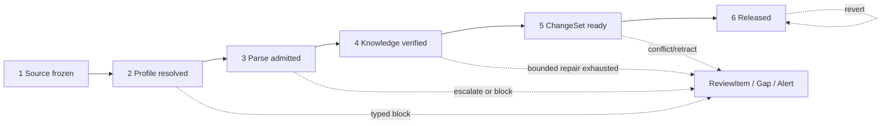

# Enterprise Knowledge Compiler Architecture

> 日期：2026-08-01
>
> 状态：`PROPOSED / OPENSPEC 051 / IMPLEMENTATION NOT STARTED`
>
> 基线：`main=0f231f9841ab31dde4bad15b958c4cd83c316086`
>
> 性质：知识编译父级架构；不授权 parser/provider/runtime/migration 实现

## 1. 结论先行

`pdfplumber → DeepSeek 一次抽 60 字段` **不是生产主链**。它只保留为：

1. 简单文本材料的 fast-path 候选；
2. `596-1` 可证伪实验的低复杂度 baseline；
3. 用来判断阶段化编译器是否真的带来质量增益的对照。

生产目标是一个材料/模板驱动、分阶段、可恢复的企业知识编译器：确定性 parser、
表格/OCR 工具先把可确定事实与结构冻结；弱模型只做窄语义任务；每一字段都经
Evidence 与业务规则回验；新材料只影响相关字段并生成可审核 ChangeSet；具名人工
批准 exact Candidate 后，由 WeKnora 作为唯一 serving authority 激活版本化 Wiki
Release，并支持 pinned read 与 revert。

这不是把多个 parser/模型同时跑一遍再投票。每个 MaterialProfile 精确批准一个
default parser，并最多批准一个 bounded upgrade；第二次仍不足就 fail closed +
ReviewItem，禁止第三次 parser attempt。MinerU、Paddle、Unlimited-OCR、VLM 等
在 G 之前都只是候选族，不能提前写成顺序 ladder。

## 2. 要解决的基础问题

寿险材料的困难不是“PDF 能否转文本”，而是四个连续的不变量：

- **输入不混版**：页、block、table/cell 必须来自同一 SourceRevision 和 parse
  attempt；
- **任务不失控**：弱模型只处理材料×模块×少量字段，失败有 receipt、有界修复；
- **事实不失真**：值、条件、适用范围和 Evidence 可确定性回验，unknown 不伪装
  absent；
- **更新不破坏**：第二、三批材料形成 add/enrich/supersede/conflict/retract，
  未受影响知识保持稳定，发布可回滚。

若第一步把复杂 PDF 压成无结构长文本，后面的模型、冲突、版本和 Wiki 都只能在
错误输入上变得更复杂。因此解析不是附属预处理，而是知识编译的第一道可验证门。

## 3. 与既有生产架构的关系

本设计不重开权威边界：

```text
WeKnora
  - Raw Source / SourceRevision / ACL
  - 唯一 serving Active Wiki Release authority
  - Wiki/API/Agent 的正式读取载体

Python Harness
  - 材料分类、模板解析、结构 admission
  - 窄任务抽取、Evidence/业务规则校验
  - 增量融合、Conflict/Gap/ReviewItem
  - Candidate、ReviewDecision、PublishAuthorization、Golden
  - 不保存第二个 serving Active Head
```

跨系统仍会物化 Candidate payload，但不存在 Harness Active→WeKnora 异步投影的
双 serving authority。Harness 的 receipt 或本地状态不能让正式读取切换版本。

## 4. 复用能力与真实缺口

| 领域 | 已有，可复用 | 051 后仍需子 Mission 补齐 |
|---|---|---|
| 外层 identity | C0 CanonicalEnvelope / canonical hash | 各新制品的 canonical member 绑定 |
| Source | SourceRevision、W1 revision manifest、FrozenW1Bundle | ParsedDocumentV1、ParseManifestV1、ParseQualityDecisionV1 |
| 产品 | exact ProductVersion resolver | MaterialProfile→产品族 exact mapping |
| 模板 | 四级 TemplatePackage resolver、content hash、approval | approved catalog 与材料接缝；不重写 resolver |
| 运行时 | Job/lease/fence/outbox、API/Worker shell | 知识编译 stage/task/attempt/receipt 接线 |
| 抽取 | 历史 compiler/routing/cleaning/引用回验能力 | 按新合同选择性迁移、窄任务、bounded repair |
| 融合 | Claim/ChangeSet 的历史能力 | 当前字段 authority、冲突与独占来源撤回纵切 |
| Golden | 049 `596-1` 60 字段 frozen Golden | G 的盲评、Metric ID、人工门与 parser/model profile 准入 |
| Release | WeKnora sole serving authority、S0-R 可行性证据 | F/G 的真实 Candidate→Release→revert 纵切 |

现有能力“存在”不等于获得当前生产准入。子 PR 必须在当前 identity、威胁和质量合同
下重用或重构，不得把历史测试结果冒充 051 验收。

## 5. 来源项目只迁移机制，不迁移运行时

### 5.1 Dayu：最多五个 load-bearing 机制

| 机制 | 当前 Harness 状态 | 051 用法 |
|---|---|---|
| 确定性可得数据不交给模型 | 表格直取/可喂性已有历史能力 | rate table cell/value 走 Locator+Verifier 主路径 |
| task/Host 分离 | P1/P3 有通用任务地基 | Host 管 durable state/budget/receipt，角色插件不掌权 |
| 阶段制品与 typed audit | C0、Attempt/Receipt 原语可复用 | 六阶段只传 immutable artifact，失败不静默 |
| source grade + 强制回指 | authority/Evidence 有历史设计 | 字段 authority 与 Evidence 两轴分开，断链硬阻断 |
| 定点 repair | 旧 pipeline 有重试但边界不完整 | 只修失败字段/locator，次数与预算固定 |

不复制 Dayu 财报领域逻辑，不把工具输出快照替代字段级 Golden，也不因为它缺投票
就删除寿险高风险字段的独立审核。

### 5.2 LLM-wiki-black：最多五个已实现能力族

| 能力族 | 当前 Harness 状态 | 051 用法 |
|---|---|---|
| 产品目录、材料/模块路由 | 部分 routing_data/sections 已迁移 | 进入 MaterialProfile 与 task partition |
| Schema/模板/产品族专门化 | 现有四级 resolver 已具纯领域合同 | 只补 approved catalog，不建 TS bridge |
| 字段聚合与弱值处理 | cleaning/compat 有选择性迁移 | 进入 verifier/normalizer，不直接成为正式 Claim |
| 来源、缺口与补全 | 历史 pipeline 有局部语义 | 进入 GapTask 与 affected-only recompilation |
| 增量冲突/撤回 | 历史 ChangeSet 有原型与测试 | 在 E 按当前 ProductVersion/Evidence/authority 重验 |

每个迁移 PR 必须记录第一方 source repo/branch/commit/path、接受与拒绝行为、Python
目标路径和 characterization tests。TypeScript/localStorage/Markdown 事实库、巨型
extractor 与第二 runtime 明确不迁移。

## 6. 核心对象与唯一 hash authority

### 6.1 外层与内层 digest

所有可跨阶段消费、审核、重放或发布的制品，外层都使用 C0 CanonicalEnvelope：

```text
C0 canonical_hash
  ├── source_revision_digest
  ├── w1_manifest_digest
  ├── parse_manifest_digest
  ├── material_profile_digest
  ├── template_content_digest
  ├── extraction_input/output_digest
  ├── evidence_set_digest
  └── changeset/candidate digest
```

C0 hash 是唯一 custody/identity authority。内层 digest 负责内容比较和完整性，
不能独立恢复批准或发布能力。这样避免 TemplatePackage hash、parser manifest hash
和 Candidate hash 形成多套“都像权威”的平行系统。

### 6.2 SourceRevision 与材料身份

一个编译输入至少冻结：

- `space_id / source_id / source_revision_id`；
- source bytes SHA-256、文件名仅作显示；
- approved source registration / trust policy version；
- `product_id / product_version_id` 或 typed unresolved；
- material role/profile version；
- ACL snapshot/reference 与 current-read recheck contract。

文件名、模型分类和向量相似度只能提出候选，不能创造 ProductVersion、产品族或
source authority。

## 7. 材料分类与字段权威

### 7.1 材料不是一个全局可信度分数

同一材料对不同字段的权威不同。条款是保障责任与除外的最高优先来源，但费率数值
应由费率表 exact cell 支持；说明书适合产品摘要，却不能覆盖条款；官方 FAQ 可
解释办理口径，却不能创造合同责任。

`MaterialProfile` 因此需要表达：

- exact material role 与输入形态（digital/scanned/structured）；
- permitted modules/fields 与 forbidden authoritative fields；
- required structural capabilities（page/table/cell/span/cross-page）；
- one approved default parser + at most one approved bounded upgrade；
- ProductVersion/product-family explicit mapping；
- TemplatePackage scope request；
- field authority policy reference、Evidence/隐私/人工门要求。

### 7.2 混合与多产品材料

PPT、FAQ 汇编或产品册可能同时包含多个产品/材料角色。classification receipt 要保留
section/block 的候选角色和产品锚点；只有 ProductVersion resolver 唯一命中才可
创建产品任务。歧义区域进入 ReviewItem，不为提高自动化率而跨产品复制事实。

### 7.3 四级模板与 fallback

```text
generic-insurance
  → line-of-business
  → document-type
  → product-family
```

产品族 ID 来自 approved ProductVersion/MaterialProfile 映射。层缺失时只能沿当前
resolver 显式、已批准的 broader chain 退层；receipt 必须记 missing layer 与
chosen chain。fallback 是“少用一层专门化”，不是“猜一个相似产品族”。

TemplatePackage 包括 schema subset、task partition、locators、prompt、normalizer、
verifier、Evidence、attempt/budget、quality/alert policy；它不是 prompt 别名。

## 8. 解析层：结构先于语义

### 8.1 最多两次的有界解析

```text
approved default parser
          │ quality insufficient and exact upgrade approved
          ▼
one approved bounded upgrade
          │ still insufficient
          ▼
fail closed + ReviewItem
```

default 与唯一可选 upgrade 都由 MaterialProfile 版本确定。MinerU、Paddle、
Unlimited-OCR、VLM 等只在 G 中作为可替换 candidate families 评测，不能组成
structure→OCR→VLM 的预授权阶梯。一次生产编译最多产生两个 parser attempt，且
只消费一个 admitted attempt；不能把不同 parser 的页/表格拼成未声明结果，也不
通过多数投票选 parser。

### 8.2 ParsedDocument/ParseManifest 最小合同

parser-neutral 合同只保留下游知识编译必需事实：

| 类别 | required facts |
|---|---|
| identity | SourceRevision、source hash、attempt/generation、parser profile/build/config |
| order | complete ordered pages/blocks/tables/cells、count、pagination snapshot |
| locator | stable page/block/table/cell locator、content hash、source region |
| table | row/column/header/grid/span/cross-page facts（profile 要求时） |
| custody | complete manifest digest、C0 envelope、reparse/delete fence |
| policy | privacy/output policy facts、redaction/omission outcome |

不建立所有 vendor 字段的联合大模型。vendor-only 数据可以留在受控 raw receipt，
只有上表事实进入公共 contract。

### 8.3 ParseQualityDecision

父级只冻结事实与原因族：identity/revision/parser drift；manifest digest/count；
locator/required structure；table grid/span；unsupported profile；privacy/output
policy。数值阈值（乱码率、覆盖率、表格完整度等）必须由 B 在 `596-1` fixtures 上
校准并版本化，不能在 051 凭经验拍数值。

决策只有：

- `ADMIT`：满足当前 MaterialProfile required capabilities；
- `ESCALATE`：default attempt 证据不足，且 exact bounded upgrade 已批准；
- `BLOCK`：unsupported、policy violation、无 upgrade、第二次仍不足或身份不可信。

## 9. 抽取层：缩小模型战场

### 9.1 任务拆解

`ExtractionTask = material × module × field-risk-group`。任务冻结 exact field set、
admitted locator candidates、Schema、template、model plan、预算和全身份链。

典型模块可包括：产品基本信息、保障责任、投保规则、费用/费率、续保、除外、理赔、
权益服务。模块不是固定平台枚举；由批准 Schema/TemplatePackage 对本产品切片定义。

同一模型也不能一次看三 PDF 生成整产品 60 字段。短任务的意义是让失败可定位、
证据可回验、repair 不破坏已通过字段，并让弱模型组合通过工程约束逼近强模型质量。

### 9.2 四个固定角色

1. **Locator**：关键词、章节、表头、产品锚点、JSON pointer 等确定性候选定位；
2. **Extractor**：弱模型处理窄上下文和少字段，输出 value/tri-state/Evidence；
3. **Deterministic Verifier**：结构、类型、单位、枚举、比较器、quote/cell、业务规则；
4. **Targeted Repairer**：仅对失败字段重定位、重切分或定向补抽。

Host 管理 durable job、attempt、预算、重试和 receipt；角色不持有发布或事实权威。
这是一组固定职责，不是可自由规划的通用多 Agent 框架。

### 9.3 Attempt 与 Receipt

每个 attempt 必须是 append-only：输入身份、model/model-plan、prompt/template、
locator manifest、输出 digest、错误分类、tokens/latency/cost、budget、causation 与
process outcome 都可审计。parse error 可以按固定次数做格式修复；语义失败不能
改 prompt 无界重试。超过预算后输出 unknown/Gap/ReviewItem，不静默丢字段。

## 10. Evidence 与确定性回验

### 10.1 证据链

文档 Evidence 至少绑定 SourceRevision、parse attempt、page/block/table/cell
locator、quote/value snapshot 和 digest。结构化 JSON Evidence 绑定 record
snapshot hash、JSON pointer 和 value snapshot。

quote 能在原文找到只证明“回指存在”，不证明主语、版本、条件和字段语义正确。
高风险字段仍需要语义支持检查和人工门；不能把历史 quote match 1.0 当成 Evidence
整体正确。

### 10.2 能确定性做的绝不交给模型

- 费率表数字从 exact cell 读取；
- 日期、百分比、金额、单位、枚举按 Schema 解析；
- `免赔额 ≤ 给付限额` 等关系由规则校验；
- 产品/版本、材料 authority、有效期与 ACL 由 authority/resolver 决定；
- manifest/count/digest/locator/quote 由代码回验。

模型只处理语义定位、条件归纳和 schema-aware 候选。它不能修正 source identity，
不能给材料提权，也不能裁决发布。

## 11. 增量融合、冲突与撤回

### 11.1 只编译受影响闭包

新 revision 到达时，根据 material/module/field/ProductVersion 计算受影响 tasks。
已有且输入 identity 未变的 verified artifacts 可复用；其他字段不重写。新材料对
unknown 的补全是定向 gap-fill，不是全产品重跑。

### 11.2 ChangeSet 语义

| action | 语义 |
|---|---|
| add | 新字段事实 |
| enrich | 值一致，增加合法 Evidence/条件细节 |
| supersede | 新事实在相同 scope 按批准规则替代旧事实 |
| conflict | 相同 scope 不可兼容且不能确定性裁决 |
| retract | 经证明的独占来源撤回/失效候选 |

冲突比较先对齐 Space、ProductVersion、业务时间、地区、渠道、人群和条件；不同版本
或范围不是冲突。字段 authority、可靠时间与 Evidence 完整性可以裁决，模型建议
不能替代 authority。值不一致时禁止把新 Evidence 挂到旧值。

### 11.3 独占来源撤回

当字段只允许由某类完整权威材料提供，新 revision 明确覆盖同一 scope 且旧值唯一
依赖被替代 revision 时，系统生成 retract ChangeItem。它仍需审核并通过新
Release 生效。Source disable/delete、法律删除、业务撤回和版本 revert 是不同
动作，不能用物理删除混为一谈。

## 12. 六阶段状态机



每阶段输入输出都是 immutable/content-addressed artifact。恢复时 fresh 读取 durable
receipt 并重验前置；不能从 report/内存 flag 推导能力。任何 identity、policy、
approval、ACL、clock 或 parser/model drift 创建新 attempt。失败保持 Active Release
不变，不能留下半 Candidate/半 Wiki。

## 13. Candidate、Release 与 revert

accepted ChangeSet 由确定性编译器生成 Wiki pages/Claim/Relation/Evidence
membership 和 changelog。模型不直接写 Wiki。

CandidateRelease 冻结 base release/epoch、完整 membership、全部 source/schema/
template/parser/model/receipt identity。`human_batch` 对 exact Candidate 一次批准；
成员变化使旧 Decision 失效。

批准后 Harness 只发不可变发布制品与授权，WeKnora 原子激活并成为唯一正式读取
authority。人、API、Agent/MCP 在请求内 pin 同一 release。raw 只能做 Evidence
核查/补编；正式 Wiki 无答案时返回 typed insufficient，不静默回退 raw RAG。

revert 是 Active Head 原子指向历史 immutable Release，epoch 递增；主动撤回则
编译一个新 Release。两者都不是单页 cherry-pick 或重新让模型生成。

## 14. 子 Mission DAG

```text
A · 051 父级架构冻结
       ↓
C · MaterialProfile + approved Template catalog（fixture-only）
       ↓
B · parser-neutral artifact + ParseQuality
       ├── D · narrow extraction + Evidence/verifier/repair
       └── E · incremental fusion + conflict/retraction
                ↓
F · fixture-only Candidate/Release/revert vertical slice
                ↓
G · 596-1 three-PDF / 60-field falsification + human gate
```

### A：本 change

退出：七路径 stable tree，经独立 Spec 与 Delivery/YAGNI 批准并合入。无功能代码。

### C：材料/模板接缝

复用现有 resolver/hash/approval，补 MaterialProfile exact mapping 与 approved catalog。
产品族只接受 resolver/MaterialProfile 映射。三 PDF 实物 admission 未齐前，catalog
完成不等于产品已可生产编译。C 可使用 deterministic fixtures 且不依赖 B，从而
先为 B 冻结 required capabilities，避免循环。

### B：解析公共合同

依赖 C。复用 W1/FrozenW1Bundle 与 C 的 exact MaterialProfile required
capabilities，补三种 V1 领域对象和 fixture-calibrated thresholds。deterministic
fixture 可覆盖三类材料，但不宣称真实 `596-1` production admission；只有 B
admit 三份 exact PDF 后该输入门才闭合。不选 vendor winner，不加 migration/proto，
除非独立 Mission 证明不可避免并重划。

### D：抽取与校验

依赖 B。用录制 fixture 和 weak-model fake 完成 task/role/attempt/receipt、
Evidence、规则与 bounded repair；禁止 provider 调用和整产品单次抽取。

### E：融合与撤回

依赖 B，可与 D 并行。用 deterministic Claim fixtures 完成五类 ChangeSet、
affected-only、字段 authority、ConflictSet 与 source-exclusive retract。

### F：fixture 纵切

依赖 D+E。provider/model=0；只用冻结制品跑 Candidate→human_batch→WeKnora
versioned Release→pinned read→revert，证明权威与事务路径，而不证明质量。

### G：唯一实验窗口

依赖 F，以及三 PDF exact admitted artifacts、049 Golden、EvaluationProtocol、
parser/model/template/prompt/budget 与人工门全部预冻结。先冻结 raw outputs，再读取
Golden；失败输出 NOT FEASIBLE/BLOCKED，不无界调参。

## 15. `596-1` 最终证伪门

三份材料必须分别是条款、产品说明书和费率表，并各自拥有 exact：source bytes、
SourceRevision、completed W1 attempt、admitted ParsedDocument/ParseManifest。
047 的两 PDF GET-only capture 不是该门完成证据。

G 报告固定 60 字段的 tri-state/value、coverage/abstention、Evidence locator/
quote/structure、关键高风险字段、漏项/幻觉/静默错误、调用/延迟。阈值来自 G
开工前批准的 EvaluationProtocol；ParseQuality 数值来自 B 的 fixture 校准。任何
结果不得看 Golden 后回改 prompt、模板、parser 路由或阈值。

offline 可以比较 native/pdfplumber、MinerU、Paddle、Unlimited-OCR、VLM 等候选，
但生产只批准一个 MaterialProfile 单链。胜负先看关键字段静默错误与 Evidence，
再看总体 value/tri-state/coverage，成本只在质量相当后比较。

只有结构、Golden、Evidence/规则和具名人工四门都通过，才允许用 F 的发布能力
形成 `596-1` versioned Wiki Release 并演示可见/pinned read/revert。

## 16. 明确不做

- 不建设通用 parser marketplace、OCR/table platform 或动态自动路由；
- 不并跑所有 parser/model 做常态投票；
- 不部署第二套 TypeScript/Node runtime；
- 不引入共享 DB/Redis/Asynq 或第二 Active Head；
- 不做 Dashboard、自动 prompt、全产品、全 Schema、Concept/Sense；
- 不让强模型成为生产 fallback、judge 或发布门；
- 不把 Golden 用作在线知识或调参泄漏；
- 不为路径预算拆出不可用半成品，也不让单一 Mission 无界膨胀。

## 17. 停止条件

任一子 Mission 出现以下情况必须停机重划：

1. 需要第二个领域不变量或通用平台才能继续；
2. 需要绕过 C0、SourceRevision/W1、TemplatePackage 或 WeKnora serving authority；
3. 需要在 G 前调用模型/provider 或读取 Golden；
4. 无法在一个 admitted parse attempt 内表达 required structure；
5. 产品族只能靠模型/文件名猜测；
6. 无法在失败时保证 Active Release 与正式知识零变化；
7. 需要把不同 parser 输出无声明混合；
8. `596-1` 三 PDF 任一缺失 exact admitted artifact。

这些停止不是失败拖延，而是防止第一步错误把后续所有能力建立在不可审计输入上。
